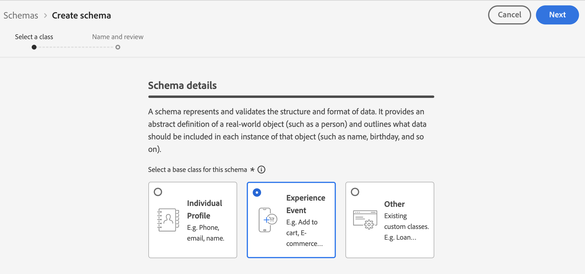
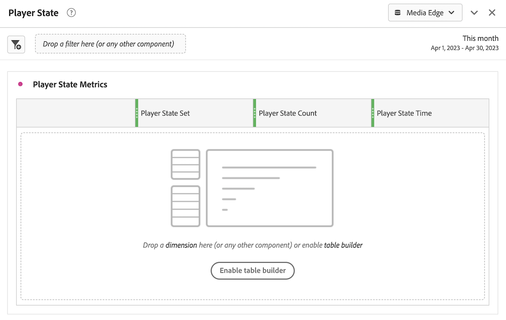

# Edge Networkを使用した Streaming Media Collection の実装

Adobe Experience Platform Edge Network を使用すると、複数の製品宛てのデータを一元的な場所に送信できます。Experience Edge は、適切な情報を目的の製品に転送します。この概念を使用すると、特に複数のデータソリューションにまたがる実装作業を統合できます。

次の図は、Streaming Media Collection アドオンを実装して、Experience Platform Edgeを使用してAdobe AnalyticsまたはCustomer Journey AnalyticsのいずれかでAnalysis Workspaceのデータを利用できるようにする方法を示しています。

Experience Platform Edgeを使用しない実装方法を含む、すべての実装オプションの概要については、[Adobe AnalyticsまたはCustomer Journey Analyticsのストリーミングメディアサービスの実装 ](/help/implementation/overview.md) を参照してください。

Experience Edgeで Streaming Media Collection を実装するために、Adobe Experience Platform Web SDK、Adobe Experience Platform Mobile SDK、Adobe Experience Platform Roku SDK、API のいずれを使用しているかに関係なく、最初に次の節を実行する必要があります。

## Adobe Experience Platformでのスキーマの設定

Adobe Experience Platform を活用するアプリケーション間で使用するデータ収集を標準化するために、アドビはオープンで公的に文書化された標準である Experience Data Model（XDM）を作成しました。

スキーマを作成して設定するには：

1. Adobe Experience Platformで、[UI でのスキーマの作成と編集 ](https://experienceleague.adobe.com/docs/experience-platform/xdm/ui/resources/schemas.html?lang=en) の説明に従ってスキーマの作成を開始します。

1. スキーマの作成時にスキーマの詳細ページで、スキーマのベースクラスを選択する際に [!UICONTROL **エクスペリエンスイベント**] を選択します。

   

1. 「[!UICONTROL **次へ**]」を選択します。

1. スキーマの表示名と説明を指定し、「[!UICONTROL **終了**]」を選択します。

1. 「[!UICONTROL **構成**]」領域の「[!UICONTROL **フィールドグループ**]」セクションで、「[!UICONTROL **追加**]」を選択し、次の新しいフィールドグループを検索してスキーマに追加します。
   * `End User ID Details`
   * `Implementation Details`
   * `MediaAnalytics Interaction Details`

   フィールドグループを追加したら、次のように、「[!UICONTROL **フィールドグループ**]」セクションに表示されます。

   

1. 「[!UICONTROL **保存**]」を選択して変更を保存します。

1. （オプション） Media Edge API で使用されない特定のフィールドを非表示にできます。 これらのフィールドを非表示にすると、スキーマが読みやすく理解しやすくなりますが、必須ではありません。 これらのフィールドは、`MediaAnalytics Interaction Details` フィールドグループのフィールドのみを参照します。

   +++ ここを展開すると、非表示にできるフィールドに関する説明が表示されます。

   1. [!UICONTROL **構造**] 領域で「`Media Collection Details`」フィールドを選択し、「[!UICONTROL **関連フィールドを管理**]」を選択します。

      

   1. [!UICONTROL **フィールドの表示名を表示**] するオプションを有効にし、次のようにスキーマを更新します。

      * `Media Collection Details`/`Advertising Details` フィールドで、レポートフィールド `Ad Completed`、`Ad Started`、`Ad Time Played` を非表示にします。

      * `Media Collection Details`/`Advertising Pod Details` フィールドで、次のレポートフィールドを非表示にします。`Ad Break ID`

      * `Media Collection Details`/`Chapter Details` フィールドで、`Chapter Completed`、`Chapter ID`、`Chapter Started` および `Chapter Time Played` のレポートフィールドを非表示にします。

      * 「`Media Collection Details`」フィールドで、「`List Of States`」フィールドを非表示にします。

        

      * `Media Collection Details`/`List Of States End` および `Media Collection Details`/`List Of States Start` フィールドで、レポートフィールド `Player State Count`、`Player State Set` および `Player State Time` を非表示にします。

        

      * `Media Collection Details`/`Qoe Data Details` フィールドで、次のレポートフィールド（`Average Bitrate`、`Average Bitrate Bucket`、`Bitrate Change Impacted Streams`、`Bitrate Changes`、`Buffer Impacted Streams`、`Buffer Events`、`Dropped Frame Impacted Streams`、`Drops Before Starts`、`Errors`、`External Error IDs`、`Error Impacted Streams`、`Media SDK Error IDs`、`Player SDK Error IDs`、`Stalling Impacted Streams`、`Stalling Events`、`Total Buffer Duration` および `Total Stalling Duration`）を非表示にします。

      * `Media Collection Details`/`Session Details` フィールドで、次のレポートフィールドを非表示にします。`10% Progress Marker`、`25% Progress Marker`、`50% Progress Marker`、`75% Progress Marker`、`95% Progress Marker`、`Ad Count`、`Average Minute Audience`、`Content Completes`、`Chapter Count`、`Content Starts`、`Content Time Spent`、`Estimated Streams`、`Federated Data`、`Media Segment Views`、`Media Downloaded Flag`、`Media Starts`、`Media Session ID`、`Media Session Server Timeout`、`Media Time Spent` `Pause Events` `Pause Impacted Streams` `Pev3` `Pccr` `Total Pause Duration` `Unique Time Played` `Video Segment`

   1. 「[!UICONTROL **確認**]」を選択して変更を保存します。

   1. [!UICONTROL **構造**] 領域で、「[!UICONTROL **フィールドの表示名を表示**]」オプションを有効にし、`List Of Media Collection Downloaded Content Events` フィールドを選択します。

   1. [!UICONTROL **関連フィールドを管理**] を選択して、次のようにスキーマを更新します。

      * `List Of Media Collection Downloaded Content Events`/`Media Details`/`Advertising Details` フィールドで、`Ad Completed`、`Ad Started`、`Ad Time Played` のレポートフィールドを非表示にします。

      * `List Of Media Collection Downloaded Content Events`/`Media Details`/`Advertising Pod Details` フィールドで、次のレポートフィールドを非表示にします。`Ad Break ID`

      * `List Of Media Collection Downloaded Content Events`/`Media Details`/`Chapter Details` フィールドで、`Chapter Completed`、`Chapter ID`、`Chapter Started` および `Chapter Time Played` のレポートフィールドを非表示にします。

      * `List Of Media Collection Downloaded Content Events` / `Media Details` フィールドで、`List Of States` フィールドを非表示にします。

      * `List Of Media Collection Downloaded Content Events`/`Media Details`/`List Of States End` および `Media Collection Details`/`List Of States Start` フィールドで、レポートフィールド `Player State Count`、`Player State Set` および `Player State Time` を非表示にします。

      * `List Of Media Collection Downloaded Content Events`/`Media Details`/`Qoe Data Details` フィールドで、次のレポートフィールド（`Average Bitrate`、`Average Bitrate Bucket`、`Bitrate Change Impacted Streams`、`Bitrate Changes`、`Buffer Events`、`Buffer Impacted Streams`、`Drops Before Starts`、`Dropped Frame Impacted Streams`、`Error Impacted Streams`、`Errors`、`External Error IDs`、`Media SDK Error IDs`、`Player SDK Error IDs`、`Stalling Events`、`Stalling Impacted Streams`、`Total Buffer Duration` および `Total Stalling Duration`）を非表示にします。

      * `List Of Media Collection Downloaded Content Events`/`Media Details`/`Session Details` フィールドで、次のレポートフィールドを非表示にします：`10% Progress Marker`、`25% Progress Marker`、`50% Progress Marker`、`75% Progress Marker`、`95% Progress Marker`、`Ad Count`、`Average Minute Audience`、`Chapter Count`、`Content Completes`、`Content Starts`、`Content Time Spent`、`Estimated Streams`、`Federated Data`、`Media Downloaded Flag`、`Media Segment Views`、`Media Session ID`、`Media Session Server Timeout`、`Media Starts` `Media Time Spent` `Pause Events` `Pause Impacted Streams` `Pccr` `Pev3` `Total Pause Duration` `Unique Time Played` `Video Segment`。

      * `List Of Media Collection Downloaded Content Events` / `Media Details` フィールドで、`Media Session ID` フィールドを非表示にします。

   1. 「[!UICONTROL **確認**]」を選択して変更を保存します。

   1. [!UICONTROL **構造**] 領域で、「`Media Reporting Details`」フィールドを選択し、「[!UICONTROL **関連フィールドを管理**]」を選択します。

   1. [!UICONTROL **フィールドの表示名を表示**] するオプションを有効にし、次のようにスキーマを更新します。

      * `Media Reporting Details` フィールドで、`Error Details`、`List Of States End`、`List of States Start`、`Media Session ID` の各フィールドを非表示にします。

   1. [!UICONTROL **確認**]/[!UICONTROL **保存**] を選択して、変更を保存します。

   +++

1. （オプション）カスタムメタデータをスキーマに追加できます。 これにより、特定のニーズやコンテキストに合わせてカスタマイズできる、ユーザー定義のメタデータを追加で含めることができます。 この柔軟性は、既存のスキーマが目的のデータポイントをカバーしていないシナリオで役立ちます。 （Media Edge API でカスタムメタデータを操作することもできます。 詳しくは、[Media Edge API を使用したカスタムメタデータの作成 ](https://developer.adobe.com/cja-apis/docs/endpoints/media-edge/custom-metadata/) を参照してください。

   +++ スキーマにカスタムメタデータを追加する方法については、こちらを参照してください。

   1. [!UICONTROL **アカウント情報**]/[!UICONTROL **割り当てられた組織**]/[!UICONTROL _**組織名**_]/[!UICONTROL **テナント**] を選択して、組織のテナントの名前を見つけます。

      これらのカスタムフィールドは、このパスを通じて受け取られます。 （例：テナント名：_dcbl → myCustomField パス：_dcbl.myCustomField。）

   1. 定義したメディアスキーマにカスタムフィールドグループを追加します。

      

   1. 追跡するカスタムフィールドをフィールドグループに追加します。

      

   1. リクエストペイロードのカスタムフィールドに [ 生成されたパスを使用 ](https://experienceleague.adobe.com/en/docs/experience-platform/xdm/ui/fields/overview#type-specific-properties) します。

      

   +++

1. [Adobe Experience Platformでデータセットを作成 ](#create-a-dataset-in-adobe-experience-platform) を参照してください。

## Adobe Experience Platform でデータセットを作成

1. [Adobe Experience Platformでのスキーマの設定 ](#set-up-the-schema-in-adobe-experience-platform) の説明に従って、スキーマを設定していることを確認してください。

1. Adobe Experience Platformで、[ データセット UI ガイド ](https://experienceleague.adobe.com/docs/experience-platform/catalog/datasets/user-guide.html?lang=ja#create) の説明に従って、データセットの作成を開始します。

   データセットのスキーマを選択する場合は、[Adobe Experience Platformでのスキーマの設定 ](#set-up-the-schema-in-adobe-experience-platform) で説明しているように、以前に作成したスキーマを選択します。

1. [Customer Journey Analyticsでのデータストリームの設定 ](#configure-a-datastream-in-adobe-experience-platform) を参照してください。

## Adobe Experience Platformでのデータストリームの設定

1. [Adobe Experience Platformでのデータセットの作成 ](#create-a-dataset-in-adobe-experience-platform) の説明に従って、データセットが作成されていることを確認します。

1. [ データストリームの設定 ](https://experienceleague.adobe.com/docs/experience-platform/edge/datastreams/configure.html?lang=ja) の説明に従って、新しいデータストリームを作成します。

   データストリームを作成する際は、必ず次の設定を選択します。

   * データストリームを作成する際の [!UICONTROL **イベントスキーマ**] フィールドで、[Adobe Experience Platformでのスキーマの設定 ](#set-up-the-schema-in-adobe-experience-platform) で作成したスキーマを選択していることを確認します。 「[!UICONTROL **保存**]」を選択します。

     >[!IMPORTANT]
     >
     >「[!UICONTROL **保存してマッピングを追加**]」を選択しないでください。選択すると、タイムスタンプフィールドにマッピングエラーが発生します。

     

   * Adobe AnalyticsとCustomer Journey Analyticsのどちらを使用しているかに応じて、次のいずれかのサービスをデータストリームに追加します。

      * [!UICONTROL **Adobe Analytics**] （Adobe Analyticsを使用している場合）

        Adobe Analyticsを使用している場合は、[ レポートスイートの作成 ](https://experienceleague.adobe.com/en/docs/analytics/admin/admin-tools/manage-report-suites/c-new-report-suite/t-create-a-report-suite) で説明されているとおりに、レポートスイートを定義してください。

      * [!UICONTROL **Adobe Experience Platform**] （Customer Journey Analyticsを使用している場合）

     データストリームにサービスを追加する方法について詳しくは、[ データストリームの設定 ](https://experienceleague.adobe.com/docs/experience-platform/edge/datastreams/configure.html?lang=en#view-details) の「データストリームへのサービスの追加」の節を参照してください。

     

      * 「[!UICONTROL **詳細オプション**]」を展開し、「[!UICONTROL **Media Analytics**]」オプションを有効にします。

     

1. これで、[Media Edge API](/help/implementation/edge/implementation-edge-api.md) または [Media Edge SDK](/help/implementation/edge/edge-mobile-sdk.md) を実装して、Media Analytics データの収集を開始する準備が整いました。

   データを収集したら、[Customer Journey Analyticsで接続を作成する ](#create-a-connection-in-customer-journey-analytics) ことができます。

## Customer Journey Analytics で接続を作成する

>[!NOTE]
>
>次の手順は、Customer Journey Analyticsを使用する場合にのみ必要です。

1. [Customer Journey Analyticsでのデータストリームの設定 ](#configure-a-datastream-in-adobe-experience-platform) の説明に従って、データストリームが作成されていることを確認します。

1. Customer Journey Analyticsで、[ 接続の作成 ](https://experienceleague.adobe.com/docs/analytics-platform/using/cja-connections/create-connection.html?lang=ja) の説明に従って接続を作成します。

   接続を作成する際、ストリーミングメディアコレクションの実装に次の設定を選択する必要があります。

   1. [Adobe Experience Platformでのデータセットの作成 ](#create-a-dataset-in-adobe-experience-platform) の説明に従って、以前に作成したデータセットを選択します。

   1. [!UICONTROL **すべての新しいデータをインポート**] 設定が有効になっていることを確認します。

1. [Customer Journey Analyticsでデータビューを作成 ](#create-a-new-data-view-in-customer-journey-analytics) を参照してください。

## Customer Journey Analytics でデータビューを作成

>[!NOTE]
>
>次の手順は、Customer Journey Analyticsを使用する場合にのみ必要です。

1. [Customer Journey Analyticsでの接続の作成 ](#create-a-connection-in-customer-journey-analytics) の説明に従って、Customer Journey Analyticsで接続が作成されていることを確認してください。

1. カスタマージャーニー分析で、[ データビューの作成または編集 ](https://experienceleague.adobe.com/docs/analytics-platform/using/cja-dataviews/create-dataview.html?lang=ja) の説明に従って、データビューを作成します。

   データビューを作成する際に、ストリーミングメディアコレクションを実装するには、次の設定選択が必要です。

   1. 「[!UICONTROL **接続**]」フィールドで、前に作成した接続を選択します（[Customer Journey Analyticsでの接続の作成 ](#create-a-connection-in-customer-journey-analytics) を参照）。

      作成した接続が選択できるようになるまで、最大 15 分かかる場合があります。

   1. 「[!UICONTROL **コンポーネント**]」タブの「[!UICONTROL **スキーマフィールド**]」セクションで、以下の表にリストされている各コンポーネントを検索し、[!UICONTROL **指標**] パネルにドラッグします。 同じ名前のフィールドが複数存在する場合は、XDM パスを使用して、それが正しいフィールドであることを確認します。

      **メインコンテンツ – コンテンツ指標**

      | コンポーネント名 | XDM パス |
      |----------|---------|
      | メディア開始 | mediaReporting.sessionDetails.isViewed |
      | メディアセグメント表示 | mediaReporting.sessionDetails.hasSegmentView |
      | コンテンツ開始 | mediaReporting.sessionDetails.isPlayed |
      | コンテンツ完了 | mediaReporting.sessionDetails.isCompleted |
      | コンテンツ視聴時間 | mediaReporting.sessionDetails.timePlayed |
      | メディア視聴時間 | mediaReporting.sessionDetails.totalTimePlayed |
      | ユニーク再生時間 | mediaReporting.sessionDetails.uniqueTimePlayed |
      | 10%進捗状況マーカー | mediaReporting.sessionDetails.hasProgress10 |
      | 分平均オーディエンス | mediaReporting.sessionDetails.averageMinuteAudience |

      **チャプターと広告 – チャプターと広告指標**

      | コンポーネント名 | XDM パス |
      |----------|---------|
      | 第 1 章 | mediaReporting.chapterDetails.isStarted |
      | チャプター完了 | mediaReporting.chapterDetails.isCompleted |
      | チャプター再生時間 | mediaReporting.chapterDetails.timePlayed |
      | 広告開始 | mediaReporting.advertisingDetails.isStarted |
      | 広告完了 | mediaReporting.advertisingDetails.isCompleted |
      | 広告の再生時間 | mediaReporting.advertisingDetails.timePlayed |

      **QoE - QoE 指標**

      | コンポーネント名 | XDM パス |
      |----------|---------|
      | 開始時間 | mediaReporting.qoeDataDetails.timeToStart |
      | 開始前にドロップ | mediaReporting.qoeDataDetails.isDroppedBeforeStart |
      | バッファーの影響を受けたストリーム | mediaReporting.qoeDataDetails.hasBufferImpactedStreams |
      | ビットレート変更の影響を受けたストリーム | mediaReporting.qoeDataDetails.hasBitrateChangeImpactedStreams |
      | ビットレート変更 | mediaReporting.qoeDataDetails.bitrateChangeCount |
      | 平均ビットレート | mediaReporting.qoeDataDetails.bitrateAverage |
      | ドロップフレーム | mediaReporting.qoeDataDetails.droppedFrames |
      | エラー数 | mediaReporting.qoeDataDetails.errorCount |
      | エラーの影響を受けたストリーム | mediaReporting.qoeDataDetails.hasErrorImpactedStreams |
      | ドロップフレームの影響を受けたストリーム | mediaReporting.qoeDataDetails.hasDroppedFrameImpactedStreams |

      **プレーヤーステート – プレーヤーステートの指標**

      | コンポーネント名 | XDM パス |
      |----------|---------|
      | プレイヤーの状態の設定 | mediaReporting.states.isSet |
      | プレイヤーの状態のカウント | mediaReporting.states.count |
      | プレイヤーの状態の時間 | mediaReporting.states.time |

   1. 次の表のコンポーネントのラベル（「コンテキストラベル [!UICONTROL **」ドロップダウンメニュー内**] を更新します。 指標パネルにまだ存在しないコンポーネントを検索してパネルにドラッグします。

      | コンポーネント名 | コンテキストラベル |
      |---------|----------|
      | メディアセッションサーバーのタイムアウト | メディア：前回の呼び出しからの経過時間（秒） |
      | メディア視聴時間 | メディア：メディアに費やした時間 |
      | 合計バッファー時間 | メディア：合計バッファー時間 |
      | 開始時間 | メディア：開始時間 |
      | 一時停止時間合計 | メディア：合計一時停止時間 |

   1. Customer Journey Analytics プロジェクトに分類を追加するには、次のディメンションを [!UICONTROL **ディメンション**] パネルに追加します。

      | XDM パス | コンポーネント名 |
      |---------|----------|
      | mediaReporting.states.name | プレイヤーの州名 |
      | mediaReporting.sessionDetails.ID | メディアセッション ID |

      このテーブルのディメンションに加えて、Customer Journey Analytics プロジェクトでデータをフィルターするために使用できるようにする他のディメンションに追加できます。

1. [!UICONTROL **保存して続行**]/[!UICONTROL **保存して終了**] を選択して、変更を保存します。

1. [Customer Journey Analyticsでのプロジェクトの作成と設定 ](#create-and-configure-a-project-in-customer-journey-analytics) を参照してください。

## Customer Journey Analyticsでのプロジェクトの作成と設定

1. [Customer Journey Analyticsでのデータビューの作成 ](#create-a-new-data-view-in-customer-journey-analytics) の説明に従って、Customer Journey Analyticsでデータビューを作成したことを確認してください。

1. Customer Journey Analyticsの「[!UICONTROL **Workspace**]」タブの「[!UICONTROL **プロジェクト**] エリアで、「[!UICONTROL **プロジェクトを作成**]」を選択します。

1. [!UICONTROL **空のプロジェクト**]/[!UICONTROL **作成**] を選択します。

1. 新規プロジェクトで、以前に作成したデータビューを選択します。

   プロジェクトでパネルを作成する場合は、[Customer Journey Analyticsでのデータビューの作成 ](#create-a-new-data-view-in-customer-journey-analytics) で説明しているように、データビューに追加した任意のコンポーネントを使用できます。

   次の 4 つのパネルは、作成可能なパネルの例です。

   

   

   

   

1. 左側のパネルで **パネル** アイコンを選択し、[!UICONTROL **メディア同時視聴者数**] パネルと [!UICONTROL **メディア再生滞在時間**] パネルにドラッグします。

   2 つのパネルは次のようになります。

   

   

1. （条件付き） [Adobe Experience Platformでのスキーマの設定 ](#set-up-the-schema-in-adobe-experience-platform) の手順 8 でスキーマにカスタムメタデータを追加した場合は、Customer Journey Analytics ガイドの [ 永続性コンポーネントの設定 ](https://experienceleague.adobe.com/ja/docs/analytics-platform/using/cja-dataviews/component-settings/persistence) で説明しているように、カスタムフィールドに永続性を設定する必要があります。

   データがCustomer Journey Analyticsに送信されると、カスタムユーザー ID ディメンションを使用できるようになります。

   

   >[!NOTE]
   >
   >Adobe Analyticsをデータストリームのアップストリームとして設定した場合、カスタムメタデータも、スキーマに設定した名前（テナントのプレフィックスを除く（例：myCustomField）で ContextData に存在します。 これにより、[ 処理ルールの作成 ](https://experienceleague.adobe.com/en/docs/analytics/admin/admin-tools/manage-report-suites/edit-report-suite/report-suite-general/c-processing-rules/processing-rules) など、ContextData で使用できるすべてのAdobe Analytics機能を使用できます。

1. [ プロジェクトの共有 ](https://experienceleague.adobe.com/docs/analytics-platform/using/cja-workspace/curate-share/share-projects.html?lang=en) の説明に従って、プロジェクトを共有します。

   >[!NOTE]
   >
   >   共有したいユーザーが使用できない場合は、そのユーザーが、Adobe Admin ConsoleのCustomer Journey Analyticsへのユーザーおよび管理者アクセス権を持っていることを確認してください。

1. [Experience Platform Edgeへのデータの送信 ](#send-data-to-experience-platform-edge) を続けます。

## Experience Platform Edgeへのデータの送信

Experience Platform Edgeに送信するデータの種類に応じて、次のいずれかの方法を使用できます。

### Web:Adobe Experience Platform Web SDKの使用

* [今すぐはじめる](https://developer.adobe.com/client-sdks/documentation/media-for-edge-network/)

* [Adobe Experience Platform Web SDKを使用したEdgeへの Web データの送信](/help/implementation/edge/edge-web-sdk.md)

* [Adobe Streaming Media for Edge Network拡張機能への移行 ](https://developer.adobe.com/client-sdks/documentation/adobe-media-analytics/migration-guide/)

### モバイル：Adobe Experience Platform Mobile SDKを使用します

次のドキュメントリソースを使用して、iOSとAndroidの両方の実装を完了してください。

* [今すぐはじめる](https://developer.adobe.com/client-sdks/documentation/media-for-edge-network/)

* [API リファレンス](https://developer.adobe.com/client-sdks/documentation/media-for-edge-network/api-reference/)

* [Adobe Streaming Media for Edge Network拡張機能への移行 ](https://developer.adobe.com/client-sdks/documentation/adobe-media-analytics/migration-guide/)

### Roku:Adobe Experience Platform Roku SDK

* [今すぐはじめる](https://developer.adobe.com/client-sdks/documentation/media-for-edge-network/)

* [Adobe Experience Platform Roku SDK](https://github.com/adobe/aepsdk-roku/tree/main)

* [Adobe Streaming Media for Edge Network拡張機能への移行 ](https://developer.adobe.com/client-sdks/documentation/adobe-media-analytics/migration-guide/) <!-- is the information here also applicable for Roku? -->

### API:Web およびその他

API は現在、web データをExperience Platform Edgeに送信する唯一の方法としてサポートされています。

API は、Edge API のカスタム実装を使用する場合にも使用できます。

Media Edge API について詳しくは、次のリソースを参照してください。

* [Media Edge API の概要 ](https://experienceleague.adobe.com/docs/experience-platform/edge-network-server-api/media-edge-apis/overview.html)

* [Media Edge API の概要 ](https://experienceleague.adobe.com/docs/experience-platform/edge-network-server-api/media-edge-apis/getting-started.html)

* [Media Edge API トラブルシューティングガイド ](https://experienceleague.adobe.com/docs/experience-platform/edge-network-server-api/media-edge-apis/troubleshooting.html)

* [Media Edge API 用の Open API 仕様ファイルの使用 ](https://developer.adobe.com/data-collection-apis/docs/api/media-edge/)
