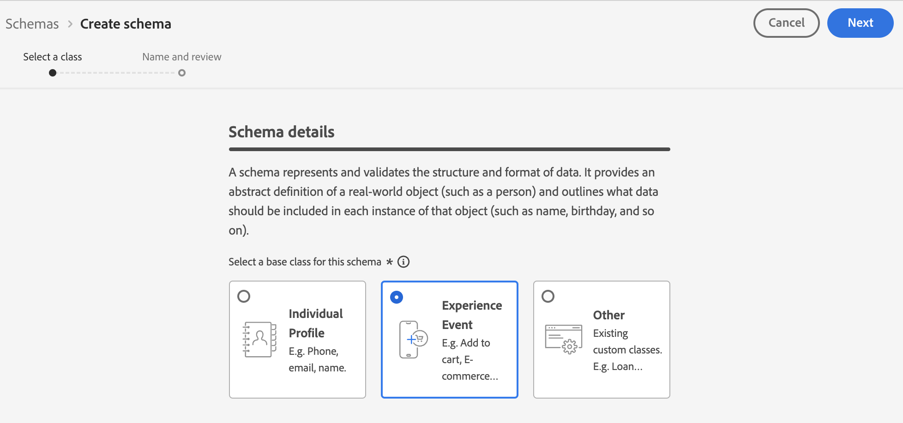
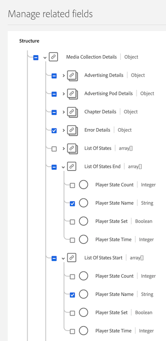
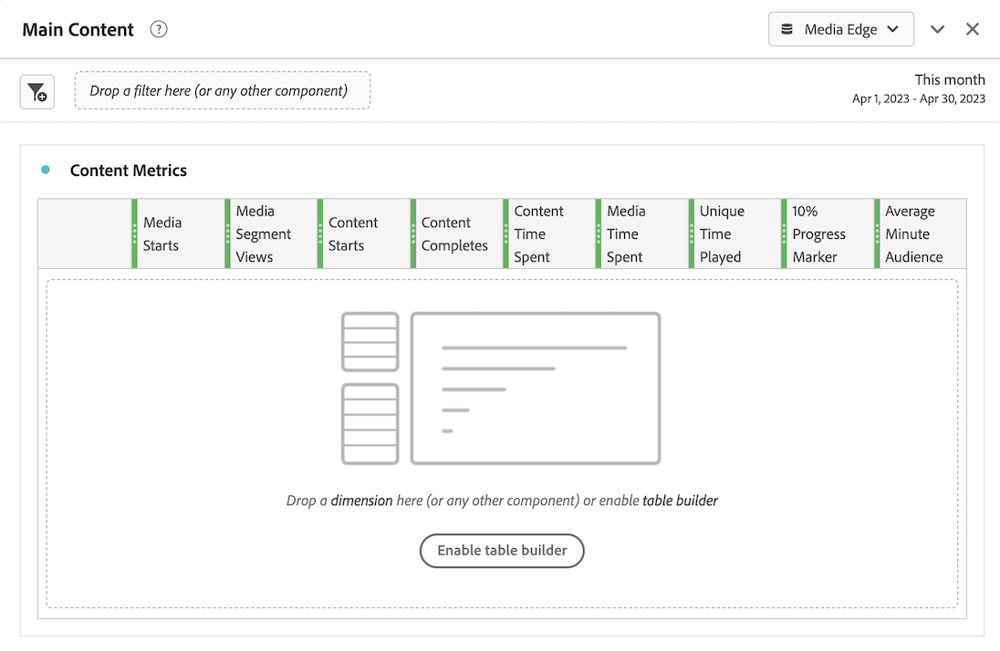
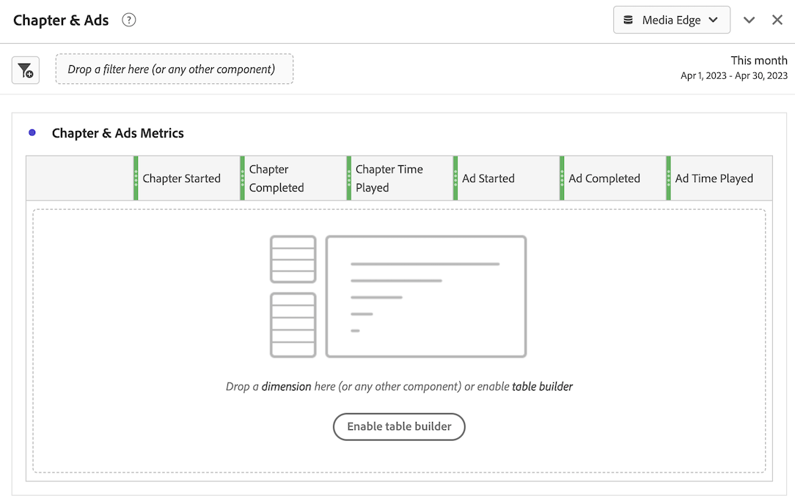
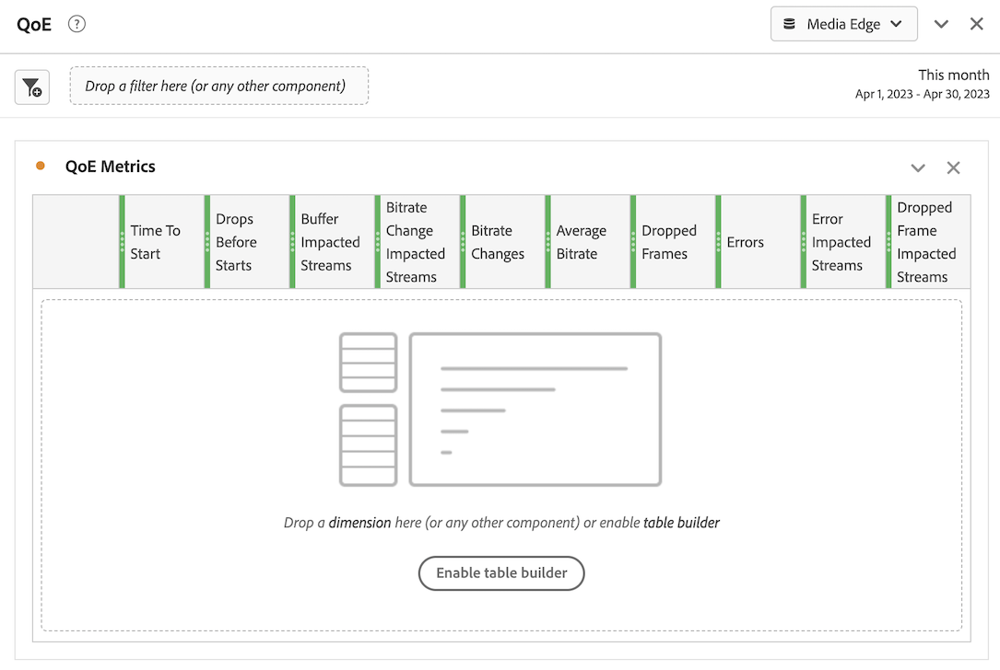
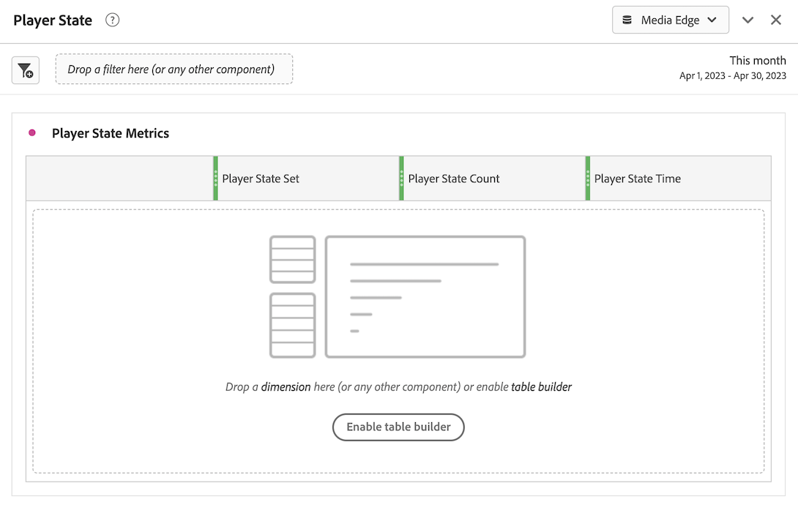
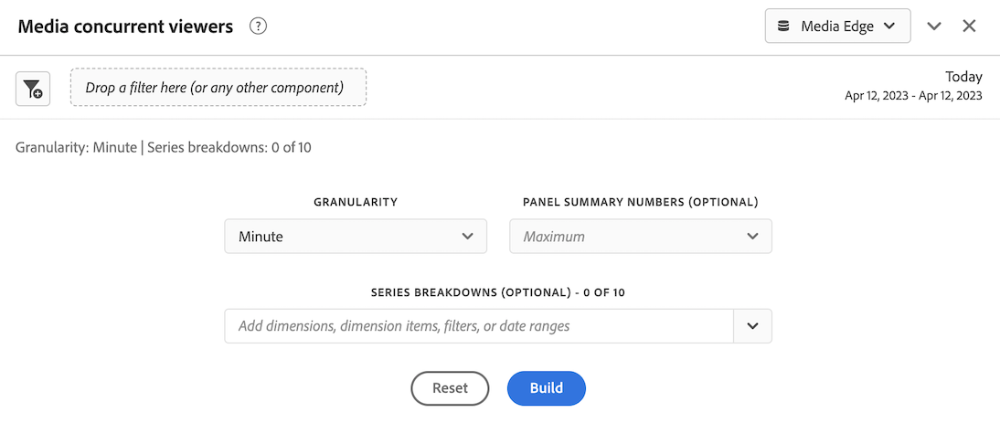
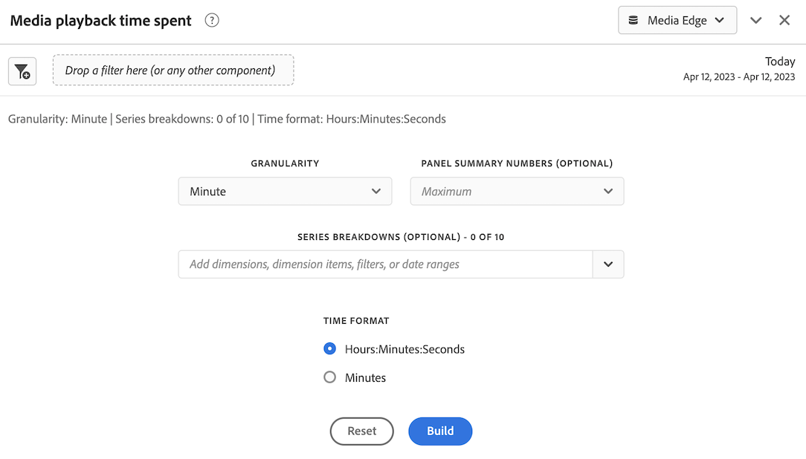
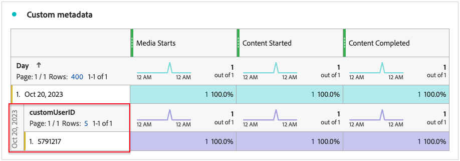

# Edge Networkを使用したStreaming Media Collectionの実装

Adobe Experience Platform Edge Network を使用すると、複数の製品宛てのデータを一元的な場所に送信できます。 Experience Edge は、適切な情報を目的の製品に転送します。 この概念を使用すると、特に複数のデータソリューションにまたがる実装作業を統合できます。

次の図は、Experience Platform Edgeを使用して、Adobe AnalyticsまたはCustomer Journey AnalyticsのAnalysis Workspaceでデータを使用できるように、Streaming Media Collection アドオンを実装する方法を示しています。

Experience Platform Edgeを使用しない実装方法など、すべての実装オプションの概要については、[Adobe AnalyticsまたはCustomer Journey Analyticsのストリーミングメディアサービスの実装](/help/implementation/overview.md)を参照してください。

Adobe Experience Platform Web SDK、Adobe Experience Platform Mobile SDK、Adobe Experience Platform Roku SDK、またはAPIのいずれを使用してExperience EdgeでStreaming Media Collectionを実装するかに関係なく、まず次のセクションを完了する必要があります。

## Adobe Experience Platformでのスキーマの設定

Adobe Experience Platform を活用するアプリケーション間で使用するデータ収集を標準化するために、アドビはオープンで公的に文書化された標準であるエクスペリエンスデータモデル（XDM）を作成しました。

スキーマを作成して設定するには：

1. Adobe Experience Platformで、[UIでのスキーマの作成と編集](https://experienceleague.adobe.com/docs/experience-platform/xdm/ui/resources/schemas.html?lang=en)の説明に従って、スキーマの作成を開始します。

1. スキーマの作成時にスキーマの詳細ページで、スキーマのベースクラスを選択する際に「[!UICONTROL **エクスペリエンスイベント**]」を選択します。

   

1. 「[!UICONTROL **次へ**]」を選択します。

1. スキーマの表示名と説明を指定し、[!UICONTROL **終了**]&#x200B;を選択します。

1. [!UICONTROL **構成**]&#x200B;領域の&#x200B;[!UICONTROL **フィールドグループ**] セクションで、[!UICONTROL **追加**]&#x200B;を選択し、次の新しいフィールドグループを検索してスキーマに追加します。
   * `End User ID Details`
   * `Implementation Details`
   * `MediaAnalytics Interaction Details`

   フィールドグループを追加すると、次のように&#x200B;[!UICONTROL **フィールドグループ**] セクションに表示されます。

   

1. [!UICONTROL **保存**]&#x200B;を選択して、変更を保存します。

1. （オプション） Media Edge APIで使用されていない特定のフィールドを非表示にできます。 これらのフィールドを非表示にすると、スキーマを読みやすく理解しやすくなりますが、必須ではありません。 これらのフィールドは、`MediaAnalytics Interaction Details` フィールドグループ内のフィールドのみを参照します。

   +++ 非表示にできるフィールドの手順を表示するには、ここを展開します。

   1. [!UICONTROL **構造**]&#x200B;領域で、`Media Collection Details` フィールドを選択し、[!UICONTROL **関連フィールドの管理**]&#x200B;を選択します。

      

   1. 「[!UICONTROL **フィールドの表示名を表示する**]」オプションを有効にし、次のようにスキーマを更新します。

      * `Media Collection Details` > `Advertising Details` フィールドで、次のレポートフィールドを非表示にします：`Ad Completed`、`Ad Started`、および`Ad Time Played`。

      * `Media Collection Details` > `Advertising Pod Details` フィールドで、次のレポートフィールドを非表示にします：`Ad Break ID`

      * `Media Collection Details` > `Chapter Details` フィールドで、次のレポートフィールドを非表示にします：`Chapter Completed`、`Chapter ID`、`Chapter Started`、および`Chapter Time Played`。

      * `Media Collection Details` フィールドで、`List Of States` フィールドを非表示にします。

        

      * `Media Collection Details` > `List Of States End`および`Media Collection Details` > `List Of States Start` フィールドで、次のレポートフィールドを非表示にします：`Player State Count`、`Player State Set`、および`Player State Time`。

        非表示にする

      * `Media Collection Details` > `Qoe Data Details` フィールドで、次のレポートフィールドを非表示にします：`Average Bitrate`、`Average Bitrate Bucket`、`Bitrate Change Impacted Streams`、`Bitrate Changes`、`Buffer Impacted Streams`、`Buffer Events`、`Dropped Frame Impacted Streams`、`Drops Before Starts`、`Errors`、`External Error IDs`、`Error Impacted Streams`、`Media SDK Error IDs`、`Player SDK Error IDs`、`Stalling Impacted Streams`、`Stalling Events`、`Total Buffer Duration`、および`Total Stalling Duration`。

      * `Media Collection Details` > `Session Details` フィールドで、次のレポートフィールドを非表示にします：`10% Progress Marker`, `25% Progress Marker`, `50% Progress Marker`, `75% Progress Marker`, `95% Progress Marker`, `Ad Count`, `Average Minute Audience`, `Content Completes`, `Chapter Count`, `Content Starts`, `Content Time Spent`, `Estimated Streams`, `Federated Data`, `Media Segment Views`, `Media Downloaded Flag`, `Media Starts`, `Media Session ID`, `Media Session Server Timeout`, `Pause Events`, `Pause Impacted Streams`, `Pccr`, `Total Pause Duration`, `Unique Time Played`および`Video Segment`。`Media Time Spent` `Pev3`

   1. [!UICONTROL **確認**]&#x200B;を選択して変更を保存します。

   1. [!UICONTROL **構造**]&#x200B;領域で、[!UICONTROL **フィールドの表示名を表示**]&#x200B;するオプションを有効にし、`List Of Media Collection Downloaded Content Events` フィールドを選択します。

   1. 「[!UICONTROL **関連フィールドを管理**]」を選択し、次のようにスキーマを更新します。

      * `List Of Media Collection Downloaded Content Events` > `Media Details` > `Advertising Details` フィールドで、次のレポートフィールドを非表示にします：`Ad Completed`、`Ad Started`、および`Ad Time Played`。

      * `List Of Media Collection Downloaded Content Events` > `Media Details` > `Advertising Pod Details` フィールドで、次のレポートフィールドを非表示にします：`Ad Break ID`

      * `List Of Media Collection Downloaded Content Events` > `Media Details` > `Chapter Details` フィールドで、次のレポートフィールドを非表示にします：`Chapter Completed`、`Chapter ID`、`Chapter Started`、および`Chapter Time Played`。

      * `List Of Media Collection Downloaded Content Events` > `Media Details` フィールドで、`List Of States` フィールドを非表示にします。

      * `List Of Media Collection Downloaded Content Events` > `Media Details` > `List Of States End`および`Media Collection Details` > `List Of States Start` フィールドで、次のレポートフィールドを非表示にします：`Player State Count`、`Player State Set`、および`Player State Time`。

      * `List Of Media Collection Downloaded Content Events` > `Media Details` > `Qoe Data Details` フィールドで、次のレポートフィールドを非表示にします：`Average Bitrate`、`Average Bitrate Bucket`、`Bitrate Change Impacted Streams`、`Bitrate Changes`、`Buffer Events`、`Buffer Impacted Streams`、`Drops Before Starts`、`Dropped Frame Impacted Streams`、`Error Impacted Streams`、`Errors`、`External Error IDs`、`Media SDK Error IDs`、`Player SDK Error IDs`、`Stalling Events`、`Stalling Impacted Streams`、`Total Buffer Duration`および`Total Stalling Duration`。

      * `List Of Media Collection Downloaded Content Events` > `Media Details` > `Session Details` フィールドで、次のレポートフィールドを非表示にします：`10% Progress Marker`, `25% Progress Marker`, `50% Progress Marker`, `75% Progress Marker`, `95% Progress Marker`, `Ad Count`, `Average Minute Audience`, `Chapter Count`, `Content Completes`, `Content Starts`, `Content Time Spent`, `Estimated Streams`, `Federated Data`, `Media Downloaded Flag`, `Media Segment Views`, `Media Session ID`, `Media Session Server Timeout`, `Media Time Spent`, `Pause Events`, `Pccr`, `Pev3`, `Total Pause Duration`、`Unique Time Played`、`Video Segment`。`Media Starts` `Pause Impacted Streams`

      * `List Of Media Collection Downloaded Content Events` > `Media Details` フィールドで、`Media Session ID` フィールドを非表示にします。

   1. [!UICONTROL **確認**]&#x200B;を選択して変更を保存します。

   1. [!UICONTROL **構造**]&#x200B;領域で、`Media Reporting Details` フィールドを選択し、[!UICONTROL **関連フィールドを管理**]&#x200B;を選択します。

   1. 「[!UICONTROL **フィールドの表示名を表示する**]」オプションを有効にし、次のようにスキーマを更新します。

      * `Media Reporting Details` フィールドで、次のフィールドを非表示にします：`Error Details`、`List Of States End`、`List of States Start`、および`Media Session ID`。

   1. [!UICONTROL **確認**] > [!UICONTROL **保存**]&#x200B;を選択して、変更を保存します。

   +++

1. （オプション）カスタムメタデータをスキーマに追加できます。 これにより、特定のニーズやコンテキストに合わせてカスタマイズできる、ユーザー定義の追加メタデータを含めることができます。 この柔軟性は、既存のスキーマが目的のデータポイントをカバーしないシナリオで役立ちます。 （カスタムのメタデータは、Media Edge APIでも使用できます。 詳しくは、[&#x200B; カスタムメタデータのサポート - XDM形式](/help/implementation/edge/implementation-edge-custom-metadata.md)を参照してください。

   +++ スキーマにカスタムメタデータを追加する手順を表示するには、ここを展開します。

   1. [!UICONTROL **アカウント情報**]/[!UICONTROL **割り当てられた組織**]/[!UICONTROL _**組織名**_]/[!UICONTROL **テナント**]&#x200B;を選択して、組織のテナントの名前を探します。

      これらのカスタムフィールドは、このパスを通じて受信されます。 （例えば、テナント名：_dcbl → myCustomField パス：_dcbl.myCustomField）。

   1. 定義したメディアスキーマにカスタムフィールドグループを追加します。

      

   1. 追跡するカスタムフィールドをフィールドグループに追加します。

      

   1. [&#x200B; リクエストペイロードのカスタムフィールドに生成されたパス &#x200B;](https://experienceleague.adobe.com/en/docs/experience-platform/xdm/ui/fields/overview#type-specific-properties)を使用します。

      

   +++

1. [Adobe Experience Platformでデータセットを作成](#create-a-dataset-in-adobe-experience-platform)します。

## Adobe Experience Platform でデータセットを作成

1. [Adobe Experience Platformでのスキーマの設定](#set-up-the-schema-in-adobe-experience-platform)の説明に従って、スキーマを設定していることを確認してください。

1. Adobe Experience Platformで、[&#x200B; データセット UI ガイド &#x200B;](https://experienceleague.adobe.com/docs/experience-platform/catalog/datasets/user-guide.html?lang=ja#create)の説明に従って、データセットの作成を開始します。

   データセットのスキーマを選択する際は、[Adobe Experience Platformでのスキーマの設定](#set-up-the-schema-in-adobe-experience-platform)で説明されているように、以前に作成したスキーマを選択します。

1. [Customer Journey Analyticsでデータストリームを設定](#configure-a-datastream-in-adobe-experience-platform)します。

## Adobe Experience Platformでのデータストリームの設定

1. 「[Adobe Experience Platformでデータセットを作成する](#create-a-dataset-in-adobe-experience-platform)」の説明に従ってデータセットを作成していることを確認してください。

1. 「[&#x200B; データストリームの設定](https://experienceleague.adobe.com/docs/experience-platform/edge/datastreams/configure.html?lang=ja)」の説明に従って、新しいデータストリームを作成します。

   データストリームを作成する際は、次の設定選択を行ってください。

   * データストリームを作成する際、[!UICONTROL **イベントスキーマ**] フィールドで、[で作成したスキーマを選択していることを確認してください。Adobe Experience Platform](#set-up-the-schema-in-adobe-experience-platform)でスキーマを設定します。 「[!UICONTROL **保存**]」を選択します。

     >[!IMPORTANT]
     >
     >「[!UICONTROL **マッピングを保存して追加**]」を選択しないでください。選択すると、タイムスタンプフィールドのマッピングエラーが発生します。

     

   * Adobe AnalyticsとCustomer Journey Analyticsのどちらを使用しているかに応じて、次のいずれかのサービスをデータストリームに追加します。

      * [!UICONTROL **Adobe Analytics**] （Adobe Analyticsを使用している場合）

        Adobe Analyticsを使用している場合は、[&#x200B; レポートスイートの作成](https://experienceleague.adobe.com/en/docs/analytics/admin/admin-tools/manage-report-suites/c-new-report-suite/t-create-a-report-suite)の説明に従って、レポートスイートを定義してください。

      * [!UICONTROL **Adobe Experience Platform**] （Customer Journey Analyticsを使用している場合）

     データストリームにサービスを追加する方法について詳しくは、[&#x200B; データストリームの設定](https://experienceleague.adobe.com/docs/experience-platform/edge/datastreams/configure.html?lang=en#view-details)の「データストリームにサービスを追加」セクションを参照してください。

     

      * [!UICONTROL **詳細オプション**]&#x200B;を展開し、[!UICONTROL **Media Analytics**] オプションを有効にします。

     

1. これで、[Media Edge API](/help/implementation/edge/implementation-edge-api.md)または[Media Edge SDK](/help/implementation/edge/edge-mobile-sdk.md)を実装して、Media Analytics データの収集を開始する準備が整いました。

   データを収集したら、[Customer Journey Analyticsで接続を作成できます](#create-a-connection-in-customer-journey-analytics)。

## Customer Journey Analytics で接続を作成する

>[!NOTE]
>
>次の手順は、Customer Journey Analyticsを使用している場合にのみ必要です。

1. 「[Customer Journey Analyticsでのデータストリームの設定](#configure-a-datastream-in-adobe-experience-platform)」の説明に従って、データストリームを作成したことを確認します。

1. Customer Journey Analyticsで、[Create a connection](https://experienceleague.adobe.com/docs/analytics-platform/using/cja-connections/create-connection.html?lang=ja)の説明に従って接続を作成します。

   接続を作成する際は、ストリーミングメディアコレクションを実装するために次の設定を選択する必要があります。

   1. 「[Adobe Experience Platformでデータセットを作成する](#create-a-dataset-in-adobe-experience-platform)」の説明に従って、以前に作成したデータセットを選択します。

   1. [!UICONTROL **すべての新しいデータの読み込み**]&#x200B;設定が有効になっていることを確認してください。

1. [Customer Journey Analyticsでデータビューを作成します](#create-a-new-data-view-in-customer-journey-analytics)。

## Customer Journey Analytics でデータビューを作成

>[!NOTE]
>
>次の手順は、Customer Journey Analyticsを使用している場合にのみ必要です。

1. [Customer Journey Analyticsでのコネクションの作成](#create-a-connection-in-customer-journey-analytics)の説明に従って、Customer Journey Analyticsでコネクションを作成したことを確認します。

1. お客様のジャーニー分析で、[&#x200B; データビューの作成または編集](https://experienceleague.adobe.com/docs/analytics-platform/using/cja-dataviews/create-dataview.html?lang=ja)の説明に従ってデータビューを作成します。

   データビューを作成する場合、ストリーミングメディアコレクションを実装するには、次の設定を選択する必要があります。

   1. [!UICONTROL **Connection**] フィールドで、[Create a connection in Customer Journey Analytics](#create-a-connection-in-customer-journey-analytics)の説明に従って、以前に作成したConnectionを選択します。

      作成した接続を選択できるようになるまでに最大15分かかる場合があります。

   1. 「[!UICONTROL **コンポーネント**]」タブの「[!UICONTROL **スキーマフィールド**]」セクションで、以下の表に記載されている各コンポーネントを検索し、[!UICONTROL **指標**] パネルにドラッグします。 同じ名前のフィールドが複数ある場合は、XDM パスを使用して正しいフィールドであることを確認します。

      **メインコンテンツ – コンテンツ指標**

      | コンポーネント名 | XDM パス |
      |----------|---------|
      | メディア開始 | mediaReporting.sessionDetails.isViewed |
      | メディアセグメント表示 | mediaReporting.sessionDetails.hasSegmentView |
      | コンテンツ開始 | mediaReporting.sessionDetails.isPlayed |
      | コンテンツ完了 | mediaReporting.sessionDetails.isCompleted |
      | コンテンツ視聴時間 | mediaReporting.sessionDetails.timePlayed |
      | メディア視聴時間 | mediaReporting.sessionDetails.totalTimePlayed |
      | ユニーク再生時間 | mediaReporting.sessionDetails.uniqueTimePlayed |
      | 10%進捗状況マーカー | mediaReporting.sessionDetails.hasProgress10 |
      | 分平均オーディエンス | mediaReporting.sessionDetails.averageMinuteAudience |

      **章と広告 – 章と広告の指標**

      | コンポーネント名 | XDM パス |
      |----------|---------|
      | 章の始め | mediaReporting.chapterDetails.isStarted |
      | 章が完了しました | mediaReporting.chapterDetails.isCompleted |
      | 章再生時間 | mediaReporting.chapterDetails.timePlayed |
      | 広告が開始されました | mediaReporting.advertisingDetails.isStarted |
      | Ad Completed | mediaReporting.advertisingDetails.isCompleted |
      | 広告再生時間 | mediaReporting.advertisingDetails.timePlayed |

      **QoE - QoE指標**

      | コンポーネント名 | XDM パス |
      |----------|---------|
      | 開始時間 | mediaReporting.qoeDataDetails.timeToStart |
      | 起動前にドロップ | mediaReporting.qoeDataDetails.isDroppedBeforeStart |
      | バッファーの影響を受けたストリーム | mediaReporting.qoeDataDetails.hasBufferImpactedStreams |
      | ビットレート変更の影響を受けたストリーム | mediaReporting.qoeDataDetails.hasBitrateChangeImpactedStreams |
      | ビットレート変更 | mediaReporting.qoeDataDetails.bitrateChangeCount |
      | 平均ビットレート | mediaReporting.qoeDataDetails.bitrateAverage |
      | ドロップフレーム | mediaReporting.qoeDataDetails.droppedFrames |
      | エラー数 | mediaReporting.qoeDataDetails.errorCount |
      | エラーの影響を受けたストリーム | mediaReporting.qoeDataDetails.hasErrorImpactedStreams |
      | ドロップフレームの影響を受けたストリーム | mediaReporting.qoeDataDetails.hasDroppedFrameImpactedStreams |

      **プレイヤーの状態 – プレイヤーの状態の指標**

      | コンポーネント名 | XDM パス |
      |----------|---------|
      | Player State Set | mediaReporting.states.isSet |
      | プレーヤーの状態カウント | mediaReporting.states.count |
      | プレーヤーの状態時間 | mediaReporting.states.time |

   1. 次の表のコンポーネントのラベル（[!UICONTROL **コンテキストラベル**] ドロップダウンメニュー）を更新します。 指標パネルにまだ含まれていないコンポーネントを検索してパネルにドラッグします。

      | コンポーネント名 | コンテキストラベル |
      |---------|----------|
      | メディアセッションサーバーのタイムアウト | メディア：最後の呼び出しからの秒数 |
      | メディア視聴時間 | メディア：メディア滞在時間 |
      | 合計バッファー時間 | メディア：合計バッファー時間 |
      | 開始時間 | メディア：開始までの時間 |
      | 一時停止時間合計 | メディア：合計一時停止の期間 |

   1. Customer Journey Analytics プロジェクトに分類を追加するには、[!UICONTROL **ディメンション**] パネルに次のディメンションを追加します。

      | XDM パス | コンポーネント名 |
      |---------|----------|
      | mediaReporting.states.name | プレーヤーの状態名 |
      | mediaReporting.sessionDetails.ID | メディアセッション ID |

      この表のディメンションに加えて、Customer Journey Analytics プロジェクトでデータをフィルタリングするために使用可能にする他のディメンションを追加できます。

1. [!UICONTROL **保存して続行**] > [!UICONTROL **保存して終了**]&#x200B;を選択し、変更を保存します。

1. [Customer Journey Analyticsでプロジェクトを作成して設定します](#create-and-configure-a-project-in-customer-journey-analytics)。

## Customer Journey Analyticsでのプロジェクトの作成と設定

1. [Customer Journey Analyticsでのデータビューの作成](#create-a-new-data-view-in-customer-journey-analytics)の説明に従って、Customer Journey Analyticsでデータビューを作成していることを確認してください。

1. Customer Journey Analyticsの「[!UICONTROL **Workspace**]」タブの「[!UICONTROL **プロジェクト**]」領域で、「[!UICONTROL **プロジェクトを作成**]」を選択します。

1. [!UICONTROL **空のプロジェクト**] > [!UICONTROL **作成**]&#x200B;を選択します。

1. 新しいプロジェクトで、以前に作成したデータビューを選択します。

   プロジェクトでパネルを作成する際は、[Customer Journey Analyticsでのデータビューの作成](#create-a-new-data-view-in-customer-journey-analytics)で説明されているように、データビューに追加した任意のコンポーネントを使用できます。

   次の4つのパネルは、作成できるパネルの例です。

   

   

   

   

1. 左側のパネルで&#x200B;**パネル** アイコンを選択し、[!UICONTROL **メディア同時視聴者数**] パネルと&#x200B;[!UICONTROL **メディア再生時間**] パネルをドラッグします。

   2つのパネルは次のようになります。

   

   

1. （条件付き）スキーマにカスタムメタデータを追加した場合（[Adobe Experience Platformでのスキーマの設定](#set-up-the-schema-in-adobe-experience-platform)の手順8で説明）、カスタムフィールドの永続性を設定する必要があります（Customer Journey Analytics ガイドの[永続性コンポーネント設定](https://experienceleague.adobe.com/ja/docs/analytics-platform/using/cja-dataviews/component-settings/persistence)で説明）。

   データがCustomer Journey Analyticsに到着すると、カスタムユーザーID ディメンションを利用できるようになります。

   

   >[!NOTE]
   >
   >データストリームのアップストリームとしてAdobe Analyticsを設定する場合、カスタムメタデータはContextDataにも存在し、スキーマで設定した名前が付きます（テナントのプレフィックスはmyCustomFieldなし）。 これにより、[処理ルールの作成](https://experienceleague.adobe.com/en/docs/analytics/admin/admin-tools/manage-report-suites/edit-report-suite/report-suite-general/c-processing-rules/processing-rules)など、ContextDataで使用できるすべてのAdobe Analytics機能を使用できるようになります。

1. 「[&#x200B; プロジェクトを共有](https://experienceleague.adobe.com/docs/analytics-platform/using/cja-workspace/curate-share/share-projects.html?lang=en)」の説明に従って、プロジェクトを共有します。

   >[!NOTE]
   >
   >   共有するユーザーが利用できない場合は、Adobe Admin ConsoleのCustomer Journey Analyticsへのユーザーおよび管理者アクセス権を持っていることを確認します。

1. [Experience Platform Edgeにデータを送信](#send-data-to-experience-platform-edge)で続行します。

## Experience Platform Edgeへのデータの送信

Experience Platform Edgeに送信するデータの種類に応じて、次のいずれかの方法を使用できます。

### Web: Adobe Experience Platform Web SDKの使用

* [基本を学ぶ](https://developer.adobe.com/client-sdks/documentation/media-for-edge-network/)

* [Adobe Experience Platform Web SDKを使用したEdgeへのweb データの送信](/help/implementation/edge/edge-web-sdk.md)

* [Adobe Streaming Media for Edge Network拡張機能への移行](https://developer.adobe.com/client-sdks/documentation/adobe-media-analytics/migration-guide/)

### モバイル：Adobe Experience Platform Mobile SDKの使用

次のドキュメントリソースを使用して、iOSとAndroidの両方の実装を完了します。

* [基本を学ぶ](https://developer.adobe.com/client-sdks/documentation/media-for-edge-network/)

* [API リファレンス](https://developer.adobe.com/client-sdks/documentation/media-for-edge-network/api-reference/)

* [Adobe Streaming Media for Edge Network拡張機能への移行](https://developer.adobe.com/client-sdks/documentation/adobe-media-analytics/migration-guide/)

### 六：Adobe Experience Platform六SDK

* [基本を学ぶ](https://developer.adobe.com/client-sdks/documentation/media-for-edge-network/)

* [Adobe Experience Platform六SDK](https://github.com/adobe/aepsdk-roku/tree/main)

* [Edge Network拡張機能のAdobe Streaming Mediaへの移行](https://developer.adobe.com/client-sdks/documentation/adobe-media-analytics/migration-guide/) <!-- is the information here also applicable for Roku? -->

### API: Webおよびその他

APIは現在、Experience Platform Edgeにweb データを送信する唯一のサポートされている方法です。

Edge APIのカスタム実装を使用する場合は、このAPIも使用できます。

Media Edge APIについて詳しくは、次のリソースを参照してください。

* [Media Edge APIの概要](https://experienceleague.adobe.com/docs/experience-platform/edge-network-server-api/media-edge-apis/overview.html)

* [Media Edge APIの概要](https://experienceleague.adobe.com/docs/experience-platform/edge-network-server-api/media-edge-apis/getting-started.html)

* [Media Edge API トラブルシューティングガイド](https://experienceleague.adobe.com/docs/experience-platform/edge-network-server-api/media-edge-apis/troubleshooting.html)

* [Media Edge APIのOpen API仕様ファイルの使用](https://developer.adobe.com/data-collection-apis/docs/api/media-edge/)
