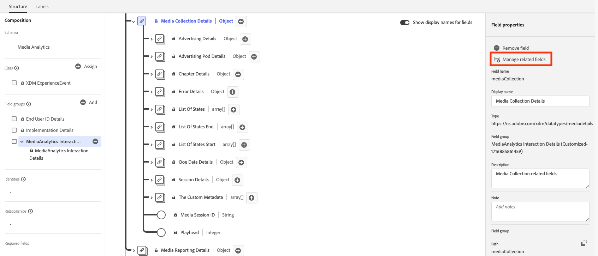

# Edge Networkを使用した Streaming Media Collection アドオンの実装

Adobe Experience Platform Edge Network を使用すると、複数の製品宛てのデータを一元的な場所に送信できます。Experience Edge は、適切な情報を目的の製品に転送します。この概念を使用すると、特に複数のデータソリューションにまたがる実装作業を統合できます。

次の図に、Adobeストリーミングメディアコレクションアドオンを実装して、Experience Platform Edgeを使用してAdobe AnalyticsまたはCustomer Journey AnalyticsのいずれかでAnalysis Workspaceのデータを利用できるようにする方法を示します。

Experience Platform Edgeを使用しない実装方法を含む、すべての実装オプションの概要については、を参照してください。 [ストリーミングメディアコレクションアドオンの実装](/help/implementation/overview.md).

Experience Edgeを使用した Streaming Media Collection アドオンの実装に、Adobe Experience Platform Web SDK、Adobe Experience Platform Mobile SDK、Adobe Experience Platform Roku SDK、API のいずれを使用しているかに関係なく、最初に次の節を完了する必要があります。

## Adobe Experience Platformでのスキーマの設定

Adobe Experience Platform を活用するアプリケーション間で使用するデータ収集を標準化するために、アドビはオープンで公的に文書化された標準である Experience Data Model（XDM）を作成しました。

スキーマを作成して設定するには：

1. Adobe Experience Platformで、の説明に従ってスキーマの作成を開始します [UI でのスキーマの作成と編集](https://experienceleague.adobe.com/docs/experience-platform/xdm/ui/resources/schemas.html?lang=en).

1. スキーマを作成する際に、スキーマの詳細ページで次を選択します [!UICONTROL **エクスペリエンスイベント**] スキーマの基本クラスを選択する場合。

   

1. 「[!UICONTROL **次へ**]」を選択します。

1. スキーマの表示名と説明を指定し、選択します [!UICONTROL **終了**].

1. が含まれる [!UICONTROL **構成**] エリア、内 [!UICONTROL **フィールドグループ**] セクションで選択 [!UICONTROL **追加**]&#x200B;を検索し、次の新しいフィールドグループをスキーマに追加します。
   * `Adobe Analytics ExperienceEvent Template`
   * `Implementation Details`
   * `MediaAnalytics Interaction Details`

   フィールドグループを追加すると、に表示されます。 [!UICONTROL **フィールドグループ**] セクションを作成します。

   

1. を選択 [!UICONTROL **保存**] 変更を保存します。

1. （オプション） Media Edge API で使用されない特定のフィールドを非表示にできます。 これらのフィールドを非表示にすると、スキーマが読みやすく理解しやすくなりますが、必須ではありません。 これらのフィールドは、のフィールドのみを参照します。 `MediaAnalytics Interaction Details` フィールドグループ。

+++ ここを展開すると、非表示にできるフィールドに関する説明が表示されます。

   1. が含まれる [!UICONTROL **構造**] エリアで、 `Media Collection Details` フィールドで次を選択 [!UICONTROL **関連フィールドを管理**].

      

   1. このオプションを有効にすると、 [!UICONTROL **フィールドの表示名を表示**]&#x200B;を設定してから、以下のようにスキーマを更新します。

      * が含まれる `Media Collection Details` > `Advertising Details` フィールドで、次のレポートフィールドを非表示にします。 `Ad Completed`, `Ad Started`、および `Ad Time Played`.

      * が含まれる `Media Collection Details` > `Advertising Pod Details` フィールドで、次のレポートフィールドを非表示にします。 `Ad Break ID`

      * が含まれる `Media Collection Details` > `Chapter Details` フィールドで、次のレポートフィールドを非表示にします。 `Chapter Completed`, `Chapter ID`, `Chapter Started`、および `Chapter Time Played`.

      * が含まれる `Media Collection Details` フィールドで、 `List Of States` フィールド。

        

      * が含まれる `Media Collection Details` > `List Of States End` および `Media Collection Details` > `List Of States Start` フィールドで、次のレポートフィールドを非表示にします。 `Player State Count`, `Player State Set`、および `Player State Time`.

        

      * が含まれる `Media Collection Details` > `Qoe Data Details` フィールドで、次のレポートフィールドを非表示にします。 `Average Bitrate`, `Average Bitrate Bucket`, `Bitrate Change Impacted Streams`, `Bitrate Changes`, `Buffer Impacted Streams`, `Buffer Events`, `Dropped Frame Impacted Streams`, `Drops Before Starts`, `Errors`, `External Error IDs`, `Error Impacted Streams`, `Media SDK Error IDs`, `Player SDK Error IDs`, `Stalling Impacted Streams`, `Stalling Events`, `Total Buffer Duration`、および `Total Stalling Duration`.

      * が含まれる `Media Collection Details` > `Session Details` フィールドで、次のレポートフィールドを非表示にします。 `10% Progress Marker`, `25% Progress Marker`, `50% Progress Marker`, `75% Progress Marker`, `95% Progress Marker`, `Ad Count`, `Average Minute Audience`, `Content Completes`, `Chapter Count`, `Content Starts`, `Content Time Spent`, `Estimated Streams`, `Federated Data`, `Media Segment Views`, `Media Downloaded Flag`, `Media Starts`, `Media Session ID`, `Media Session Server Timeout`, `Media Time Spent`, `Pause Events`, `Pause Impacted Streams`, `Pev3`, `Pccr`, `Total Pause Duration`, `Unique Time Played`、および `Video Segment`.

   1. を選択 [!UICONTROL **確認**] 変更を保存します。

   1. が含まれる [!UICONTROL **構造**] エリアで、このオプションを有効にして [!UICONTROL **フィールドの表示名を表示**]&#x200B;を選択してから、 `List Of Media Collection Downloaded Content Events` フィールド。

   1. を選択 [!UICONTROL **関連フィールドを管理**]&#x200B;を設定してから、以下のようにスキーマを更新します。

      * が含まれる `List Of Media Collection Downloaded Content Events` > `Media Details` > `Advertising Details` フィールドで、次のレポートフィールドを非表示にします。 `Ad Completed`, `Ad Started`、および `Ad Time Played`.

      * が含まれる `List Of Media Collection Downloaded Content Events` > `Media Details` > `Advertising Pod Details` フィールドで、次のレポートフィールドを非表示にします。 `Ad Break ID`

      * が含まれる `List Of Media Collection Downloaded Content Events` > `Media Details` > `Chapter Details` フィールドで、次のレポートフィールドを非表示にします。 `Chapter Completed`, `Chapter ID`, `Chapter Started`、および `Chapter Time Played`.

      * が含まれる `List Of Media Collection Downloaded Content Events` > `Media Details` フィールドで、 `List Of States` フィールド。

      * が含まれる `List Of Media Collection Downloaded Content Events` > `Media Details` > `List Of States End` および `Media Collection Details` > `List Of States Start` フィールドで、次のレポートフィールドを非表示にします。 `Player State Count`, `Player State Set`、および `Player State Time`.

      * が含まれる `List Of Media Collection Downloaded Content Events` > `Media Details` > `Qoe Data Details` フィールドで、次のレポートフィールドを非表示にします。 `Average Bitrate`, `Average Bitrate Bucket`, `Bitrate Change Impacted Streams`, `Bitrate Changes`, `Buffer Events`, `Buffer Impacted Streams`, `Drops Before Starts`, `Dropped Frame Impacted Streams`, `Error Impacted Streams`, `Errors`, `External Error IDs`, `Media SDK Error IDs`, `Player SDK Error IDs`, `Stalling Events`, `Stalling Impacted Streams`, `Total Buffer Duration`、および `Total Stalling Duration`.

      * が含まれる `List Of Media Collection Downloaded Content Events` > `Media Details` > `Session Details` フィールドで、次のレポートフィールドを非表示にします。 `10% Progress Marker`, `25% Progress Marker`, `50% Progress Marker`, `75% Progress Marker`, `95% Progress Marker`, `Ad Count`, `Average Minute Audience`, `Chapter Count`, `Content Completes`, `Content Starts`, `Content Time Spent`, `Estimated Streams`, `Federated Data`, `Media Downloaded Flag`, `Media Segment Views`, `Media Session ID`, `Media Session Server Timeout`, `Media Starts`, `Media Time Spent`, `Pause Events`, `Pause Impacted Streams`, `Pccr`, `Pev3`, `Total Pause Duration`, `Unique Time Played`、および `Video Segment`.

      * が含まれる `List Of Media Collection Downloaded Content Events` > `Media Details`  フィールドで、 `Media Session ID` フィールド。

   1. を選択 [!UICONTROL **確認**] 変更を保存します。

   1. が含まれる [!UICONTROL **構造**] エリアで、 `Media Reporting Details` フィールド、選択 [!UICONTROL **関連フィールドを管理**].

   1. このオプションを有効にすると、 [!UICONTROL **フィールドの表示名を表示**]&#x200B;を設定してから、以下のようにスキーマを更新します。

      * が含まれる `Media Reporting Details` フィールドで、次のフィールドを非表示にします。 `Error Details`, `List Of States End`, `List of States Start`、および `Media Session ID`.

   1. を選択 [!UICONTROL **確認**] > [!UICONTROL **保存**]  変更を保存します。

1. 続行 [Adobe Experience Platformでのデータセットの作成](#create-a-dataset-in-adobe-experience-platform).

## Adobe Experience Platformでのデータセットの作成

1. の説明に従って、必ずスキーマを設定してください。 [Adobe Experience Platformでのスキーマの設定](#set-up-the-schema-in-adobe-experience-platform).

1. Adobe Experience Platformで、の説明に従ってデータセットの作成を開始します [データセット UI ガイド](https://experienceleague.adobe.com/docs/experience-platform/catalog/datasets/user-guide.html?lang=ja#create).

   データセットのスキーマを選択する場合、の説明に従って、以前に作成したスキーマを選択します [Adobe Experience Platformでのスキーマの設定](#set-up-the-schema-in-adobe-experience-platform).

1. 続行 [Customer Journey Analyticsでのデータストリームの設定](#configure-a-datastream-in-adobe-experience-platform).

## Adobe Experience Platformでのデータストリームの設定

1. の説明に従って、データセットが作成されたことを確認します。 [Adobe Experience Platformでのデータセットの作成](#create-a-dataset-in-adobe-experience-platform).

1. の説明に従って、新しいデータストリームを作成します。 [データストリームの設定](https://experienceleague.adobe.com/docs/experience-platform/edge/datastreams/configure.html?lang=ja).

   データストリームを作成する際は、必ず次の設定を選択します。

   * が含まれる [!UICONTROL **イベントスキーマ**] フィールド データストリームの作成時には、で作成したスキーマを選択していることを確認してください [Adobe Experience Platformでのスキーマの設定](#set-up-the-schema-in-adobe-experience-platform). 「[!UICONTROL **保存**]」を選択します。

     >[!IMPORTANT]
     >
         > 選択しない [!UICONTROL **マッピングを保存および追加**] これは、タイムスタンプフィールドのマッピングエラーが発生するためです。
     
     

   * Adobe AnalyticsとCustomer Journey Analyticsのどちらを使用しているかに応じて、次のいずれかのサービスをデータストリームに追加します。

      * [!UICONTROL **Adobe Analytics**] （Adobe Analyticsを使用している場合）

        Adobe Analyticsを使用している場合は、の説明に従ってレポートスイートを定義してください [レポートスイートの作成](https://experienceleague.adobe.com/en/docs/analytics/admin/admin-tools/manage-report-suites/c-new-report-suite/t-create-a-report-suite).

      * [!UICONTROL **Adobe Experience Platform**] （Customer Journey Analyticsを使用する場合）

     データストリームにサービスを追加する方法については、の「データストリームへのサービスの追加」の節を参照してください。 [データストリームの設定](https://experienceleague.adobe.com/docs/experience-platform/edge/datastreams/configure.html?lang=en#view-details).

     

   * を展開 [!UICONTROL **詳細オプション**]&#x200B;を選択してから、を有効にします [!UICONTROL **Media Analytics**] オプション。

     

1. これで、を実装する準備ができました [Media Edge API](/help/implementation/edge/implementation-edge-api.md) または [Media Edge SDK](/help/implementation/edge/edge-mobile-sdk.md) メディア分析データの収集を開始します。

   データを収集したら、次のことができます [Customer Journey Analyticsでの接続の作成](#create-a-connection-in-customer-journey-analytics).

## Customer Journey Analytics で接続を作成する

>[!NOTE]
>
>次の手順は、Customer Journey Analyticsを使用する場合にのみ必要です。

1. の説明に従って、データストリームが作成されていることを確認してください。 [Customer Journey Analyticsでのデータストリームの設定](#configure-a-datastream-in-adobe-experience-platform).

1. Customer Journey Analyticsで、の説明に従って接続を作成します。 [接続の作成](https://experienceleague.adobe.com/docs/analytics-platform/using/cja-connections/create-connection.html?lang=ja).

   接続を作成する際、ストリーミングメディアコレクションアドオンを実装するには、次の設定を選択する必要があります。

   1. の説明に従って、以前に作成したデータセットを選択します [Adobe Experience Platformでのデータセットの作成](#create-a-dataset-in-adobe-experience-platform).

   1. 必ずを [!UICONTROL **すべての新しいデータをインポート**] 設定は有効になっています。

1. 続行 [Customer Journey Analyticsでのデータビューの作成](#create-a-new-data-view-in-customer-journey-analytics).

## Customer Journey Analyticsでのデータビューの作成

>[!NOTE]
>
>次の手順は、Customer Journey Analyticsを使用する場合にのみ必要です。

1. の説明に従って、Customer Journey Analyticsで接続を作成したことを確認してください。 [Customer Journey Analyticsでの接続の作成](#create-a-connection-in-customer-journey-analytics).

1. Customer ジャーニー分析で、の説明に従って、データ ビューを作成します [データビューの作成または編集](https://experienceleague.adobe.com/docs/analytics-platform/using/cja-dataviews/create-dataview.html?lang=ja).

   データビューを作成する際に、ストリーミングメディアコレクションアドオンを実装するには、次の設定選択が必要です。

   1. が含まれる [!UICONTROL **接続**] フィールドで、以前作成した接続を選択します（「」を参照） [Customer Journey Analyticsでの接続の作成](#create-a-connection-in-customer-journey-analytics).

      作成した接続が選択できるようになるまで、最大 15 分かかる場合があります。

   1. 日 [!UICONTROL **Components**] タブの [!UICONTROL **スキーマフィールド**] セクションで、以下の表にリストされている各コンポーネントを検索し、にドラッグします [!UICONTROL **指標**] パネル。 同じ名前のフィールドが複数存在する場合は、XDM パスを使用して、それが正しいフィールドであることを確認します。

      **メインコンテンツ – コンテンツ指標**

      | コンポーネント名 | XDM パス |
      |----------|---------|
      | メディア開始 | mediaReporting.sessionDetails.isViewed |
      | メディアセグメント表示 | mediaReporting.sessionDetails.hasSegmentView |
      | コンテンツ開始 | mediaReporting.sessionDetails.isPlayed |
      | コンテンツ完了 | mediaReporting.sessionDetails.isCompleted |
      | コンテンツ視聴時間 | mediaReporting.sessionDetails.timePlayed |
      | メディア視聴時間 | mediaReporting.sessionDetails.totalTimePlayed |
      | ユニーク再生時間 | mediaReporting.sessionDetails.uniqueTimePlayed |
      | 10%進捗状況マーカー | mediaReporting.sessionDetails.hasProgress10 |
      | 分平均オーディエンス | mediaReporting.sessionDetails.averageMinuteAudience |

      **チャプターと広告 – チャプターと広告指標**

      | コンポーネント名 | XDM パス |
      |----------|---------|
      | 第 1 章 | mediaReporting.chapterDetails.isStarted |
      | チャプター完了 | mediaReporting.chapterDetails.isCompleted |
      | チャプター再生時間 | mediaReporting.chapterDetails.timePlayed |
      | 広告開始 | mediaReporting.advertisingDetails.isStarted |
      | 広告完了 | mediaReporting.advertisingDetails.isCompleted |
      | 広告の再生時間 | mediaReporting.advertisingDetails.timePlayed |

      **QoE - QoE 指標**

      | コンポーネント名 | XDM パス |
      |----------|---------|
      | 開始時間 | mediaReporting.qoeDataDetails.timeToStart |
      | 開始前にドロップ | mediaReporting.qoeDataDetails.isDroppedBeforeStart |
      | バッファーの影響を受けたストリーム | mediaReporting.qoeDataDetails.hasBufferImpactedStreams |
      | ビットレート変更の影響を受けたストリーム | mediaReporting.qoeDataDetails.hasBitrateChangeImpactedStreams |
      | ビットレート変更 | mediaReporting.qoeDataDetails.bitrateChangeCount |
      | 平均ビットレート | mediaReporting.qoeDataDetails.bitrateAverage |
      | ドロップフレーム | mediaReporting.qoeDataDetails.droppedFrames |
      | エラー数 | mediaReporting.qoeDataDetails.errorCount |
      | エラーの影響を受けたストリーム | mediaReporting.qoeDataDetails.hasErrorImpactedStreams |
      | ドロップフレームの影響を受けたストリーム | mediaReporting.qoeDataDetails.hasDroppedFrameImpactedStreams |

      **プレーヤーステート – プレーヤーステートの指標**

      | コンポーネント名 | XDM パス |
      |----------|---------|
      | プレイヤーの状態の設定 | mediaReporting.states.isSet |
      | プレイヤーの状態のカウント | mediaReporting.states.count |
      | プレイヤーの状態の時間 | mediaReporting.states.time |

   1. ラベルを更新する（ [!UICONTROL **コンテキストラベル**] ドロップダウンメニュー）を選択できます。 指標パネルにまだ存在しないコンポーネントを検索してパネルにドラッグします。

      | コンポーネント名 | コンテキストラベル |
      |---------|----------|
      | メディアセッションサーバーのタイムアウト | メディア：前回の呼び出しからの経過時間（秒） |
      | メディア視聴時間 | メディア：メディアに費やした時間 |
      | 合計バッファー時間 | メディア：合計バッファー時間 |
      | 開始時間 | メディア：開始時間 |
      | 一時停止時間合計 | メディア：合計一時停止時間 |

   1. Customer Journey Analyticsプロジェクトに分類を追加するには、次のディメンションをに追加します [!UICONTROL **Dimension**] パネル：

      | XDM パス | コンポーネント名 |
      |---------|----------|
      | mediaReporting.states.name | プレイヤーの州名 |
      | mediaReporting.sessionDetails.ID | メディアセッション ID |

      このテーブルのディメンションに加えて、Customer Journey Analyticsプロジェクトでデータをフィルターするために使用できるようにする他のディメンションに追加できます。

1. を選択 [!UICONTROL **保存して続行**] > [!UICONTROL **保存して終了**] 変更を保存します。

1. 続行 [Customer Journey Analyticsでのプロジェクトの作成と設定](#create-and-configure-a-project-in-customer-journey-analytics).

## Customer Journey Analyticsでのプロジェクトの作成と設定

1. の説明に従って、Customer Journey Analyticsでデータビューを作成したことを確認してください。 [Customer Journey Analyticsでのデータビューの作成](#create-a-new-data-view-in-customer-journey-analytics).

1. Customer Journey Analyticsで、次の場所にある [!UICONTROL **Workspace**] タブの [!UICONTROL **プロジェクト**] エリア、選択 [!UICONTROL **プロジェクトを作成**].

1. を選択 [!UICONTROL **空のプロジェクト**] > [!UICONTROL **作成**].

1. 新規プロジェクトで、以前に作成したデータビューを選択します。

   プロジェクトにパネルを作成する場合、の説明に従って、データ ビューに追加した任意のコンポーネントを使用できます [Customer Journey Analyticsでのデータビューの作成](#create-a-new-data-view-in-customer-journey-analytics).

   次の 4 つのパネルは、作成可能なパネルの例です。

   

   

   

   

1. 「」を選択します **パネル** アイコンを左パネルでドラッグしてから、 [!UICONTROL **メディア同時視聴者数**] パネルと [!UICONTROL **メディア再生に費やした時間**] パネル。

   2 つのパネルは次のようになります。

   

   

1. の説明に従って、プロジェクトを共有します [プロジェクトの共有](https://experienceleague.adobe.com/docs/analytics-platform/using/cja-workspace/curate-share/share-projects.html?lang=en).

   >[!NOTE]
   >
   >   共有したいユーザーが使用できない場合は、そのユーザーが、Adobe Admin ConsoleのCustomer Journey Analyticsへのユーザーおよび管理者アクセス権を持っていることを確認してください。

1. 続行 [Experience PlatformEdgeへのデータの送信](#send-data-to-experience-platform-edge).

## Experience PlatformEdgeへのデータの送信

Experience PlatformEdgeに送信するデータの種類に応じて、次のいずれかの方法を使用できます。

### Web:Adobe Experience Platform Web SDK の使用

* [今すぐはじめる](https://developer.adobe.com/client-sdks/documentation/media-for-edge-network/)

* [Adobe Experience Platform Web SDK を使用したEdgeへの web データの送信](/help/implementation/edge/edge-web-sdk.md)

* [Edge Network拡張用にAdobeストリーミングメディアに移行](https://developer.adobe.com/client-sdks/documentation/adobe-media-analytics/migration-guide/)

### モバイル：Adobe Experience Platform Mobile SDK の使用

次のドキュメントリソースを使用して、iOSとAndroidの両方の実装を完了してください。

* [今すぐはじめる](https://developer.adobe.com/client-sdks/documentation/media-for-edge-network/)

* [API リファレンス](https://developer.adobe.com/client-sdks/documentation/media-for-edge-network/api-reference/)

* [Edge Network拡張用にAdobeストリーミングメディアに移行](https://developer.adobe.com/client-sdks/documentation/adobe-media-analytics/migration-guide/)

### Roku:Adobe Experience Platform Roku SDK

* [今すぐはじめる](https://developer.adobe.com/client-sdks/documentation/media-for-edge-network/)

* [Adobe Experience Platform Roku SDK](https://github.com/adobe/aepsdk-roku/tree/main)

* [Edge Network拡張用にAdobeストリーミングメディアに移行](https://developer.adobe.com/client-sdks/documentation/adobe-media-analytics/migration-guide/) <!-- is the information here also applicable for Roku? -->

### API:Web およびその他

API は現在、web データをExperience Platform Edgeに送信する唯一の方法としてサポートされています。

API は、Edge API のカスタム実装を使用する場合にも使用できます。

Media Edge API について詳しくは、次のリソースを参照してください。

* [Media Edge API の概要](https://experienceleague.adobe.com/docs/experience-platform/edge-network-server-api/media-edge-apis/overview.html)

* [Media Edge API の概要](https://experienceleague.adobe.com/docs/experience-platform/edge-network-server-api/media-edge-apis/getting-started.html)

* [Media Edge API トラブルシューティングガイド](https://experienceleague.adobe.com/docs/experience-platform/edge-network-server-api/media-edge-apis/troubleshooting.html)

* [Media Edge API 用の Open API 仕様ファイルの使用](https://experienceleague.adobe.com/docs/experience-platform/edge-network-server-api/media-edge-apis/swagger.html)
