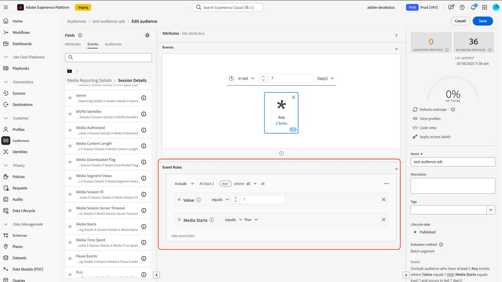

# 新しいストリーミングメディアフィールドへのオーディエンスの移行

このドキュメントでは、「Media」と呼ばれるAdobe ストリーミングメディアサービスのデータタイプのフィールドを使用するオーディエンスを、「[Media Reporting Details](https://experienceleague.adobe.com/en/docs/experience-platform/xdm/data-types/media-reporting-details)」と呼ばれる新しい対応するデータタイプを使用するように移行する方法について説明します。

## オーディエンスの移行

オーディエンスを「メディア」という古いデータタイプから「[&#x200B; メディアのレポートの詳細](https://experienceleague.adobe.com/en/docs/experience-platform/xdm/data-types/media-reporting-details)」という新しいデータタイプに移行するには、オーディエンスを編集し、各ルールで、廃止されたデータタイプの古いフィールドを、新しいデータタイプの新しい対応するフィールドに置き換える必要があります。

1. 非推奨の「メディア」データタイプのフィールドを含むルールを探します。 パス `media.mediaTimed`で始まるすべてのフィールドです。

1. 新しい「[Media Reporting Details](https://experienceleague.adobe.com/en/docs/experience-platform/xdm/data-types/media-reporting-details)」データタイプのフィールドを使用して、これらのルールを複製します。

1. オーディエンスが期待どおりに機能していることを検証するまで、両方のルールを導入し続けます。

1. 非推奨の「メディア」データタイプからフィールドを含むルールを削除します。

1. オーディエンスが期待どおりに機能していることを確認します。

古いフィールドと新しいフィールドの間のマッピングについては、[&#x200B; コンテンツ ID](/help/reporting/dimensions/content.md) パラメーターと、[&#x200B; ストリーミングメディアサービス &#x200B;](/help/media-overview.md)に記載されているストリーミングメディア変数の残りの部分を参照してください。 古いフィールドパスは「XDM フィールドパス」プロパティの下にあり、新しいフィールドパスは「レポート XDM フィールドパス」プロパティの下にあります。

## 例

移行ガイドラインに簡単に従えるように、単一のルールを持つオーディエンスを含む次の例を考えてみましょう。 オーディエンスにはルールが1つあるため、移行ガイドラインを1回だけ適用する必要があります。

1. 右上隅の「**[!UICONTROL オーディエンスを編集]**」ボタンを選択します。

1. オーディエンスに設定されたルールを探します。

   

   

1. ルールを選択して設定を開きます。

   

1. （オプション）ルールで使用されるフィールドのパスを表示するには、フィールド名の近くにある「情報」ボタンを選択します。

   

1. フィールド名を特定します（この場合は「メディア開始」）。

   

1. 古いフィールド間のマッピングについては、[&#x200B; ストリーミングメディアサービス &#x200B;](/help/media-overview.md)で説明されているストリーミングメディア変数を参照してください。 古いフィールドパスは「XDM フィールドパス」プロパティの下にあり、新しいフィールドパスは「レポート XDM フィールドパス」プロパティの下にあります。 例えば、[Media Starts](/help/reporting/metrics/media-starts.md) パラメーターの場合、`media.mediaTimed.impressions.value`の対応者は`xdm.mediaReporting.sessionDetails.isViewed`です。

   

1. 新しいフィールドを使用して、既存のルールと同じルールを追加します。

   

   

   

1. 「**[!UICONTROL 保存]**」を選択して、オーディエンスを保存します。 オーディエンスが期待どおりに機能していることを検証する必要がある限り、この設定を維持できます。

1. 検証が完了したら、古いフィールドを削除し、**[!UICONTROL 保存]**&#x200B;を選択してオーディエンスを保存します。

   

1. オーディエンスを再度検証します。

   オーディエンスの移行プロセスが完了しました。
