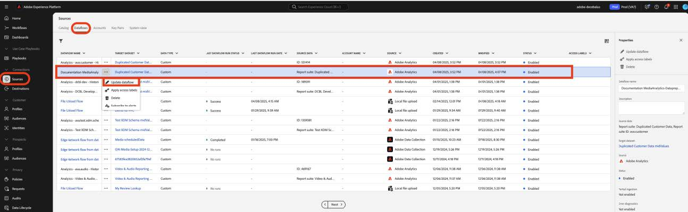
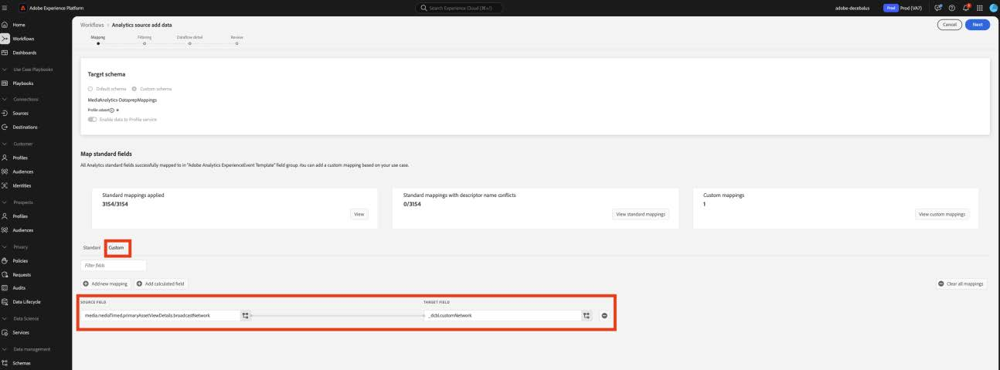
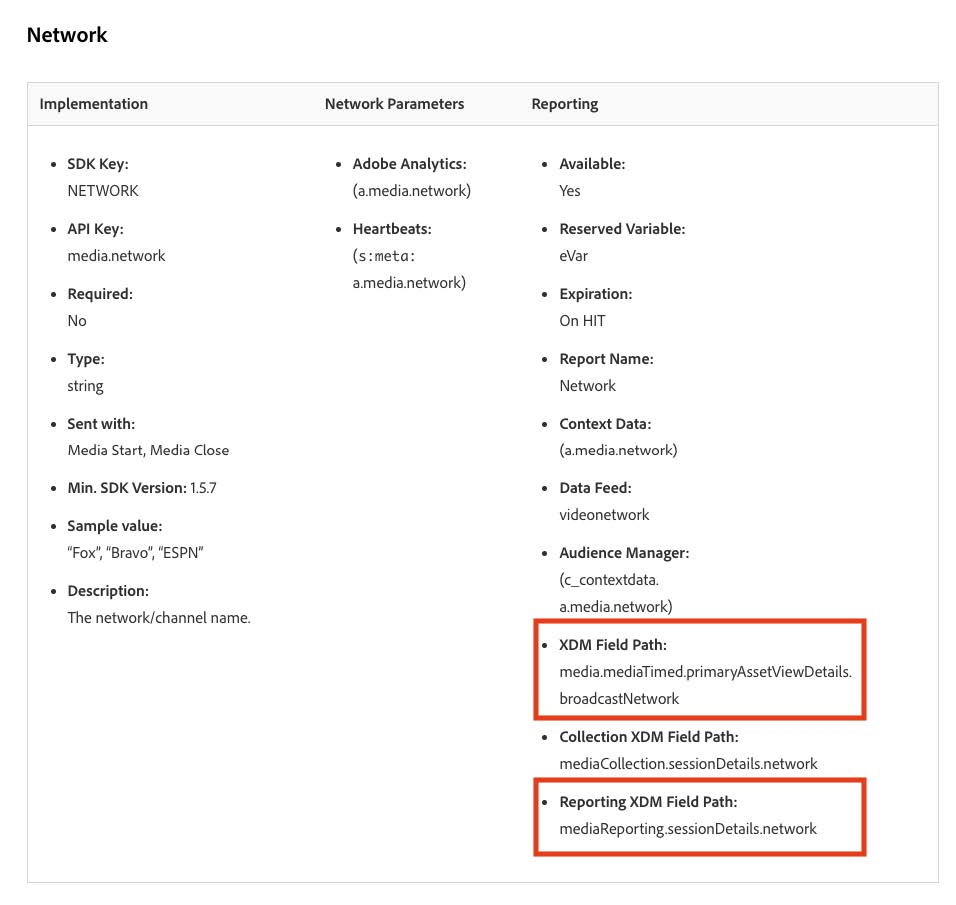

# カスタムフィールドのデータ準備を新しいストリーミングメディアフィールドに移行する

このドキュメントでは、Adobe Streaming Media Collection データに対して有効になっているAdobe Data Collection フローの上に存在するData Prep サービスを移行するプロセスについて説明します。 移行は、「Media」という名前のAdobe Streaming Media Collection データタイプからData Prep マッピングを変換して、「[Media Reporting Details](https://experienceleague.adobe.com/en/docs/experience-platform/xdm/data-types/media-reporting-details)」という名前の新しい対応するデータタイプを使用します。

## カスタムフィールドのデータ準備の移行

データ準備マッピングを「メディア」と呼ばれる古いデータ型から「[&#x200B; メディアのレポートの詳細](https://experienceleague.adobe.com/en/docs/experience-platform/xdm/data-types/media-reporting-details)」と呼ばれる新しいデータ型に移行するには、データ準備マッピングを編集する必要があります。

>[!IMPORTANT]
>
>データが失われるのを防ぐには、このセクションの手順を完了する前に、Analytics ソースコネクタが新しい`mediaReporting` フィールドを使用してデプロイされていることを確認します。

1. Adobe Experience Platformの「**[!UICONTROL ソース]**」セクションで、「**[!UICONTROL データフロー]**」タブに移動します。

1. Adobe Data Collectionを使用して、Adobe AnalyticsからAdobe Experience Platformにストリーミングメディアデータを読み込むデータフローを見つけます。

1. 非推奨フィールドを含むすべてのカスタムソースマッピングを、新しいXDM オブジェクトの新しい対応フィールドに置き換えて、**[!UICONTROL データフローの更新]**&#x200B;を選択して、データ準備の設定を変更します。

1. 非推奨の「メディア」オブジェクトのソースフィールドを含むマッピングを探します。

1. 新しい「Media Reporting Details」オブジェクトのフィールドを使用して、これらのソースを置き換えます。

1. マッピングが期待どおりに機能していることを確認します。

古いフィールドと新しいフィールドの間のマッピングについては、[&#x200B; コンテンツ ID](/help/reporting/dimensions/content.md) パラメーターと、[&#x200B; ストリーミングメディアサービス &#x200B;](/help/media-overview.md)に記載されているストリーミングメディア変数の残りの部分を参照してください。 古いフィールドパスは「XDM フィールドパス」プロパティの下にあり、新しいフィールドパスは「レポート XDM フィールドパス」プロパティの下にあります。

## 例

移行ガイドラインに簡単に従えるように、単一のマッピングを含む次のデータフローの例を考えてみましょう。 この場合、移行ガイドラインを1回だけ適用する必要があります。

1. Adobe Experience Platformの「**[!UICONTROL ソース]**」セクションで、「**[!UICONTROL データフロー]**」タブに移動します。

1. Adobe Data Collectionを使用して、Adobe AnalyticsからAdobe Experience Platformにストリーミングメディアデータを読み込むデータフローを見つけます。

1. 次の画像に示すように、**[!UICONTROL データフローを更新]**&#x200B;を選択して編集UIに入ります。

   

1. 「**[!UICONTROL マッピング]**」タブで、「**[!UICONTROL カスタム]**」を選択します。

1. `media.mediaTimed` フィールドに基づくカスタムマッピングをソースとして特定します。

   

   この例では、開発組織のスキーマにカスタムフィールドグループを作成したため、ターゲットフィールドは`_dcbl`未満です。 カスタムフィールドグループのパスは、組織名によって異なります。

1. `media.mediaTimed` オブジェクトを使用する各マッピングについて、このドキュメントを使用して`mediaReporting` オブジェクト内の対応するオブジェクトを見つけます。

   例えば、Networkの場合、`media.mediaTimed.primaryAssetViewDetails`.broadcastNetworkの通信相手は`xdm.mediaReporting.sessionDetails.network`です。

   

1. **[!UICONTROL Source フィールド]** フィールドで、`media.mediaTimed` パスを`mediaReporting` パスに置き換えます。 ターゲットフィールドは変更されません。

   

1. **[!UICONTROL 次へ]**&#x200B;を選択して変更を保存します。

   ステータスは&#x200B;**[!UICONTROL 処理中]**&#x200B;と表示されます。 変更が適用されると、ステータスは&#x200B;**[!UICONTROL 有効]**&#x200B;と表示されます。

   

## 異なるデータタイプを使用した例

上記の例では、関連するすべてのデータタイプがStringだったので、マッピングの置換は直接でした。

ソースフィールドのデータタイプがターゲットフィールドのデータタイプと異なる場合は、[&#x200B; データ準備のトラブルシューティングガイド &#x200B;](https://experienceleague.adobe.com/en/docs/experience-platform/data-prep/troubleshooting-guide)、[&#x200B; データ準備](https://experienceleague.adobe.com/en/docs/experience-platform/data-prep/data-handling)でのデータ形式の処理、[&#x200B; データ準備マッピング関数](https://experienceleague.adobe.com/en/docs/experience-platform/data-prep/data-handling)のガイドラインに従う必要があります。

例えば、ソースタイプが文字列で、ターゲットタイプがブール値の場合、Data Prepは値を自動的に解析し、ソース値をブール値に変換できます。

ソース型が数値で、ターゲット型がブール値の場合は、データ操作関数を使用する必要があります。

`media.mediaTimed`をカスタムフィールドにマッピングしています。

`mediaReporting`と同じカスタムフィールドへのマッピング：

