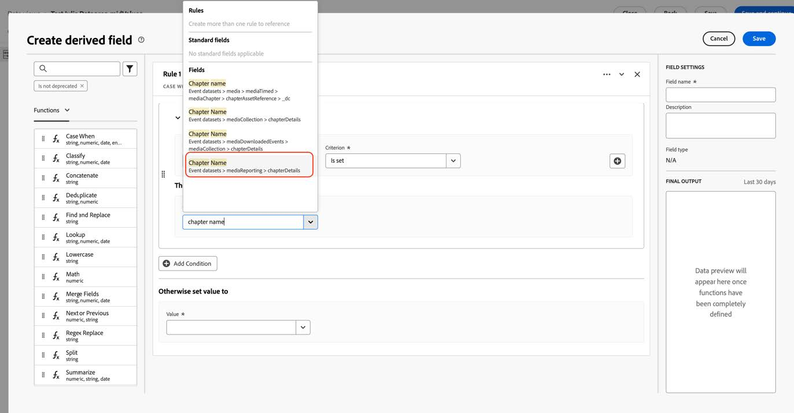
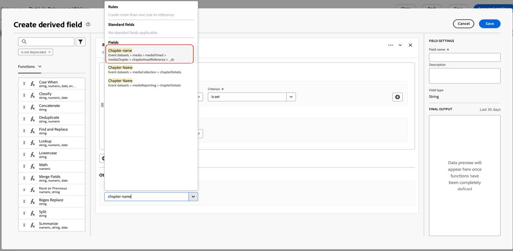
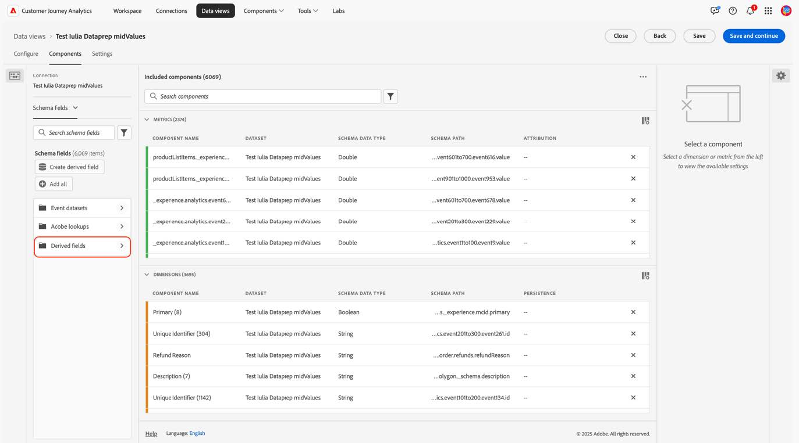

# Customer Journey Analyticsを移行して、新しいストリーミングメディアフィールドを使用する

このドキュメントでは、「Media」という名前のAdobe ストリーミングメディアサービスのデータタイプを使用するCustomer Journey Analyticsの設定を、「[Media Reporting Details](https://experienceleague.adobe.com/en/docs/experience-platform/xdm/data-types/media-reporting-details)」という名前の新しい対応するデータタイプを使用するように更新する方法について説明します。

## Customer Journey Analyticsの移行

Customer Journey Analytics設定を「Media」という古いデータ型から「[Media Reporting Details](https://experienceleague.adobe.com/en/docs/experience-platform/xdm/data-types/media-reporting-details)」という新しいデータ型に移行するには、古いデータ型を使用している次の設定を更新する必要があります。

* データビュー

* 派生フィールド

### データビューの移行

データビューを新しいデータタイプに移行するには：

1. 非推奨の「メディア」データタイプを使用して、すべてのデータビューを検索します。 これは、パスが`media.mediaTimed`で始まるすべてのフィールドです。

1. 次のいずれかの操作を行います。

   * これらのデータビューで、新しい「Media Reporting Details」データタイプからフィールドを挿入します。

   * 新しい「Media Reporting Details」データタイプが設定されている場合は使用する、新しい「Media Reporting Details」データタイプが設定されていない場合は古い「Media」データタイプにフォールバックする派生フィールドを作成します。

### 派生フィールドの移行

派生フィールドを新しいデータタイプに移行するには：

1. 非推奨の「メディア」データタイプを使用して、すべての派生フィールドを探します。 これは、パスが`media.mediaTimed`で始まるフィールドを含むすべての派生フィールドです。

1. 派生フィールドのすべての古いフィールドを、「Media Reporting Details」の新しい対応するフィールドに置き換えます。

古いフィールドと新しいフィールドの間のマッピングについては、[&#x200B; コンテンツ ID](/help/reporting/dimensions/content.md) パラメーターと、[&#x200B; ストリーミングメディアサービス &#x200B;](/help/media-overview.md)に記載されているストリーミングメディア変数の残りの部分を参照してください。 古いフィールドパスは「XDM フィールドパス」プロパティの下にあり、新しいフィールドパスは「レポート XDM フィールドパス」プロパティの下にあります。

## 例

移行ガイドラインに従いやすくするために、古い非推奨の「メディア」データタイプのフィールドを含むデータビューを含む次の例を考えてみましょう。 このデータビューでは、対応する新しいフィールドを追加する必要があります。

### データビューの更新

次のいずれかのオプションを使用して、データビューを更新できます。

#### オプション 1

1. 非推奨のデータタイプから、古いフィールドを使用している指標またはディメンションを探します。

   

1. [章オフセット &#x200B;](/help/reporting/dimensions/chapter-offset.md)記事の対応する新しいフィールドを確認してください。

1. データビューで、新しい対応するフィールドを見つけます。

   

1. 新しいフィールドを指標またはディメンションにドラッグします。

1. 非推奨の「メディア」データタイプのフィールドを使用するすべての指標とディメンションに対して、このプロセスを繰り返します。

#### オプション 2

このオプションは、特定のイベントに存在するフィールドに基づいて、古いフィールドの値または新しいフィールドの値を選択する派生フィールドを作成します。 この派生フィールドは、使用されているプロジェクトの古い「メディア」データタイプを置き換えます。

新しい「Media Reporting Details」データタイプが設定されている場合は「Chapter Name」の派生フィールドを作成する場合、または「Media Reporting Details」データタイプが設定されていない場合は古い「Media」データタイプにフォールバックする場合：

1. 「Case When」句を派生フィールドにドラッグします。

   

1. [章名](/help/reporting/dimensions/chapter-name.md) ページに示すように、**レポート XDM フィールドパス**&#x200B;の値を使用して&#x200B;[!UICONTROL **If**]&#x200B;句を入力します。

   

   

   

   

1. 非推奨の「メディア」データタイプの古いフィールドを使用してフォールバック値を入力します。

   

   

   これが派生フィールドの最終的な定義です。

   

1. 派生フィールドを更新するには、古い非推奨フィールド（`media.mediaTimed`で始まるパス）を使用している派生フィールドを見つけます。

   

1. 更新する派生フィールドにマウスポインターを置き、[!UICONTROL **編集**] アイコンを選択します。

1. 古いデータタイプ（`media.mediaTimed`で始まるパス）のすべてのフィールドを見つけ、新しい対応するフィールドに置き換えます。

   

1. [&#x200B; コンテンツ名](/help/reporting/dimensions/content-name.md)記事の対応する新しいフィールドを確認してください。

1. 古いフィールドを新しいフィールドに置き換えます。

   

1. 古い非推奨の「メディア」データタイプのフィールドを使用して、すべての派生フィールドに対してこのプロセスを繰り返します。

   CJA設定の移行が完了しました。
