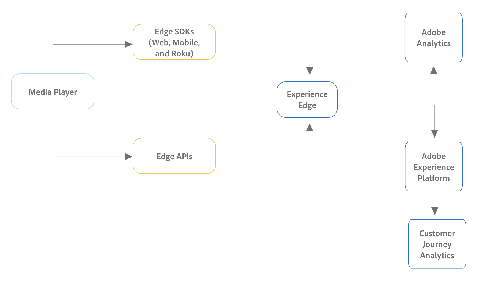

# Adobe AnalyticsまたはCustomer Journey Analytics用のストリーミングメディアサービスの導入

Adobeのストリーミングメディアサービスを導入するには、さまざまな方法があります。 このページで説明している実装方法でサポートされるデバイスとプラットフォームの比較について詳しくは、[サポートされるデバイスとプラットフォーム](/help/getting-started/supported-devices.md)を参照してください。

## Edge の実装方法

Adobe AnalyticsまたはCustomer Journey Analyticsの新規のお客様にストリーミングメディアサービスを実装する場合は、Edgeを使用することをお勧めします。

Edgeの実装方法では、Streaming Media Collection アドオンを使用します。

* **Media for Edge Network SDK / Extension:** Web、iOSおよびAndroid デバイス、またはRoku デバイスからデータを収集し、Edge Networkに送信します。 その後、データを Customer Journey Analytics または Adobe Analytics に送信できます。

  Media for Edge Network SDK / Extensionについて詳しくは、[Edge Networkを使用したStreaming Media Collectionの実装](/help/implementation/edge/implementation-edge.md)を参照してください。

* **Media Edge API:**&#x200B;は、任意のデバイスまたはフォーマット（モバイル、web、オーバーザトップ デバイスを含む）からデータを収集し、Edge Networkにデータを送信するようにカスタマイズできます。 その後、データを Customer Journey Analytics または Adobe Analytics に送信できます。

  Media Edge APIについて詳しくは、[Media Edge APIの概要](https://developer.adobe.com/cja-apis/docs/endpoints/media-edge/)を参照してください。

## Adobe Analytics のみの実装方式

上記の Edge 実装方式は、Customer Journey Analytics と Adobe Analytics の両方、特に新しい実装の場合に推奨されます。

Edge 実装方式に加えて、他の実装方式も使用できます。 これらの実装方式は、Adobe Analytics で使用するために設計されました。 ただし、次のいずれかの実装方法を使用している既存の顧客は、[Analytics ソース接続](https://experienceleague.adobe.com/docs/experience-platform/sources/ui-tutorials/create/adobe-applications/analytics.html?lang=ja)を作成することで、Customer Journey Analytics でデータを使用できるようにすることができます。

Adobe Analyticsのみの実装方法では、Adobe Analytics for Streaming Media アドオンを使用します。

* **タグ付きのメディア拡張機能：** Adobe Medium Analytics for Audio and Video 拡張機能は、タグが有効なサイトまたはプロジェクトにメディアトラッカーインスタンスを追加する機能を提供します。 データは Adobe Analytics に送信されます。

  タグ付きのメディア拡張機能のインストール、設定、実装について詳しくは、[Adobe Media Analytics (3.x SDK) for Audio and Video 拡張機能の概要](https://experienceleague.adobe.com/docs/experience-platform/tags/extensions/client/media-analytics-3x/overview.html?lang=ja)を参照してください。

* **Media SDK：** Media SDK を使用すると、web サイト、携帯電話、コネクテッド TV、タブレット、OTT デバイス、セットトップボックス、ゲームコンソールなど、複数のメディアプラットフォームを測定できます。 （詳しくは、[サポートされるデバイスとプラットフォーム](/help/getting-started/supported-devices.md)を参照してください）。

  Media SDK は、Media Collection API をトラッキングに使用します。 データは Adobe Analytics に送信されます。

  Media SDK と拡張機能のダウンロードとインストールについて詳しくは、[Media SDK、タグを使用した拡張機能、OTT SDK の取得](/help/getting-started/download-sdks.md)を参照してください。

* **Media Collection API：** Media Collection API はカスタマイズ可能なので、カスタムトラッキング機能を必要とするアプリケーションや、Media SDK でサポートされていないデバイスに使用できます。 Media Collection API は、RESTful HTTP 呼び出しを使用してオーディオおよびビデオイベントを追跡します。 データは Adobe Analytics に送信されます。

  Media Collection API の使用について詳しくは、[Media Collection API](media-collection-api/mc-api-overview.md) を参照してください。

<!--
(Not sure if we need the following paragraph and graphic. Paragraph is somewhat redundant with the intro paragraph of this article)
Choose the implementation method depending on the supported platforms. Some players are not supported by the Media SDKs or the Adobe Experience Platform Media Extensions. The Media Collection APIs provide a way to support those players. For information on supported devices, see [Supported devices and platforms](/help/getting-started/supported-devices.md).

-->
