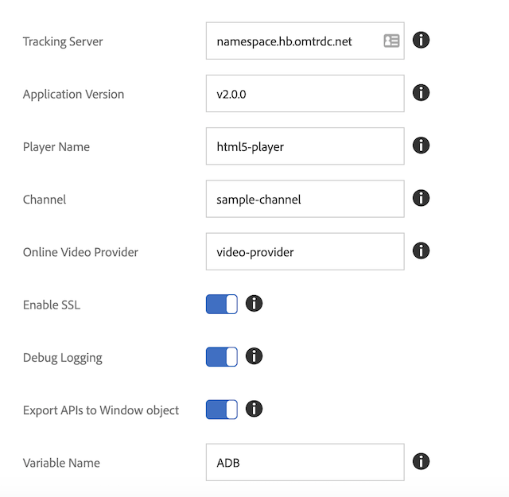

# スタンドアロンの Media SDK から Adobe Launch - Web（JS）への移行

>[!NOTE]
>Adobe Experience Platform Launch は、Experience Platform のデータ収集テクノロジースイートとしてリブランドされています。 その結果、製品ドキュメント全体でいくつかの用語の変更がロールアウトされました。 用語の変更点の一覧については、次の[ドキュメント](https://experienceleague.adobe.com/docs/experience-platform/tags/term-updates.html?lang=ja)を参照してください。

## 機能の違い

* *Launch* - Launch は、Web ベースのメディアトラッキングソリューションの設定、構成およびデプロイの手順を示す UI を提供します。 Launch は、Dynamic Tag Management（DTM）を改善したものです。
* *Media SDK* - Media SDK は、特定のプラットフォーム向けに設計されたメディアトラッキングライブラリ（例：Android、iOSなど）を提供します。 モバイルアプリケーションでのメディア使用状況を追跡する際には、Media SDK をお勧めします。

## 設定

### スタンドアロンの Media SDK

スタンドアロンのMedia SDKでは、アプリでトラッキング設定を設定します
SDKに渡します。

```javascript
//Media Heartbeat initialization
var mediaConfig = new MediaHeartbeatConfig();
mediaConfig.trackingServer = "namespace.hb.omtrdc.net";
mediaConfig.playerName = "html5-player";
mediaConfig.channel = "sample-channel";
mediaConfig.ovp = "video-provider";
mediaConfig.appVersion = "v2.0.0"
mediaConfig.ssl = true;
mediaConfig.debugLogging = true;
```

`MediaHeartbeat`設定に加えて、ページを設定して渡す必要があります
メディアトラッキング用の`AppMeasurement` インスタンスと`VisitorAPI` インスタンスを順番に実行します
適切に機能させる必要があります。

### Launch 拡張機能

1. Experience Platform Launchで、[!UICONTROL 拡張機能] タブをクリックします
web プロパティ。
1. 「[!UICONTROL  カタログ ]」タブで、Adobe Media Analytics for Audioと
ビデオ拡張機能を選択し、[!UICONTROL  インストール ]をクリックします。
1. 拡張機能の設定ページで、トラッキングパラメーターを設定します。
メディア拡張機能では、設定済みのパラメーターをトラッキングに使用します。

   

[起動ユーザーガイド – メディア拡張機能のインストールと設定](https://experienceleague.adobe.com/docs/experience-platform/tags/extensions/adobe/media-analytics/overview.html?lang=ja#install-and-configure-the-ma-extension)

## トラッカーの作成の違い

### メディア SDK

1. 開発プロジェクトに Media Analytics ライブラリを追加します。
1. 設定オブジェクト（`MediaHeartbeatConfig`）を作成します。
1. `getQoSObject()` および `getCurrentPlaybackTime()` を公開する delegate プロトコルを実装します。
1. メディアハートビートインスタンス（`MediaHeartbeat`）を作成します。

```
// Media Heartbeat initialization
var mediaConfig = new MediaHeartbeatConfig();
...
// Configuration settings
mediaConfig.trackingServer = Configuration.HEARTBEAT.TRACKING_SERVER;
...
// Implement Media Delegate (Quality of Service and Playhead)
var mediaDelegate = new MediaHeartbeatDelegate();
...
mediaDelegate.getQoSObject = function() {
    return MediaHeartbeat.createQoSObject(<bitrate>, <startuptime>, <fps>, <droppedFrames>);
    ...
}
...
// Create your tracker
this.mediaHeartbeat = new MediaHeartbeat(mediaDelegate, mediaConfig, appMeasurement);
```

### Launch

Launch は、トラッキングインフラストラクチャを作成する 2 つの方法を提供します。 いずれの方法でも、Media Analytics Launch 拡張機能を使用します。

1. Web ページからメディアトラッキング API を使用します。

   このシナリオでは、Media Analytics 拡張機能が、グローバルウィンドウオブジェクトの設定済み変数にメディアトラッキング API をエクスポートします。

   ```
   window["CONFIGURED_VARIABLE_NAME"].MediaHeartbeat.getInstance
   ```

1. 別の Launch 拡張機能のメディアトラッキング API を使用します。

   このシナリオでは、`get-instance` および `media-heartbeat` 共有モジュールで公開されているメディアトラッキング API を使用します。

   >[!NOTE]
   >
   >共有モジュールは Web ページでは使用できません。 他の拡張機能の共有モジュールのみを使用できます。

   `get-instance` 共有モジュールを使用して `MediaHeartbeat` インスタンスを作成します。
delegate オブジェクトを、`getQoSObject()` および `getCurrentPlaybackTime()`　関数を公開する `get-instance` に渡します。

   ```
   var getMediaHeartbeatInstance =
   turbine.getSharedModule('adobe-video-analytics', 'get-instance');
   ```

   `media-heartbeat`共有モジュールを使用して `MediaHeartbeat` 定数にアクセスします。

## 関連ドキュメント

### メディア SDK

* [JavaScript 2.x のセットアップ](/help/legacy/media-sdk/setup/setup-javascript/set-up-js-2.md)
* [Media SDK JS API](https://adobe-marketing-cloud.github.io/media-sdks/reference/javascript/MediaHeartbeat.html)

### Launch

* [ローンチの概要](https://experienceleague.adobe.com/docs/experience-platform/tags/home.html?lang=ja)
* [Media Analytics拡張機能](https://experienceleague.adobe.com/docs/experience-platform/tags/extensions/adobe/media-analytics/overview.html?lang=ja)
