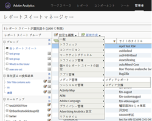
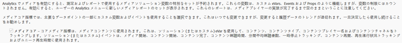
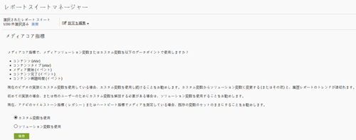
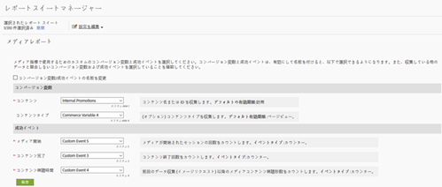

# マイルストーンの概要 {#milestone-overview}

>[!CAUTION]
>
>この測定オプションは非推奨です。

[レガシーのマイルストーンドキュメント](milestone_analytics_video.pdf)

## 設定 {#configuration}

### マイルストーンビデオの設定

ビデオを追跡するには、追跡とレポートに使用される&#x200B;*カスタムコンバージョン変数*（eVar）と&#x200B;*カスタムイベント*&#x200B;のセットを指定します。また、1 つの&#x200B;*カスタムインサイト*&#x200B;変数（）もパスに使用されます。`s.prop`

それぞれの指標に対して選択した変数がビデオ設定ページに追加されます。これにより、システムは、自動的に標準ビデオレポートを生成し、書式設定します。*ビデオ名* eVar と&#x200B;*ビデオビュー*&#x200B;カウンターの両方が必要です。その他の変数は任意ですが、完全な測定をおこなううえで推奨されます。ビデオトラッキングを有効にしたら、ビデオトラッキングを使用してレポートしたビデオデータから生成されたレポートを表示できます。

さらに、ビデオに関する任意の数の追加指標を追跡できます。例えば、サイトで複数のビデオプレーヤーを使用している場合は、eVar にプレーヤー名を格納できます。選択した変数のいくつかは、サイトの他の領域でも使用される場合があります。例えば、サイト全体で使用される&#x200B;*コンテンツタイプ*&#x200B;変数を利用すると、ビデオから取得されたページ表示の割合を測定したり、コンバージョンイベントをビデオに関連付けたりできます。

### マイルストーンレポートの設定

マイルストーン実装用にビデオレポートを設定するには、**[!UICONTROL 管理者／レポートスイートマネージャー]に移動します。**&#x200B;レポートスイートを選択し、**[!UICONTROL ビデオ管理／ビデオレポート]を選択します。**

<!--{width="248"}-->


最初の画面では、マイルストーンデータと共に使用できるのはビデオコアのみです。「**[!UICONTROL ビデオコア]**」を選択し、「**[!UICONTROL 保存]」を選択します。**



次の画面で、「**[!UICONTROL カスタム変数を使用]」を選択します。**

<!--{width="470"}-->


最後の画面で、次のように、ビデオ測定で使用する 2 つの eVar と 3 つのイベントを選択します。

<!---->


## ビデオ変数リファレンス {#video-variable-reference}

次の表に、ビデオのコマース変数とカスタムイベントの詳細を示します。

| ビデオ指標 | 変数の種類 | 説明 |
| --- | --- | --- |
| コンテンツ | eVar<br/>デフォルトの有効期限：訪問 | （必須）実装での指定に従って、ビデオの名前を収集します。 |
| コンテンツタイプ | eVar<br/>デフォルトの有効期限：ページビュー | 訪問者によって閲覧されたコンテンツのタイプに関するデータを収集します。ビデオ測定によって送信されるヒットには、コンテンツタイプ `video.` が割り当てられます。<br/>この変数は、ビデオ追跡専用に予約する必要はありません。同じ変数を使用する他のコンテンツレポートコンテンツタイプを使用することにより、異なるコンテンツのタイプでの訪問者の分布を分析できます。例えば、この変数を使用する `article` や `product page` などの値を使用して、他のコンテンツタイプにタグを付けることができます。<br/>ビデオ測定の見地からすると、*コンテンツタイプ*&#x200B;を使用することによってビデオ訪問者を識別でき、その結果、ビデオのコンバージョン率を計算できます。 |
| コンテンツ視聴時間 | イベント<br/>タイプ：カウンター | 前回のデータ収集プロセス（イメージリクエスト）以降のビデオ視聴秒数をカウントします。 |
| ビデオ開始 | イベント<br/>タイプ：カウンター | 訪問者がビデオの一部を視聴したことを示します。ただし、訪問者がビデオを視聴した時間や視聴した部分に関する情報は提供されません。 |
| ビデオ完了 | event <br/>タイプ：カウンター | ユーザーがビデオを最後まで視聴したことを示します。デフォルトでは、完了イベントはビデオが終了する 1 秒前に測定されます。<br/>導入時に、表示完了と見なすビデオの終わりからの秒数を指定できます。終わりが定義されないライブビデオやその他のストリーミングの場合は、完了を測定するためのカスタムポイントを指定できます。例えば、表示開始から特定の時間が経過したポイントなどです。 |

## メディアモジュール変数 {#media-module-variables}

次の変数を使用して、ビデオ測定を設定できます。「必須変数」の表に示した変数に対する値を定義する必要があります。また、ビデオプレーヤーでイベントを追跡するには、autoTrack を有効にするか（サポートされているプレーヤーの場合）、open、play、stop および close の各メソッドを使用してカスタムプレーヤーイベント追跡を導入する必要があります。

| 変数    | 説明 |
| --- | --- |
| `Media.trackUsingContextData` | **構文：** <br/><br/> `s.Media.trackUsingContextData = true;`<br/>このオプションは、統合ビデオトラッキングを有効にします。true に設定すると、メディアモジュールは、従来の `pev3` ではなく、メディアトラッキングのコンテキストデータを生成します。<br/>`Media.contextDataMapping` を使用して、選択した eVar および event にコンテキストデータをマッピングします。<br/>デフォルト値: `false` |
| `Media.contextDataMapping` | **構文：** <br/><br/> `s.Media.contextDataMapping = {`<br/>      `"a.media.name":"eVar2, prop2",` <br/>     `"a.media.segment":"eVar3",` <br/>     `"a.contentType":"eVar1",` <br/>     `"a.media.timePlayed":"event3",` <br/>     `"a.media.view":"event1",` <br/>     `"a.media.segmentView":"event2",` <br/>     `"a.media.complete":"event7",` <br/>     `"a.media.milestones":{` <br/>         `25:"event4",` <br/>         `50:"event5",` <br/>         `75:"event6"` <br/>     ` }` <br/> `};`<br/><br/>ビデオ測定に使用する eVar および event への変数マッピングを定義するオブジェクトです。オブジェクトでは、次のフィールドをマッピングする必要があります。<br/><br/> **a.media.name：**（必須）変数にビデオ名を入力します。ビデオ名の格納先として選択した eVar と、ビデオパス用に使用するカスタムインサイトビデオ変数（`s.prop`）を指定します。値はコンマ区切りリストで指定します。<br/><br/> **a.media.segment：**（オプション）メディアセグメント名の格納先の eVar です。a.contentType：（オプション）ビデオ値の格納先の eVar。これには、ビデオの訪問回数および訪問者数のレポート生成が有効にされた、訪問回数および訪問者数の追跡機能が含まれます。選択する変数は、記事、スライドショー、製品ページというように、データの格納に既に使用されているものの場合もあります。<br/><br/> **a.media.view：**（必須）メディアビューをカウントするイベントです。<br/><br/> **a.media.segmentView：**（オプション）セグメントビューをカウントするイベントです。<br/><br/> **a.media.complete：**（オプション）視聴の完了をカウントするイベントです。<br/><br/> **a.media.timePlayed：**（オプション、推奨）ビデオの再生秒数を格納する数値のイベントです。<br/><br/> **a.media.milestones：**（オプション）s.Media.trackMilestones マイルストーンをカウンターイベントにマッピングするオブジェクトです。マイルストーンを定義する場合は、Media.segmentByMilestones を true に設定する必要があります。 <br/><br/> **広告トラッキング** 広告を追跡するには、以下のコンテキストデータ編集を使用できます。<br/> **a.media.ad.name：**（必須）変数に広告名を入力します。広告名の格納先として選択した eVar と、パス用に使用するカスタムインサイトビデオ変数（`s.prop`）を指定します。値はコンマ区切りリストで指定します。<br/><br/> **a.media.ad.pod：**&#x200B;広告が表示されたプライマリコンテンツ内の位置。<br/><br/> **a.media.ad.podPosition：**&#x200B;広告が表示されるポッド内の位置。<br/><br/> **a.media.ad.CPM：**&#x200B;この再生に適用される CPM または暗号化された CPM（「~」のプレフィックスが付く）。<br/><br/> **a.media.ad.view：** と同じように機能します。`a.media.view`<br/><br/> **a.media.ad.clicked：**&#x200B;広告のクリック数をカウントします（`Media.click` 呼び出し）。<br/><br/> **a.media.ad.timePlayed：** と同じように機能します。`a.media.timePlayed`<br/><br/> **a.media.ad.complete：** `a.media.complete` と同じように機能します。a.media.ad.segment：`a.media.segment` と同じように機能します。 <br/><br/> **a.media.ad.segmentView：** と同じように機能します。`a.media.segmentView`<br/><br/> **a.media.ad.milestones：** と同じように機能します。`a.media.milestones`<br/><br/> **a.media.ad.offsetMilestones：** と同じように機能します。`a.media.offsetMilestones` |
| `Media.trackVars` | **構文：** <br/><br/> `s.Media.trackVars =` <br/> `"events,``prop2,``eVar1,``eVar2,``eVar3";`<br/><br/>ビデオ追跡コードに設定されるすべての変数のコンマ区切りリストです。 |
| `Media.trackEvents` | **構文：** <br/><br/> `s.Media.trackEvents =` <br/> `"event1,``event2,``event3,``event4,``event5,``event6,``event7"`<br/><br/>ビデオ追跡コードに設定されるすべてのイベントのコンマ区切りリストです。 |

## オプションの変数 {#optional-variables}

|  変数    | 説明 |
| --- | --- |
| `Media.autoTrack` | **構文：** <br/><br/> `s.Media.autoTrack = true`<br/><br/>サポートされているプレーヤーの自動追跡を有効にします。サポートされているプレーヤーは次のとおりです。 <ul> <li> Open Source Media Framework（OSMF） </li> <li> FLVPlayback（Flash Professional のビデオのインポートウィザードによって作成されるビデオプレーヤー） </li> <li> Silverlight </li> <li> MediaDisplay </li> <li> MediaPlayback </li> <li> Brightcove API バージョン 2 および 3（[Brightcove](https://marketing.adobe.com/resources/help/ja_JP/sc/appmeasurement/video/video_other_players.html) を参照） </li> <li> JavaScript を使用する、Windows Media Player、Quicktime または Real Player </li> </ul> <br/><br/>以上のプレーヤーの中の 1 つを使用しない場合は、`Media.open`、`Media.play`、`Media.stop`、`Media.close` を使用して、プレーヤーイベントを追跡できます。 |
| `Media.autoTrackNetStreams` | **構文：** <br/><br/> `s.Media.autoTrackNetStreams = true`<br/><br/>Flash 10.3 では、拡張ビデオトラッキングを可能にする新しい機能が NetStream コンポーネントに追加されました。カスタム Flash NetStream プレーヤーを使用する場合は、この変数を有効にすることで、autoTrack と同様の機能を有効にできます。このメソッドを使用するには、ビデオが Flash 10.3 以降で視聴されている必要があります。 |
| `Media.completeByCloseOffset` | **構文：** <br/><br/> <br/><br/>`s.Media.completeByCloseOffset = true`<br/><br/>この設定を使用すると、実際にビデオの最後に到達する数秒前に、ビデオビューの完了としてカウントできます。<br/><br/>イベントは、`completeCloseOffsetThreshold` で指定されている秒数に基づいて送信されます。これにより、ビデオの長さに等しいオフセットの報告を実行しないビデオプレーヤーでも、完了を測定できます。<br/><br/>デフォルトでは、この値は true に設定され、しきい値は 1 秒に設定されます。これらのデフォルトでは、完了イベントは、ビデオの最後の 1 秒前に送信されます。 |
| `Media.completeCloseOffsetThreshold` | **構文：** <br/><br/> `s.Media.completeCloseOffsetThreshold = 1`<br/><br/>このしきい値を使用すると、実際にビデオの最後に到達する数秒前に、ビデオビューの完了としてカウントできます。このしきい値を使用するには、`Media.completeByCloseOffset` を true に設定する必要があります。<br/><br/>指定する整数値によって、close 時に完了としてカウントされる、ビデオの長さからのオフセットの値（秒数）が決まります。これにより、ビデオの長さに等しいオフセットの報告を実行しないビデオプレーヤーでも、完了を測定できます。<br/><br/>しきい値のデフォルトは 1 秒です。 |
| `Media.playerName` | **構文：** <br/><br/> `s.Media.playerName = "Custom Player Name"`<br/><br/>カスタムビデオプレーヤー名を指定します。 |
| `Media.trackSeconds` | **構文：** <br/><br/> `s.Media.trackSeconds = 15`<br/><br/>ビデオ再生中にビデオトラッキングデータを Adobe データ収集サーバーへ送信する時間間隔を秒数で定義します。値は 5 秒単位の増分で設定する必要があります。<br/><br/> `Media.trackSeconds` を有効にすると、`Media.contextDataMapping` で定義されているイベントのみがトリガーされます。ビデオ測定のために指定以外の変数を追加で送信するには、Media.Monitor を使用する必要があります。 |
| `Media.trackMilestones` | ビデオの長さに対する割合として、マイルストーンを追跡します。<br/><br/> **構文：** <br/><br/> `s.Media.trackMilestones = "25, 50, 75";`<br/><br/>ビデオトラッキングデータを Adobe データ収集サーバーに送信する時間間隔を、ビデオの長さの割合として定義します。整数のコンマ区切りリストとしてマイルストーンを指定します。例えば、10 は 10％を表し、23 は 23％を表します。<br/><br/>これらのマイルストーンはビデオ内の固定ポイントなので、訪問者が 10％のマイルストーンをまたいで視聴し、その後に巻戻しを実行して、もう一度 10％のマイルストーンを通過した場合、メディアモジュールは追跡データを複数回送信します。同様に、ある訪問者が早送りしてマイルストーンを通過した場合、そのマイルストーンについての追跡データはメディアモジュールによって送信されません。<br/><br/> `Media.trackMilestones` を有効にすると、`Media.contextDataMapping` で定義されているイベントのみがトリガーされます。ビデオ測定のために指定以外の変数を追加で送信するには、Media.Monitor を使用する必要があります。 |
| `Media.trackOffsetMilestones` | ビデオの開始時点からの経過秒数としてマイルストーンを追跡します。<br/><br/> **構文：** <br/><br/> `s.Media.trackOffsetMilestones = "20, 40, 60";`<br/><br/>ビデオトラッキングデータを Adobe データ収集サーバーに送信する時間間隔を、ビデオの開始時点からの経過秒数として定義します。整数のコンマ区切りリストとしてマイルストーンを指定します。例：20 = 20 秒、40 = 40 秒。<br/><br/>これらのマイルストーンはビデオ内の固定ポイントなので、訪問者が 20 秒のマイルストーンをまたいで視聴し、その後に巻戻しを実行して、もう一度 20 秒のマイルストーンを通過した場合、メディアモジュールは追跡データを複数回送信します。同様に、ある訪問者が早送りしてマイルストーンを通過した場合、そのマイルストーンについての追跡データはメディアモジュールによって送信されません。<br/><br/> `Media.trackOffsetMilestones` を有効にすると、`Media.contextDataMapping` で定義されているイベントのみがトリガーされます。ビデオ測定のために指定以外の変数を追加で送信するには、Media.Monitor を使用する必要があります。 |
| `Media.segmentByMilestones` | **構文：** <br/><br/> `s.Media.segmentByMilestones = true;` <br/><br/>メディアの長さと `Media.trackMilestones` で指定されているマイルストーンに基づいて、セグメント名、セグメント番号、セグメントの長さのデータを自動的に生成します。<br/><br/>マイルストーンによってセグメントに分割する方法は、`autoTrack` を使用する場合にセグメントを定義する唯一の方法です。<br/><br/>デフォルト値: `false` |
| `Media.segmentByOffsetMilestones` | **構文：** <br/><br/> `s.Media.segmentByOffsetMilestones = true;` <br/><br/>メディアの長さと `Media.trackOffsetMilestones` で指定されているマイルストーンに基づいて、セグメント名、セグメント番号、セグメントの長さのデータを自動的に生成します。<br/><br/>マイルストーンによってセグメントに分割する方法は、`autoTrack` を使用する場合にセグメントを定義する唯一の方法です。<br/><br/>デフォルト値: `false` |

## 広告トラッキング変数 {#ad-tracking-variables}

これらの変数は、openAd メソッドと組み合わせて広告情報を送信するために使用されます。[VAST ビデオ広告トラッキング](https://marketing.adobe.com/resources/help/ja_JP/sc/appmeasurement/video/video_ads.html)を参照してください。

| 変数    | 説明 |
| --- | --- |
| `Media.adTrackSeconds` | **構文：** <br/><br/> `s.Media.adTrackSeconds = 15;`<br/><br/>ビデオ再生中にビデオ広告トラッキングデータを Adobe データ収集サーバーに送信する時間間隔を秒数で定義します。値は 5 秒単位の増分で設定する必要があります。<br/><br/> `Media.adTrackSeconds` を有効にすると、`Media.contextDataMapping` で定義されているイベントのみがトリガーされます。ビデオ測定のために指定以外の変数を追加で送信するには、`Media.monitor` を使用する必要があります。 |
| `Media.adTrackMilestones` | 広告の長さに対する割合として、広告マイルストーンを追跡します。<br/><br/> **構文：** <br/><br/> `s.Media.adTrackMilestones = "25, 50, 75";`<br/><br/>広告トラッキングデータを Adobe データ収集サーバーに送信する時間間隔を、広告の長さの割合として定義します。整数のコンマ区切りリストとしてマイルストーンを指定します。例えば、10 は 10% を表し、23 は 23% を表します。<br/><br/>これらのマイルストーンは広告内の固定ポイントなので、訪問者が 10％のマイルストーンをまたいで視聴し、その後に巻戻しを実行して、もう一度 10％のマイルストーンを通過した場合、メディアモジュールは追跡データを複数回送信します。同様に、ある訪問者が早送りしてマイルストーンを通過した場合、そのマイルストーンについての追跡データはメディアモジュールによって送信されません。<br/><br/> `Media.adTrackMilestones` を有効にすると、`Media.contextDataMapping` で定義されているイベントのみがトリガーされます。ビデオ測定のために指定以外の変数を追加で送信するには、`Media.monitor` を使用する必要があります。 |
| `Media.adTrackOffsetMilestones` | 広告の開始時点からの経過秒数として広告マイルストーンを追跡します。<br/><br/> **構文：** <br/><br/> `s.Media.adTrackOffsetMilestones = "20, 40, 60";`<br/><br/>広告トラッキングデータを Adobe データ収集サーバーに送信する時間間隔を、広告の開始時点からの経過秒数として定義します。整数のコンマ区切りリストとしてマイルストーンを指定します。例：20 = 20 秒、40 = 40 秒。<br/><br/>これらのマイルストーンは広告内の固定ポイントなので、訪問者が 20 秒のマイルストーンをまたいで視聴し、その後に巻戻しを実行して、もう一度 20 秒のマイルストーンを通過した場合、メディアモジュールは追跡データを複数回送信します。同様に、ある訪問者が早送りしてマイルストーンを通過した場合、そのマイルストーンについての追跡データはメディアモジュールによって送信されません。<br/><br/> `Media.adTrackOffsetMilestones` を有効にすると、`Media.contextDataMapping` で定義されているイベントのみがトリガーされます。ビデオ測定のために指定以外の変数を追加で送信するには、`Media.monitor` を使用する必要があります。 |
| `Media.adSegmentByMilestones` | **構文：** <br/><br/> `s.Media.adSegmentByMilestones = true;` <br/><br/>メディアの長さと `Media.adTrackMilestones` で指定されているマイルストーンに基づいて、セグメント名、セグメント番号、セグメントの長さのデータを自動的に生成します。<br/><br/>マイルストーンによってセグメントに分割する方法は、`autoTrack` を使用する場合にセグメントを定義する唯一の方法です。<br/><br/>デフォルト値: `false` |
| `Media.adSegmentByOffsetMilestones` | **構文：** <br/><br/> `s.Media.adSegmentByOffsetMilestones = true;` <br/><br/>メディアの長さと `Media.adTrackOffsetMilestones` で指定されているマイルストーンに基づいて、セグメント名、セグメント番号、セグメントの長さのデータを自動的に生成します。<br/><br/>マイルストーンによってセグメントに分割する方法は、`autoTrack` を使用する場合にセグメントを定義する唯一の方法です。<br/><br/>デフォルト値: `false` |

## メディアモジュールメソッド {#media-module-methods}

メディアモジュールメソッドを使用すると、プレーヤーのイベントを手動で追跡したり、標準ビデオレポートに含まれていない追加の指標を追跡したりできます。

`Media.autoTrack` を使用し、追加指標を追跡しない場合、これらのメソッドを直接呼び出す必要はありません。特にオプションとして指定されていない限り、すべての引数が必要です。

| メソッド    | 説明 |
| --- | --- |
| `Media.open` | **構文：** <br/><br/> `s.Media.open(mediaName, mediaLength, mediaPlayerName)`<br/><br/>メディアモジュールでビデオトラッキングデータを収集するよう準備します。このメソッドでは次のパラメーターを取ります。 <ul><li> **mediaName：**（必須）ビデオレポートに表示するビデオの名前。 </li><li>  **mediaLength：**（必須）ビデオの長さ（秒単位）。  </li><li> **mediaPlayerName：**（必須）ビデオの視聴に使用されるメディアプレーヤーの名前。ビデオレポートに表示する名前です。 </li></ul> |
| `Media.openAd` | **構文：** <br/><br/> `s.Media.openAd(name, length, playerName, parentName,`<br/>   `parentPod, parentPodPosition, CPM)` <br/><br/>メディアモジュールで広告トラッキングデータを収集するよう準備します。このメソッドでは次のパラメーターを取ります。 <ul> <li> **name：**（必須）広告の名前または ID。  </li> <li> **length：**（必須）広告の長さ。  </li> <li> **playerName：**（必須）広告の表示に使用するメディアプレーヤーの名前。  </li> <li> **parentName：**&#x200B;広告が埋め込まれたプライマリコンテンツの名前または ID。  </li> <li> **parentPod：**&#x200B;広告が表示されたプライマリコンテンツ内の位置。  </li> <li> **parentPodPosition：**&#x200B;広告が表示されるポッド内の位置。  </li> <li> **CPM：**&#x200B;この再生に適用される CPM または暗号化された CPM（「~」のプレフィックスが付く）。  </li> </ul> |
| `Media.click` | **構文：** <br/><br/> `s.Media.click(name, offset)`<br/><br/>ビデオで広告がいつクリックされたかを追跡します。このメソッドでは次のパラメーターを取ります。 <ul> <li> **name：**&#x200B;広告の名前。Media.openAd で使用されている名前と一致させる必要があります。  </li> <li> **offset：**&#x200B;クリックが発生した際の、広告までのオフセット。  </li> </ul> |
| `Media.close` | **構文：** <br/><br/> `s.Media.close(mediaName)`<br/><br/>ビデオデータの収集を終了して情報を Adobe データ収集サーバーに送信します。このメソッドはビデオの最後で呼び出します。このメソッドでは次のパラメーターを取ります。 <br/><br/> **mediaName：**&#x200B;ビデオ名。`Media.open` で使用されている名前と一致させる必要があります。 |
| `Media.complete` | **構文：** <br/><br/> `s.Media.complete(name, offset)`<br/><br/>このメソッドを使用して、完了イベントを手動で追跡します。このメソッドは、`Media.completeByCloseOffset` で処理できない特別なロジックを使用してイベントをトリガーする必要がある場合に使用します。<br/><br/>例えば、最後が定義されていないライブストリームを測定する場合、ユーザーがライブストリームを X 秒間視聴した後で、完了をトリガーすることができます。コンテンツの長さと種類に基づいた割合の計算を使用して、完了を測定します。このメソッドでは次のパラメーターを取ります。 <ul> <li> **mediaName：**&#x200B;ビデオ名。Media.open で使用されている名前と一致させる必要があります。  </li> <li> **mediaOffset：**&#x200B;完了イベントを送信する、ビデオ開始後の秒数。ゼロ秒を開始点としてオフセットを指定します。<br/><br/>メディアプレーヤーでマイルストーンを使用して追跡を行っている場合は、Media.complete を呼び出す前に、値を秒数に必ず変換してください。  </li> </ul> complete を手動で呼び出す計画がある場合は、<br/><br/> `s.Media.completeByCloseOffset = false` を設定します。 |
| `Media.play` | **構文：** <br/><br/> `s.Media.play(name, offset, segmentNum, segment, segmentLength)`<br/><br/>ビデオの再生を開始するときは常にこのメソッドを呼び出します。手動でビデオ測定を行う場合、ビデオ測定データを送信するときに現在のセグメントデータを送信できます。<br/><br/>プレーヤーでの再生があるセグメントから別のセグメントへ移行した場合は、その理由がどのようなものであっても、`Media.stop` `Media.play` を呼び出す必要があります。<br/><br/>このメソッドでは次のパラメーターを取ります。<br/><br/> **mediaName：**&#x200B;ビデオ名。Media.open で使用されている名前と一致させる必要があります。  <br/><br/> **mediaOffset：**&#x200B;ビデオの再生が開始されてからの秒数。ゼロ秒を開始点としてオフセットを指定します。メディアプレーヤーでマイルストーンを使用して追跡を行っている場合は、Media.play を呼び出す前に、値を秒数に必ず変換してください。  <br/><br/> **segmentNum：**（オプション）現在のセグメント番号。マーケティングレポートでは、この番号を使用して、レポートでのセグメントの表示順を決定します。segmentNum には、正の数を指定する必要があります。  <br/><br/> **segment：**（オプション）現在のセグメント名。<br/><br/> **segmentLength：**（オプション）<br/><br/>現在のセグメントの長さ（秒単位）。<br/><br/>例：<br/><br/> `s.Media.play("My Video", 1800, 2,"Second Quarter", 1800)` <br/><br/> `s.Media.play("My Video", 0, 1,"Preroll", 30)` |
| `Media.stop` | **構文：** <br/><br/> `s.Media.stop(mediaName, mediaOffset)`<br/><br/>指定したビデオの停止イベント（停止、一時停止など）を追跡します。このメソッドでは次のパラメーターを取ります。 <ul> <li> **mediaName：**&#x200B;ビデオ名。`Media.open` で使用されている名前と一致させる必要があります。  </li> <li> **mediaOffset：**&#x200B;停止または一時停止が発生するビデオ開始後の秒数。ゼロ秒を開始点としてオフセットを指定します。  </li> </ul> |
| `Media.monitor` | **構文：** <br/><br/> `s.Media.monitor(s, media)` <br/><br/> **Silverlight の構文：**<br/><br/> `s.Media.monitor =` <br/>   `new AppMeasurement_Media_Monitor(myMediaMonitor);` <br/><br/>Silverlight アプリケーションのメディアモニターには、Objective-C delegate の設計パターンが導入されています。`myMediaMonitor` クラスメソッドは `s` および `media` パラメーターを取ります。<br/><br/>このメソッドを使用して、追加のビデオ指標を送信します。変数（prop、eVar、event）を追加したり、ビデオの再生進行に伴う最新の状態に基づいて `Media.track` を呼び出し、変数を送信したりできます。<br/><br/>[Media.monitor を使用した追加指標の測定を参照してください。](https://marketing.adobe.com/resources/help/ja_JP/sc/appmeasurement/video/video_mediamonitor.html) <br/><br/>このメソッドでは次のパラメーターを取ります。<br/><br/>  **s：** `AppMeasurement` インスタンス（または、JavaScript `s` オブジェクト）。<br/><br/> **media：**&#x200B;メンバーがビデオの状態を表すオブジェクトです。メンバーの例は次のとおりです。  <ul><li> `media.name:` ビデオの名前。`Media.open` で使用されている名前と一致させる必要があります。 </li><li> `media.length:` `Media.open` への呼び出しで提供されるビデオの長さ（秒）。 </li><li> `media.playerName:` `Media.open` への呼び出しで提供されるメディア プレイヤー名。 </li><li> `media.openTime:` `Media.open` が呼び出された時点についてのデータを含む NSDate オブジェクト。 </li><li> `media.offset:`ビデオの現在の秒オフセット（実際のビデオ経過時間）。オフセットは 0 で開始します（ビデオの最初は 0 秒）。 </li><li> `media.percent:`ビデオの長さと現在のオフセットを基にした、再生されているビデオの現在のパーセント。  </li><li> `media.timePlayed:`それまでの再生秒数の合計。  </li><li> `media.eventFirstTime:`そのビデオに当該メディアイベントが初めて呼び出されたことを示します。 </li><li> `media.mediaEvent:`モニターが呼び出される原因となったイベント名を含む文字列。 </li></ul> |
|  | `media.mediaEvent` events: <ul><li> `OPEN:` 再生が初めて観察されたとき（`Media.autoTrack` 使用時）、または `Media.play` への呼び出し。 </li><li> `CLOSE:` ビデオの完了時に再生が終了したとき（`Media.autoTrack` 使用時）、または `Media.close` への呼び出し。</li><li> `PLAY:`一時停止またはスクラブ後に再生が再開されたとき（`Media.autoTrack` 使用時）、または `Media.play` への呼び出し。</li><li> `STOP:`スクラブの開始の一時停止により再生が停止したとき（`Media.autoTrack` 使用時）、または `Media.stop` への呼び出し。</li><li> `MONITOR:`自動監視機能により再生中にビデオの状態がチェックされるとき（毎秒）。</li><li> `SECONDS:` `Media.trackSeconds` 変数で定義されている秒間隔。</li><li> `MILESTONE:` `Media.trackMilestones` 変数で定義されているマイルストーン。 </li></ul> |
| `Media.track` | **構文：** <br/><br/> `s.Media.track(mediaName)`<br/><br/>現在のビデオの状態と共に、ユーザーが定義した `Media.trackVars` と Media.trackEvents を即座に送信します。このメソッドは、`Media.monitor` 内で使用します。<br/><br/>[Media.monitor を使用した追加指標の測定を参照してください。](https://marketing.adobe.com/resources/help/ja_JP/sc/appmeasurement/video/video_mediamonitor.html)<br/><br/>このメソッドを呼び出す前にビデオの `Media.open` と `Media.play` を呼び出します。このメソッドでは次のパラメーターを取ります。 <ul> <li> **mediaName**：ビデオ名。`Media.open` で使用されている名前と一致させる必要があります。</li> </ul> このメソッドは、ビデオ再生中に他の変数を送信する唯一の方法です。このメソッドは、追跡が複数回ヒットしないように、秒間隔およびパーセントマイルストーンを 0 にリセットします。 |


## ビデオプレーヤーイベントの追跡 {#track-video-player-events}

ビデオプレーヤーのイベントハンドラーに追加する関数を作成することで、メディアプレーヤーを追跡できます。これにより、`Media.open`、`Media.play`、`Media.stop` および `Media.close` を適切なタイミングで呼び出すことができます。次に例を示します。

* **読み込み：** `Media.open`および`Media.play` を呼び出します。
* **一時停止** `Media.stop` を呼び出します。例えば、ユーザーが 15 秒後にビデオを一時停止したときは、`s.Media.stop("Video1", 15)` を呼び出します。
* **バッファー：**&#x200B;ビデオのバッファリング中に `Media.stop` を呼び出します。再生の再開時に `Media.play` を呼び出します。
* **再開** `Media.play` を呼び出します。例えば、ユーザーが最初にビデオを 15 秒間再生した後にビデオを再開した場合は、`s.Media.play("Video1", 15)` を呼び出します。
* **スクラブ（スライダー）：**&#x200B;ユーザーがビデオスライダーをドラッグしたとき、`Media.stop` を呼び出します。ユーザーがビデオのスライダーを離したときに、`Media.play` を呼び出します。
* **終了** `Media.stop` を呼び出してから、`Media.close` を呼び出します。例えば、100 秒のビデオの終了時に、`s.Media.stop("Video1", 100)` を呼び出し、次に `s.Media.close("Video1")` を呼び出します。

以上を実行するために、メディアプレーヤーイベントハンドラーから呼び出すことができる 4 つのカスタム関数を定義します。プレーヤーから各種パラメーターが `Media.open`、`Media.play`、`Media.stop` および `Media.close` に渡されます。次の擬似コードに、この処理を示します。

```javascript
/* Call on video load */ 
function startMovie() { 
    s.Media.open(mediaName, mediaLength, mediaPlayerName); 
    playMovie(); 
} 
 
/* Call on video resume from pause and slider release */ 
function playMovie() { 
    s.Media.play(mediaName, 
                 mediaOffset,  
                 segmentNum,  
                 segment,  
                 segmentLength); 
} 
/* Call on video pause and slider grab */ 
function stopMovie() { 
    s.Media.stop(mediaName, mediaOffset); 
} 
 
/* Call on video end */ 
/* Measuring Video for Developers 43 */ 
function endMovie() { 
    stopMovie(); 
    s.Media.close(mediaName); 
} 
```

## JavaScript autotrack {#javascript-autotrack}

JavaScript メディアモジュールは、ページ HTML 内のすべての `<embed>` タグまたは `<object>` タグを識別します。その後、各タグのデータを検索し、使用されているメディアプレーヤーがある場合はどのメディアプレーヤーかを判断します。プレーヤーが Windows Media Player、Quicktime、または Real Player の場合は、`autoTrack` を使用できます。ただし、Windows Media Player については、`autoTrack` が機能するのは Internet Explorer のみです。その他のすべてのブラウザーをサポートするには、Windows Media Player の手動の追跡が必要です。

追跡するオブジェクトに `classid` 属性を設定する必要があります。ビデオを自動的に追跡するには、`classid` は、メディアモジュールで使用するイベントハンドラーを公開する必要があります。

```javascript
s.Media.autoTrack = true
```

## JavaScript のサンプルコード {#javascript-sample-code}

```javascript
// Sample implementation 
s.usePlugins=true 
function s_doPlugins(s) { 
    /* Add manual calls to modules and plugins here */ 
} 
 
s.doPlugins=s_doPlugins 
 
/*********Media Module Calls**************/ 
s.loadModule("Media") 
 
/*Configure Media Module Functions */ 
s.Media.autoTrack= true; 
s.Media.trackVars="events, prop2, eVar1, eVar2, eVar3"; 
s.Media.trackEvents="event1, event2, event3, event4, event5, event6, event7" 
s.Media.trackMilestones="25, 50, 75"; 
s.Media.playerName="My Media Player"; 
s.Media.segmentByMilestones = true; 
s.Media.trackUsingContextData = true; 
s.Media.contextDataMapping = { 
    "a.media.name":"eVar2, prop2", 
    "a.media.segment":"eVar3", 
    "a.contentType":"eVar1", 
    "a.media.timePlayed":"event3", 
    "a.media.view":"event1", 
    "a.media.segmentView":"event2", 
    "a.media.complete":"event7", 
    "a.media.milestones":{ 
        25:"event4", 
        50:"event5", 
        75:"event6" 
    } 
} 
 
s.Media.monitor = function (s, media) { } //If Needed

/* Turn on and configure debugging here */ 
s.debugTracking = true; 
s.trackLocal = true; 
 
/* WARNING: Changing any of the below variables will cause drastic changes to how your visitor 
data is collected. Changes should only be made when instructed to do so by your account 
manager.*/ 
s.visitorNamespace = "yourNamespace"; 
s.trackingServer="metrics.mysite.com" //Use only if using first party cookies 
s.trackingServerSecure="smetrics.mysite.com" // Use only if using first party cookies in  
                                             // conjunction with SSL 
s.dc = '122'; 
 
/************************** PLUGINS SECTION *************************/ 
/* Insert any plugins code you want to use here. */ 
 
/****************************** MODULES *****************************/ 
/* Insert the media module tracking code here. */ 
```

