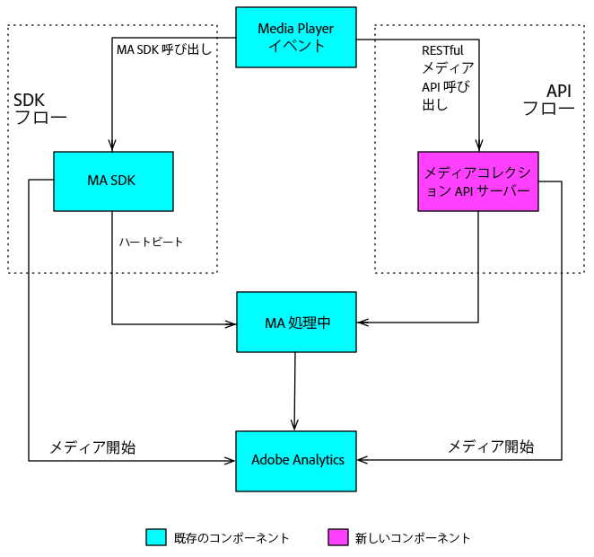

# 概要{#overview}

メディアコレクション API は、クライアント側のメディア SDK の代替として使用できるアドビの RESTful API です。メディアコレクション API を使用すると、プレーヤーで RESTful HTTP 呼び出しを使用してオーディオおよびビデオイベントを追跡できます。

メディアコレクション API は、基本的に、メディア SDK のサーバー側バージョンとして動作するアダプターです。つまり、メディア SDK ドキュメントの一部はメディアコレクション API にも関連しています。例えば、両方のソリューションが同じ[ストリーミングメディアパラメーター](/help/metrics-and-metadata/audio-video-parameters.md)を使用すると、収集されたストリーミングメディアトラッキングデータは、同じ[レポートと分析になります。](/help/media-reports/media-reports-enable.md)

## メディアトラッキングデータのフロー {#media-tracking-data-flows}

メディアコレクション API を実装するメディアプレーヤーは、メディアバックエンドサーバーに対して RESTful API トラッキングコールを直接送信します。一方、メディア SDK を実装するプレーヤーは、プレーヤーアプリ内で SDK API に対してトラッキングコールを送信します。Web 経由で呼び出しを送信する影響の 1 つとして、メディアコレクション API を実装するプレーヤーでは、メディア SDK が自動的に処理する処理の一部を処理する必要があります（詳しくは、[メディアコレクション実装](mc-api-impl/mc-api-quick-start.md)を参照）。

メディアコレクション API でキャプチャされたトラッキングデータは、送信された後、最初はメディア SDK プレーヤーでキャプチャされたトラッキングデータと異なる方法で処理されます。ただし、どちらもバックエンドの同じ処理エンジンが使用されます。



## API の概要 {#api-overview}

**URI：**&#x200B;この情報はアドビの担当者から入手します。

**HTTP メソッド：** JSON リクエスト本文を使用した POST。

### API 呼び出し {#mc-api-calls}

* **`sessions`-** サーバーとのセッションを確立し、後続の `events` 呼び出しで使用するセッション ID を返します。アプリは、トラッキングセッションの開始時にこれを 1 回呼び出します。

   ```
   {uri}/api/v1/sessions
   ```

* **`events`-** メディアトラッキングデータを送信します。

   ```
   {uri}/api/v1/sessions/{session-id}/events
   ```

### リクエスト本文 {#mc-api-request-body}

```
{
    "playerTime": {
        "playhead": {playhead position in seconds},
        "ts": {timestamp in milliseconds}
    },
    "eventType": {event-type},
    "params": {
        {parameter-name}: {parameter-value},
        ...
        {parameter-name}: {parameter-value}
    },
    "qoeData" : {
        {parameter-name}: {parameter-value},
        ...
        {parameter-name}: {parameter-value}
    },
    "customMetadata": {
        {parameter-name}: {parameter-value},
        ...
        {parameter-name}: {parameter-value}
    }
}
```

* `playerTime` - すべてのリクエストに必須です。
* `eventType` - すべてのリクエストに必須です。
* `params` - 特定の `eventTypes` に必須です。[JSON 検証スキーマ](mc-api-ref/mc-api-json-validation.md)を調べて、必須の eventTypes とオプションの eventType を確認してください。

* `qoeData` - すべてのリクエストでオプションです。
* `customMetadata` - すべてのリクエストでオプションです。ただし、`sessionStart`、`adStart` および `chapterStart` イベントタイプでのみ送信されます。

各 `eventType` には公開されている [JSON 検証スキーマ](mc-api-ref/mc-api-json-validation.md)があります。これを使用して、パラメータータイプを確認し、特定のイベントに対してパラメーターがオプションであるか必須であるかを確認してください。

### イベントタイプ {#mc-api-event-types}

* `sessionStart`
* `play`
* `ping`
* `pauseStart`
* `bufferStart`
* `adStart`
* `adComplete`
* `adSkip`
* `adBreakStart`
* `adBreakComplete`
* `chapterStart`
* `chapterSkip`
* `chapterComplete`
* `sessionEnd`
* `sessionComplete`
