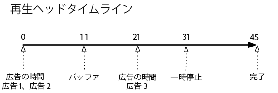
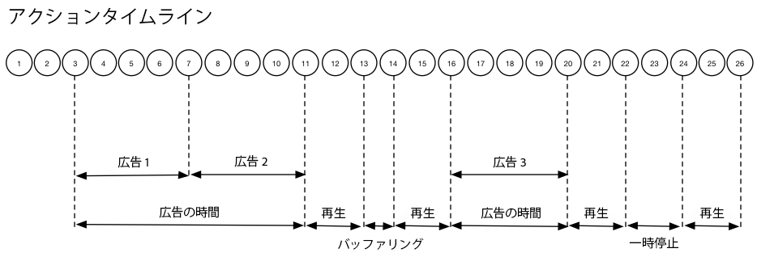

# タイムライン 1 - コンテンツの最後まで視聴{#timeline-view-to-end-of-content}

## VOD、プリロール広告、一時停止、バッファリング、コンテンツの最後まで視聴

次の図は、再生ヘッドタイムラインおよびユーザーのアクションのCorrectingタイムラインを示しています。各アクションの詳細とそれに付随するリクエストは以下のとおりです。








## アクションの詳細

### Action 1 - Start session {#Action-1}

| アクション | アクションタイムライン（秒） | 再生ヘッドの位置（秒） | クライアントリクエスト |
| --- | :---: | :---: | --- |
| 自動再生または再生ボタンが押され、ビデオの読み込みが開始される | 0 | 0 | `/api/v1/sessions` |

**実装の詳細**

この呼び出しは、ビデオを&#x200B;_再生しようとするユーザーの意図_&#x200B;を示します。<br/><br/>セッション内の後続のすべてのトラッキングコールを識別するために使用されるクライアントに、セッションID（ `{sid}`）を返します。プレーヤーの状態はまだ「再生中」ではなく、「開始中」です。<br/><br/>[必須のセッションパラメーター](../../media-collection-api/mc-api-ref/mc-api-sessions-req.md)をリクエスト本文の `params` マップに含める必要があります。<br/><br/>バックエンドでは、この呼び出しによって Adobe Analytics の開始呼び出しが生成されます。

**リクエスト本文の例**

```
{
    playerTime: {
        playhead: 0, ts: <timestamp>
    },
    eventType:sessionStart, params: {
        "media.playerName": "sample-html5-api-player",
        "analytics.trackingServer": "[ _YOUR_TS_ ]",
        "analytics.reportSuite": "[ _YOUR_RSID_ ]",
        "analytics.visitorId": "[ _YOUR_VISITOR_ID_ ]",
        "media.contentType": "VOD",
        "media.length": 60.3333333333333,
        "media.id": "VA API Sample Player",
        "visitor.marketingCloudOrgId": "[YOUR_MCID]",
        "media.name": "ClickMe",
        "media.channel": "sample-channel",
        "media.sdkVersion": "va-api-0.0.0",
        "analytics.enableSSL": false
    }
}
```

### Action 2 - Ping timer start {#Action-2}

| アクション | アクションタイムライン（秒） | 再生ヘッドの位置（秒） | クライアントリクエスト |
| --- | :---: | :---: | --- |
| アプリが ping イベントタイマーを開始する | 0 | 0 | `/api/v1/sessions/{sid}/events` |  |

**実装の詳細**

アプリのpingタイマーを起動します。最初のpingイベントは、プリロール広告がある場合は1秒、それ以外の場合は10秒を実行します。

### Action 3 - Ad break start {#Action-3}

| アクション | アクションタイムライン（秒） | 再生ヘッドの位置（秒） | クライアントリクエスト |
| --- | :---: | :---: | --- |
| プリロール広告ブレークの開始を追跡する | 0 | 0 | `/api/v1/sessions/{sid}/events` |

**実装の詳細**

広告は、広告ブレーク内でのみ追跡できます。

**リクエスト本文の例**

```
{
    playerTime: {
        playhead: 0,
        ts: <timestamp>
    },
    eventType:adBreakStart, params: {
        "media.ad.podFriendlyName": "ad_pod1",
        "media.ad.podIndex": 0,
        "media.ad.podSecond": 0
    }
}
```

### Action 4 - Ad start {#Action-4}

| アクション | アクションタイムライン（秒） | 再生ヘッドの位置（秒） | クライアントリクエスト |
| --- | :---: | :---: | --- |
| プリロール広告 #1 の開始を追跡する | 0 | 0 | `/api/v1/sessions/{sid}/events` |

**実装の詳細**

長さが 15 秒の最初のプリロール広告の追跡を開始します。この `adStart` を使用してカスタムメタデータを含めます。

**リクエスト本文の例**

```
{
    playerTime: {
        playhead: 0,
        ts: &lt;timestamp&gt;
    },
    eventType:adStart,
    params: {
        "media.ad.podFriendlyName": "ad_pod1",
        "media.ad.name": "Ad 1",
        "media.ad.id": "001",
        "media.ad.length": 15,
        "media.ad.podPosition": 1,
        "media.ad.playerName": "Sample Player",
        "media.ad.advertiser": "Ad Guys",
        "media.ad.campaignId": "1",
        "media.ad.creativeId": "42",
        "media.ad.siteId": "XYZ",
        "media.ad.creativeURL": "https://xyz_creative.com",
        "media.ad.placementId": "sample_placement"
    },
    customMetadata: {
        "myCustomData1": "CustomData1",
        "myCustomData2": "CustomData2"
    }
}
```

### Action 5 - Ad pings {#Action-5}

#### Action 5.1 - Ad ping 1 {#Action-5-1}

| アクション | アクションタイムライン（秒） | 再生ヘッドの位置（秒） | クライアントリクエスト |
| --- | :---: | :---: | --- |
| アプリが ping イベントを送信する | 1 | 0 | `/api/v1/sessions/{sid}/events` |

**実装の詳細**

広告内の1秒おきにバックエンドにpingます。

**リクエスト本文の例**

```
{
    playerTime: {
        playhead: 0,
        ts: <timestamp>
    },
    eventType:ping
}
```

#### Action 5.2 - Ad ping 2 {#Action-5-2}

| アクション | アクションタイムライン（秒） | 再生ヘッドの位置（秒） | クライアントリクエスト |
| --- | :---: | :---: | --- |
| アプリが ping イベントを送信する | 2 | 0 | `/api/v1/sessions/{sid}/events` |

**実装の詳細**

広告内の1秒おきにバックエンドにpingます。

**リクエスト本文の例**

```
{
    playerTime: {
        playhead: 0,
        ts: <timestamp>
    },
    eventType:ping
}
```

#### Action 5.3 - Ad ping 3 {#Action-5-3}


| アクション | アクションタイムライン（秒） | 再生ヘッドの位置（秒） | クライアントリクエスト |
| --- | :---: | :---: | --- |
| アプリが ping イベントを送信する | 3 | 0 | `/api/v1/sessions/{sid}/events` |

**実装の詳細**

広告内の1秒おきにバックエンドにpingます。

>[!NOTE]
>
>タイムラインの後続の広告は、1秒のpingの表示をスキップします
>簡略化の関心がある場合…

**リクエスト本文の例**

```
{
    playerTime: {
        playhead: 0,
        ts: <timestamp>
    },
    eventType:ping
}
```

### Action 6 - Ad complete {#Action-6}

| アクション | アクションタイムライン（秒） | 再生ヘッドの位置（秒） | クライアントリクエスト |
| --- | :---: | :---: | --- |
| プリロール広告 #1 の完了を追跡する | 15 | 0 | `/api/v1/sessions/{sid}/events` |

**実装の詳細**

最初のプリロール広告の終わりを追跡します。

**リクエスト本文の例**

```
{
    playerTime: {
        playhead: 0,
        ts: <timestamp>
    },
    eventType:adComplete
}
```

### Action 7 - Ad start {#Action-7}

| アクション | アクションタイムライン（秒） | 再生ヘッドの位置（秒） | クライアントリクエスト |
| --- | :---: | :---: | --- |
| プリロール広告 #2 の開始を追跡する | 15 | 0 | `/api/v1/sessions/{sid}/events` |

**実装の詳細**

長さが 7 秒の 2 番目のプリロール広告の開始を追跡します。

**リクエスト本文の例**

```
{
    playerTime: {
        playhead: 0,
        ts: <timestamp>
    },
    eventType:adStart, params: {
        "media.ad.podFriendlyName": "ad_pod1",
        "media.ad.name": "Ad 2",
        "media.ad.id": "002",
        "media.ad.length": 7,
        "media.ad.podPosition": 1,
        "media.ad.playerName": "Sample Player",
        "media.ad.advertiser": "Ad Guys",
        "media.ad.campaignId": "2",
        "media.ad.creativeId": "44",
        "media.ad.siteId": "XYZ",
        "media.ad.creativeURL": "https://xyz_creative.com",
        "media.ad.placementId": "sample_placement2"
    },
}
```

### Action 8 - Ad pings {#Action-8}

| アクション | アクションタイムライン（秒） | 再生ヘッドの位置（秒） | クライアントリクエスト |
| --- | :---: | :---: | --- |
| アプリが ping イベントを送信する | 20 | 0 | `/api/v1/sessions/{sid}/events` |

**実装の詳細**

1秒おきにバックエンドにpingます。

**リクエスト本文の例**

```
{
    playerTime: {
        playhead: 0,
        ts: <timestamp>
    },
    eventType:ping
}
```

### Action 9 - Ad complete {#Action-9}

| アクション | アクションタイムライン（秒） | 再生ヘッドの位置（秒） | クライアントリクエスト |
| --- | :---: | :---: | --- |
| プリロール広告 #2 の完了を追跡する | 22 | 0 | `/api/v1/sessions/{sid}/events` |

**実装の詳細**

2 番目のプリロール広告の終わりを追跡します。

**リクエスト本文の例**

```
{
    playerTime: {
        playhead: 0,
        ts: <timestamp>
    },
    eventType:adComplete
}
```

### Action 10 - Ad break complete {#Action-10}

| アクション | アクションタイムライン（秒） | 再生ヘッドの位置（秒） | クライアントリクエスト |
| --- | :---: | :---: | --- |
| プリロール広告ブレークの完了を追跡する | 22 | 0 | `/api/v1/sessions/{sid}/events` |

**実装の詳細**

広告ブレークが終了します。広告ブレーク中、再生状態は「再生中」のままになります。

**リクエスト本文の例**

```
{
    playerTime: {
        playhead: 0,
        ts: <timestamp>
    },
    eventType:adBreakComplete
}
```

### Action 11 - Play content {#Action-11}

| アクション | アクションタイムライン（秒） | 再生ヘッドの位置（秒） | クライアントリクエスト |
| --- | :---: | :---: | --- |
| 再生イベントを追跡する | 22 | 0 | `/api/v1/sessions/{sid}/events` |

**実装の詳細**

`adBreakComplete` イベントの後、`play` イベントを使用してプレーヤーを「再生中」状態にします。

**リクエスト本文の例**

```
{
    playerTime: {
        playhead: 0,
        ts: <timestamp>
    },
    eventType:play
}
```

### Action 12 - Ping {#Action-12}

| アクション | アクションタイムライン（秒） | 再生ヘッドの位置（秒） | クライアントリクエスト |
| --- | :---: | :---: | --- |
| アプリが ping イベントを送信する | 30 | 8 | `/api/v1/sessions/{sid}/events` |

**実装の詳細**

バックエンドに対する ping を 10 秒ごとに実行します。

**リクエスト本文の例**

```
{
    playerTime: {
        playhead: 8,
        ts: <timestamp>
    },
    eventType:ping
}
```

### Action 13 - Buffer start {#Action-13}

| アクション | アクションタイムライン（秒） | 再生ヘッドの位置（秒） | クライアントリクエスト |
| --- | :---: | :---: | --- |
| バッファー開始イベントが発生した | 33 | 11 | `/api/v1/sessions/{sid}/events` |

**実装の詳細**

プレーヤーの「バッファリング」状態への移行を追跡します。

**リクエスト本文の例**

```
{
    playerTime: {
        playhead: 11,
        ts: <timestamp>
    }, eventType:bufferStart
}
```

### Action 14 - Buffer end {#Action-14}

| アクション | アクションタイムライン（秒） | 再生ヘッドの位置（秒） | クライアントリクエスト |
| --- | :---: | :---: | --- |
| バッファリングが終了し、アプリがコンテンツの再開を追跡する | 36 | 11 | `/api/v1/sessions/{sid}/events` |

**実装の詳細**

バッファリングが 3 秒後に終了するので、プレーヤーを「再生中」状態に戻します。バッファリングが終了したら再生イベントの追跡をもう 1 件送信する必要があります。**`play`呼び出し側が`bufferStart`バックエンドへの"BufferEnd"呼び出しの後に呼び出し** を行うので `bufferEnd` 、イベントは不要です。

**リクエスト本文の例**

```
{
    playerTime: {
        playhead: 11,
        ts: <timestamp>
    },
    eventType:play
}
```

### Action 15 - Ping {#Action-15}

| アクション | アクションタイムライン（秒） | 再生ヘッドの位置（秒） | クライアントリクエスト |
| --- | :---: | :---: | --- |
| アプリが ping イベントを送信する | 40 | 15 | `/api/v1/sessions/{sid}/events` |

**実装の詳細**

バックエンドに対する ping を 10 秒ごとに実行します。

**リクエスト本文の例**

```
{
    playerTime: {
        playhead: 15,
        ts: <timestamp>
    }, eventType:ping
}
```

### Action 16 - Ad break start {#Action-16}

| アクション | アクションタイムライン（秒） | 再生ヘッドの位置（秒） | クライアントリクエスト |
| --- | :---: | :---: | --- |
| ミッドロール広告ブレークの開始を追跡する | 46 | 21 | `/api/v1/sessions/{sid}/events` |

**実装の詳細**

期間が 8 秒のミッドロール広告。`adBreakStart` を送信します。

**リクエスト本文の例**

```
{
    playerTime: {
        playhead: 21,
        ts: <timestamp>
    },
    eventType:adBreakStart,
    params: {
        "media.ad.podFriendlyName": "ad_pod2",
        "media.ad.podIndex": 1,
        "media.ad.podSecond": 21
    }
}
```

### Action 17 - Ad start {#Action-17}

| アクション | アクションタイムライン（秒） | 再生ヘッドの位置（秒） | クライアントリクエスト |
| --- | :---: | :---: | --- |
| ミッドロール広告 #3 の開始を追跡する | 46 | 21 | `/api/v1/sessions/{sid}/events` |

**実装の詳細**

ミッドロール広告を追跡します。

**リクエスト本文の例**

```
{
    playerTime: {
        playhead: 21,
        ts: <timestamp>
    },
    eventType:adStart, params: {
        "media.ad.podFriendlyName": "ad_pod2",
        "media.ad.name": "Ad 3",
        "media.ad.id": "003",
        "media.ad.length": 8,
        "media.ad.podPosition": 2,
        "media.ad.playerName": "Sample Player",
        "media.ad.advertiser": "Ad Guys",
        "media.ad.campaignId": "7",
        "media.ad.creativeId": "40",
        "media.ad.siteId": "XYZ",
        "media.ad.creativeURL": "https://xyz_creative.com",
        "media.ad.placementId": "sample_placement2"
    },
}
```

### Action 18 - Ad ping {#Action-18}

| アクション | アクションタイムライン（秒） | 再生ヘッドの位置（秒） | クライアントリクエスト |
| --- | :---: | :---: | --- |
| アプリが ping イベントを送信する | 50 | 21 | `/api/v1/sessions/{sid}/events` |

**実装の詳細**

バックエンドに対する ping を 10 秒ごとに実行します。

**リクエスト本文の例**

```
{
    playerTime: {
        playhead: 21,
        ts: <timestamp>
    }, eventType:ping
}
```

### Action 19 - Ad complete {#Action-19}

| アクション | アクションタイムライン（秒） | 再生ヘッドの位置（秒） | クライアントリクエスト |
| --- | :---: | :---: | --- |
| ミッドロール広告 #1 の完了を追跡する | 54 | 21 | `/api/v1/sessions/{sid}/events` |

**実装の詳細**

ミッドロール広告が完了します。

**リクエスト本文の例**

```
{
    playerTime: {
        playhead: 21,
        ts: <timestamp>
    },
    eventType:adComplete
}
```

### Action 20 - Ad break complete {#Action-20}

| アクション | アクションタイムライン（秒） | 再生ヘッドの位置（秒） | クライアントリクエスト |
| --- | :---: | :---: | --- |
| ミッドロール広告ブレークの完了を追跡する | 54 | 21 | `/api/v1/sessions/{sid}/events` |

**実装の詳細**

広告ブレークが完了します。

**リクエスト本文の例**

```
{
    playerTime: {
        playhead: 21,
        ts: <timestamp>
    },
    eventType:adBreakComplete
}
```

### Action 21 - Ping {#Action-21}

| アクション | アクションタイムライン（秒） | 再生ヘッドの位置（秒） | クライアントリクエスト |
| --- | :---: | :---: | --- |
| アプリが ping イベントを送信する | 60 | 27 | `/api/v1/sessions/{sid}/events` |

**実装の詳細**

バックエンドに対する ping を 10 秒ごとに実行します。

**リクエスト本文の例**

```
{
    playerTime: {
        playhead: 27,
        ts: <timestamp>
    },
    eventType:ping
}
```

### Action 22 - Pause {#Action-22}

| アクション | アクションタイムライン（秒） | 再生ヘッドの位置（秒） | クライアントリクエスト |
| --- | :---: | :---: | --- |
| ユーザーが一時停止を押した | 64 | 31 | `/api/v1/sessions/{sid}/events` |

**実装の詳細**

ユーザーのアクションにより、再生状態が「一時停止」に移行します。

**リクエスト本文の例**

```
{
    playerTime: {
        playhead: 31,
        ts: <timestamp>
    },
    eventType:pauseStart
}
```

### Action 23 - Ping {#Action-23}

| アクション | アクションタイムライン（秒） | 再生ヘッドの位置（秒） | クライアントリクエスト |
| --- | :---: | :---: | --- |
| アプリが ping イベントを送信する | 70 | 31 | `/api/v1/sessions/{sid}/events` |

**実装の詳細**

バックエンドに対する ping を 10 秒ごとに実行します。プレーヤーはまだ「バッファリング」状態になっています。ユーザーは、コンテンツの 20 秒時点で停止しています。待ちます...

**リクエスト本文の例**

```
{
    playerTime: {
        playhead: 31,
        ts: <timestamp>
    }, eventType:ping
}
```

### Action 24 - Play {#Action-24}

| アクション | アクションタイムライン（秒） | 再生ヘッドの位置（秒） | クライアントリクエスト |
| --- | :---: | :---: | --- |
| ユーザーが再生を押してメインコンテンツを再開する | 74 | 31 | `/api/v1/sessions/{sid}/events` |

**実装の詳細**

再生状態を「再生中」に移行します。**`play`呼び出し側が`pauseStart`バックエンドへの「再開」呼び出しを** 実行した後、イベントは `resume` 不要です。

**リクエスト本文の例**

```
{
    playerTime: {
        playhead: 31,
        ts: <timestamp>
    }, eventType:play
}
```

### Action 25 - Ping {#Action-25}

| アクション | アクションタイムライン（秒） | 再生ヘッドの位置（秒） | クライアントリクエスト |
| --- | :---: | :---: | --- |
| アプリが ping イベントを送信する | 80 | 37 | `/api/v1/sessions/{sid}/events` |

**実装の詳細**

バックエンドに対する ping を 10 秒ごとに実行します。

**リクエスト本文の例**

```
{
    playerTime: {
        playhead: 37,
        ts: <timestamp>
    }, eventType:ping
}
```

### Action 26 - Session complete {#Action-26}

| アクション | アクションタイムライン（秒） | 再生ヘッドの位置（秒） | クライアントリクエスト |
| --- | :---: | :---: | --- |
| ユーザーがコンテンツを最後まで視聴する | 88 | 45 | `/api/v1/sessions/{sid}/events` |

**実装の詳細**

`sessionComplete` をバックエンドに送信して、ユーザーがコンテンツ全体の視聴を終了したことを示します。

**リクエスト本文の例**

```
{
    playerTime: {
        playhead: 45,
        ts: <timestamp>
    }, eventType:sessionComplete
}
```

>[!NOTE]
>
>**シークイベントはありませんか?-** メディアコレクション API では、`seekStart` および `seekComplete` イベントの明示的なサポートはありません。これは、特定のプレーヤーではエンドユーザーがスクラビングすると、これらのイベントが大量に生成され、数百人のユーザーであってもバックエンドサービスのネットワーク帯域幅のボトルネックになり得るからです。アドビでは、再生ヘッドの位置ではなく、デバイスのタイムスタンプに基づいてハートビート期間を計算することで、シークイベントの明示的なサポートの代わりとしています。

