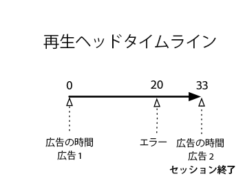
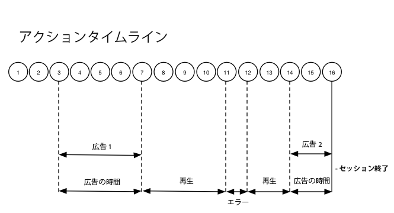

# タイムライン 2 - ユーザーが中断したセッション {#timeline--2-user-abandons-session}

## VOD、プリロール広告、ミッドロール広告、ユーザーがコンテンツを早い時点で中断

次の図に、再生ヘッドタイムラインと、ユーザーのアクションの対応するタイムラインを示します。各アクションの詳細とそれに付随するリクエストは以下のとおりです。








## アクションの詳細

### Action 1 - Start session {#Action-1}

| アクション | アクションタイムライン（秒） | 再生ヘッドの位置（秒） | クライアントリクエスト |
| --- | :---: | :---: | --- |
| 自動再生または再生ボタンが押された | 0 | 0 | `/api/v1/sessions` |

**実装の詳細**

この呼び出しは、ビデオを&#x200B;_再生しようとするユーザーの意図_&#x200B;を示します。It returns a Session ID ( `{sid}` ) to the client that is used to identify all subsequent tracking calls within the session. プレーヤーの状態はまだ「再生中」ではなく、「開始中」です。[必須のセッションパラメーター](/help/media-collection-api/mc-api-ref/mc-api-sessions-req.md)をリクエスト本文の `params` マップに含める必要があります。バックエンドでは、この呼び出しによって Adobe Analytics の開始呼び出しが生成されます。

**リクエスト本文の例**

```
{
    playerTime: {
        playhead: 0,
        ts: <timestamp>
    },
    eventType:sessionStart, params: {
        "media.playerName": "sample-html5-api-player",
        "analytics.trackingServer": "[ _YOUR-TS_ ]",
        "analytics.reportSuite": "[ _YOUR-RSID_ ]",
        "analytics.visitorId": "[ _YOUR-VISITOR-ID_ ]",
        "media.contentType": "VOD",
        "media.length": 60.3333333333333,
        "media.id": "VA API Sample Player",
        "visitor.marketingCloudOrgId": "[YOUR-MCID]",
        "media.name": "ClickMe",
        "media.channel": "sample-channel",
        "media.sdkVersion": "va-api-0.0.0",
        "analytics.enableSSL": false
    }
}
```

### Action 2 - Ping timer start {#Action-2}

| アクション | アクションタイムライン（秒） | 再生ヘッドの位置（秒） | クライアントリクエスト |
| --- | :---: | :---: | --- |
| アプリが ping イベントタイマーを開始する | 0 | 0 |  |

**実装の詳細**

アプリのpingタイマーを起動します。最初のpingイベントは、プリロール広告がある場合は1秒、それ以外の場合は10秒を実行します。

### Action 3 - Ad break start {#Action-3}

| アクション | アクションタイムライン（秒） | 再生ヘッドの位置（秒） | クライアントリクエスト |
| --- | :---: | :---: | --- |
| プリロール広告ブレークの開始を追跡する | 0 | 0 | `/api/v1/sessions/{sid}/events` |

**実装の詳細**

プリロール広告を追跡する必要があります。広告は、広告ブレーク内でのみ追跡できます。

**リクエスト本文の例**

```
{
    playerTime: {
        playhead: 0,
        ts: <timestamp>
    },
    eventType:adBreakStart, params: {
        "media.ad.podFriendlyName": "ad_pod1",
        "media.ad.podIndex": 0,
        "media.ad.podSecond": 0
    }
}
```

### Action 4 - Ad start {#Action-4}

| アクション | アクションタイムライン（秒） | 再生ヘッドの位置（秒） | クライアントリクエスト |
| --- | :---: | :---: | --- |
| プリロール広告 #1 の開始を追跡する | 0 | 0 | `/api/v1/sessions/{sid}/events` |

**実装の詳細**

12 秒の広告が開始されます。

**リクエスト本文の例**

```
{
    playerTime: {
        playhead: 0,
        ts: <timestamp>
    },
    eventType:adStart, params: {
        "media.ad.podFriendlyName": "ad_pod1",
        "media.ad.name": "Ad 1",
        "media.ad.id": "002",
        "media.ad.length": 7,
        "media.ad.podPosition": 1,
        "media.ad.playerName": "Sample Player",
        "media.ad.advertiser": "Ad Guys",
        "media.ad.campaignId": "1",
        "media.ad.creativeId": "42",
        "media.ad.siteId": "XYZ",
        "media.ad.creativeURL": "https://xyz-creative.com",
        "media.ad.placementId": "sample-placement2"
    },
}
```

### Action 5 - Ad pings {#Action-5}

| アクション | アクションタイムライン（秒） | 再生ヘッドの位置（秒） | クライアントリクエスト |
| --- | :---: | :---: | --- |
| アプリが ping イベントを送信する | 1 | 0 | `/api/v1/sessions/{sid}/events` |

**実装の詳細**

1秒おきにバックエンドにpingます。（簡潔の関心のため、後続の広告pingが表示されません。）

**リクエスト本文の例**

```
{
    playerTime: {
        playhead: 0,
        ts: <timestamp>
    },
    eventType:ping
}
```

### Action 6 - Ad complete {#Action-6}

| アクション | アクションタイムライン（秒） | 再生ヘッドの位置（秒） | クライアントリクエスト |
| --- | :---: | :---: | --- |
| プリロール広告 #1 の完了を追跡する | 12 | 0 | `/api/v1/sessions/{sid}/events` |

**実装の詳細**

最初のプリロール広告が終了します。

**リクエスト本文の例**

```
{
    playerTime: {
        playhead: 0,
        ts: <timestamp>
    },
    eventType:adComplete
}
```

### Action 7 - Ad break complete {#Action-7}

| アクション | アクションタイムライン（秒） | 再生ヘッドの位置（秒） | クライアントリクエスト |
| --- | :---: | :---: | --- |
| プリロール広告ブレークの完了を追跡する | 12 | 0 | `/api/v1/sessions/{sid}/events` |

**実装の詳細**

広告ブレークが終了します。広告ブレーク中、プレーヤーの状態は「再生中」のままになります。

**リクエスト本文の例**

```
{
    playerTime: {
        playhead: 0,
        ts: <timestamp>
    },
    eventType:adBreakComplete
}
```

### Action 8 - Play content {#Action-8}

| アクション | アクションタイムライン（秒） | 再生ヘッドの位置（秒） | クライアントリクエスト |
| --- | :---: | :---: | --- |
| 再生イベントを追跡する | 12 | 0 | `/api/v1/sessions/{sid}/events` |

**実装の詳細**

プレーヤーを「再生中」状態に移行します。コンテンツ再生の開始の追跡を開始します。

**リクエスト本文の例**

```
{
    playerTime: {
        playhead: 0,
        ts: <timestamp>
    },
    eventType:play,
    qoeData: { bitrate: 10000 }
}
```

### Action 9 - Ping {#Action-9}

| アクション | アクションタイムライン（秒） | 再生ヘッドの位置（秒） | クライアントリクエスト |
| --- | :---: | :---: | --- |
| アプリが ping イベントを送信する | 20 | 8 | `/api/v1/sessions/{sid}/events` |

**実装の詳細**

バックエンドに対する ping を 10 秒ごとに実行します。

**リクエスト本文の例**

```
{
    playerTime: {
        playhead: 8ß,
        ts: <timestamp>
    },
    eventType:ping
}
```

### Action 10 - Ping {#Action-10}

| アクション | アクションタイムライン（秒） | 再生ヘッドの位置（秒） | クライアントリクエスト |
| --- | :---: | :---: | --- |
| アプリが ping イベントを送信する | 30 | 18 | `/api/v1/sessions/{sid}/events` |

**実装の詳細**

バックエンドに対する ping を 10 秒ごとに実行します。

**リクエスト本文の例**

```
{
    playerTime: {
        playhead: 18,
        ts: <timestamp>
    },
    eventType:ping
}
```

### Action 11 - Error {#Action-11}

| アクション | アクションタイムライン（秒） | 再生ヘッドの位置（秒） | クライアントリクエスト |
| --- | :---: | :---: | --- |
| エラーが発生し、アプリがエラー情報を送信する | 32 | 20 | `/api/v1/sessions/{sid}/events` |

**実装の詳細**


**リクエスト本文の例**

```
{
    playerTime: {
        playhead: 20,
        ts: <timestamp>
    },
    eventType:error
}
```

### Action 12 - Play content {#Action-12}

| アクション | アクションタイムライン（秒） | 再生ヘッドの位置（秒） | クライアントリクエスト |
| --- | :---: | :---: | --- |
| アプリがエラーから回復し、ユーザーが再生を押す | 37 | 20 | `/api/v1/sessions/{sid}/events` |

**実装の詳細**


**リクエスト本文の例**

```
{
    playerTime: {
        playhead: 18,
        ts: <timestamp>
    },
    eventType:play, qoeData: { bitrate: 10000 }
}
```

### Action 13 - Ping {#Action-13}

| アクション | アクションタイムライン（秒） | 再生ヘッドの位置（秒） | クライアントリクエスト |
| --- | :---: | :---: | --- |
| アプリが ping イベントを送信する | 40 | 28 | `/api/v1/sessions/{sid}/events` |

**実装の詳細**

バックエンドに対する ping を 10 秒ごとに実行します。

**リクエスト本文の例**

```
{
    playerTime: {
        playhead: 28,
        ts: <timestamp>
    },
    eventType:ping
}
```

### Action 14 - Ad break start {#Action-14}

| アクション | アクションタイムライン（秒） | 再生ヘッドの位置（秒） | クライアントリクエスト |
| --- | :---: | :---: | --- |
| ミッドロール広告ブレークの開始を追跡する | 45 | 33 | `/api/v1/sessions/{sid}/events` |

**実装の詳細**

期間が 8 秒のミッドロール広告。`adBreakStart` を送信します。

**リクエスト本文の例**

```
{
    playerTime: {
        playhead: 33,
        ts: <timestamp>
    },
    eventType:adBreakStart, params: {
        "media.ad.podFriendlyName": "ad_pod2",
        "media.ad.podIndex": 1,
        "media.ad.podSecond": 33
    }
}
```

### Action 15 - Ad start {#Action-15}

| アクション | アクションタイムライン（秒） | 再生ヘッドの位置（秒） | クライアントリクエスト |
| --- | :---: | :---: | --- |
| ミッドロール広告 #1 の開始を追跡する | 45 | 33 | `/api/v1/sessions/{sid}/events` |

**実装の詳細**

ミッドロール広告を追跡します。

**リクエスト本文の例**

```
{
    playerTime: { playhead: 33, ts: <timestamp>
    },
    eventType:adStart, params: {
        "media.ad.podFriendlyName": "ad_pod1",
        "media.ad.name": "Ad 1",
        "media.ad.id": "002",
        "media.ad.length": 8,
        "media.ad.podPosition": 1,
        "media.ad.playerName": "Sample Player",
        "media.ad.advertiser": "Ad Guys",
        "media.ad.campaignId": "7",
        "media.ad.creativeId": "40",
        "media.ad.siteId": "XYZ",
        "media.ad.creativeURL": "https://xyz_creative.com",
        "media.ad.placementId": "sample_placement2"
    },
}
```

### Action 16 - Close app {#Action-16}

| アクション | アクションタイムライン（秒） | 再生ヘッドの位置（秒） | クライアントリクエスト |
| --- | :---: | :---: | --- |
| ユーザーがアプリを閉じ、視聴を中断したユーザーがこのセッションに戻らないとアプリが判断する | 48 | 33 | `/api/v1/sessions/{sid}/events` |

**実装の詳細**

`sessionEnd` を VA バックエンドに送信して、それ以上の処理をおこなうことなくセッションを即座に終了する必要があることを示します。

**リクエスト本文の例**

```
{
    playerTime: {
        playhead: 33,
        ts: <timestamp>
    },
    eventType:sessionEnd
}
```


