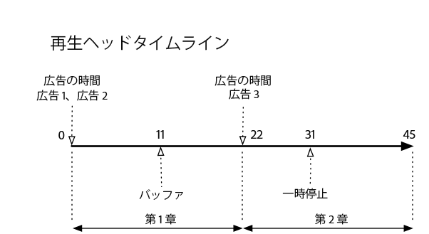
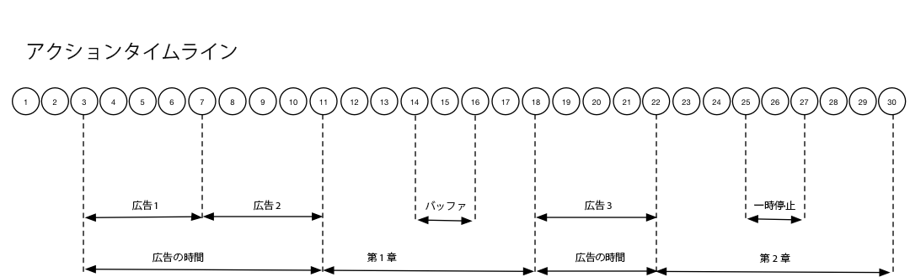

# タイムライン 3 - チャプター {#timeline-3-chapters}

## VOD、プリロール広告、一時停止、バッファリング、コンテンツの最後まで視聴


次の図に、再生ヘッドタイムラインおよびユーザーのアクションに対応するタイムラインを示します。各アクションおよびそれに伴うリクエストを次に示します。








## アクションの詳細


### アクション 1 - セッションの開始 {#Action-1}

| アクション | アクションタイムライン（秒） | 再生ヘッドの位置（秒） | クライアントリクエスト |
| --- | :---: | :---: | --- |
| 自動再生または再生ボタンが押され、ビデオの読み込みが開始される | 0 | 0 | `/api/v1/sessions` |

**実装の詳細**

この呼び出しは、ビデオを&#x200B;_再生しようとするユーザーの意図_&#x200B;を示します。セッション内の後続のすべてのトラッキングコールを識別するために使用されるセッション ID（`{sid}`）がクライアントに返されます。プレーヤーの状態はまだ「再生中」ではなく、「開始中」です。[必須のセッションパラメーター](/help/media-collection-api/mc-api-ref/mc-api-sessions-req.md)をリクエスト本文の `params` マップに含める必要があります。バックエンドでは、この呼び出しによって Adobe Analytics の開始呼び出しが生成されます。

**リクエスト本文のサンプル**

```
{
    playerTime: {
        playhead: 0,
        ts: <timestamp>
    },
    eventType:sessionStart, params: {
        "media.playerName": "sample-html5-api-player",
        "analytics.trackingServer": "[ _YOUR-TS_ ]",
        "analytics.reportSuite": "[ _YOUR_RSID_ ]",
        "analytics.visitorId": "[ _YOUR_VISITOR_ID_ ]",
        "media.contentType": "VOD",
        "media.length": 60.3333333333333,
        "media.id": "VA API Sample Player",
        "visitor.marketingCloudOrgId": "[YOUR_MCID]",
        "media.name": "ClickMe",
        "media.channel": "sample-channel",
        "media.sdkVersion": "va-api-0.0.0",
        "analytics.enableSSL": false
    }
}
```

### アクション 2 - ping タイマー開始 {#Action-2}

| アクション | アクションタイムライン（秒） | 再生ヘッドの位置（秒） | クライアントリクエスト |
| --- | :---: | :---: | --- |
| アプリが ping イベントタイマーを開始する | 0 | 0 |  |

**実装の詳細**

ping タイマーを開始します。最初の ping イベントは、プリロール広告がある場合は 1 秒、その他の場合は 10 秒で発生させる必要があります。

### アクション 3 - 広告ブレーク開始 {#Action-3}

| アクション | アクションタイムライン（秒） | 再生ヘッドの位置（秒） | クライアントリクエスト |
| --- | :---: | :---: | --- |
| プリロール広告ブレークの開始を追跡する | 0 | 0 | `/api/v1/sessions/{sid}/events` |

**実装の詳細**

広告は、広告ブレーク内でのみ追跡できます。

**リクエスト本文のサンプル**

```
{
    playerTime: {
        playhead: 0,
        ts: <timestamp>
    },
    eventType:adBreakStart, params: {
        "media.ad.podFriendlyName": "ad_pod1",
        "media.ad.podIndex": 0, "media.ad.podSecond": 0
    }
}
```

### アクション 4 - 広告開始 {#Action-4}

| アクション | アクションタイムライン（秒） | 再生ヘッドの位置（秒） | クライアントリクエスト |
| --- | :---: | :---: | --- |
| プリロール広告 #1 の開始を追跡する | 0 | 0 | `/api/v1/sessions/{sid}/events` |

**実装の詳細**

長さが 15 秒の最初のプリロール広告の追跡を開始します。この `adStart` を使用してカスタムメタデータを含めます。

**リクエスト本文のサンプル**

```
{
    playerTime: {
        playhead: 0,
        ts: <timestamp>
    },
    eventType:adStart, params: {
        "media.ad.podFriendlyName": "ad_pod1",
        "media.ad.name": "Ad 1",
        "media.ad.id": "001",
        "media.ad.length": 15,
        "media.ad.podPosition": 1,
        "media.ad.playerName": "Sample Player",
        "media.ad.advertiser": "Ad Guys",
        "media.ad.campaignId": "1",
        "media.ad.creativeId": "42",
        "media.ad.siteId": "XYZ",
        "media.ad.creativeURL": "https://xyz_creative.com",
        "media.ad.placementId": "sample_placement"
    },
    customMetadata: {
        "myCustomData1": "CustomData1",
        "myCustomData2": "CustomData2"
    }
}
```

### アクション 5 - 広告 ping {#Action-5}

| アクション | アクションタイムライン（秒） | 再生ヘッドの位置（秒） | クライアントリクエスト |
| --- | :---: | :---: | --- |
| アプリが ping イベントを送信する | 10 | 0 | `/api/v1/sessions/{sid}/events` |

**実装の詳細**

バックエンドに対する ping を 1 秒ごとに実行します。（簡潔にするために、後続の広告 ping は示しません。）

**リクエスト本文のサンプル**

```
{
    playerTime: {
        playhead: 0,
        ts: <timestamp>
    },
    eventType:ping
}
```

### アクション 6 - 広告完了 {#Action-6}

| アクション | アクションタイムライン（秒） | 再生ヘッドの位置（秒） | クライアントリクエスト |
| --- | :---: | :---: | --- |
| プリロール広告 #1 の完了を追跡する | 15 | 0 | `/api/v1/sessions/{sid}/events` |

**実装の詳細**

最初のプリロール広告の終わりを追跡します。

**リクエスト本文のサンプル**

```
{
    playerTime: {
        playhead: 0,
        ts: <timestamp>
    },
    eventType:adComplete
}
```

### アクション 7 - 広告開始 {#Action-7}

| アクション | アクションタイムライン（秒） | 再生ヘッドの位置（秒） | クライアントリクエスト |
| --- | :---: | :---: | --- |
| プリロール広告 #2 の開始を追跡する | 15 | 0 | `/api/v1/sessions/{sid}/events` |

**実装の詳細**

長さが 7 秒の 2 番目のプリロール広告の開始を追跡します。

**リクエスト本文のサンプル**

```
{
    playerTime: {
        playhead: 0,
        ts: <timestamp>
    },
    eventType:adStart, params: {
        "media.ad.podFriendlyName": "ad_pod1",
        "media.ad.name": "Ad 2",
        "media.ad.id": "002",
        "media.ad.length": 7,
        "media.ad.podPosition": 1,
        "media.ad.playerName": "Sample Player",
        "media.ad.advertiser": "Ad Guys",
        "media.ad.campaignId": "2",
        "media.ad.creativeId": "44",
        "media.ad.siteId": "XYZ",
        "media.ad.creativeURL": "https://xyz_creative.com",
        "media.ad.placementId": "sample_placement2"
    },
}
```

### アクション 8 - 広告 ping {#Action-8}

| アクション | アクションタイムライン（秒） | 再生ヘッドの位置（秒） | クライアントリクエスト |
| --- | :---: | :---: | --- |
| アプリが ping イベントを送信する | 16 | 0 | `/api/v1/sessions/{sid}/events` |

**実装の詳細**

バックエンドに対する ping を 1 秒ごとに実行します。（簡潔にするために、後続の広告 ping は示しません。）

**リクエスト本文のサンプル**

```
{
    playerTime: {
        playhead: 0,
        ts: <timestamp>
    },
    eventType:ping
}
```

### アクション 9 - 広告完了 {#Action-9}

| アクション | アクションタイムライン（秒） | 再生ヘッドの位置（秒） | クライアントリクエスト |
| --- | :---: | :---: | --- |
| プリロール広告 #2 の完了を追跡する | 22 | 0 | `/api/v1/sessions/{sid}/events` |

**実装の詳細**

2 番目のプリロール広告の終わりを追跡します。

**リクエスト本文のサンプル**

```
{
    playerTime: {
        playhead: 0,
        ts: <timestamp>
    },
    eventType:adComplete
}
```

### アクション 10 - 広告ブレーク完了 {#Action-10}

| アクション | アクションタイムライン（秒） | 再生ヘッドの位置（秒） | クライアントリクエスト |
| --- | :---: | :---: | --- |
| プリロール広告ブレークの完了を追跡する | 22 | 0 | `/api/v1/sessions/{sid}/events` |

**実装の詳細**

広告ブレークが終了します。広告ブレーク中、再生状態は「再生中」のままになります。

**リクエスト本文のサンプル**

```
{
    playerTime: {
        playhead: 0,
        ts: <timestamp>
    },
    eventType:adBreakComplete
}
```

### アクション 11 - コンテンツの再生 {#Action-11}

| アクション | アクションタイムライン（秒） | 再生ヘッドの位置（秒） | クライアントリクエスト |
| --- | :---: | :---: | --- |
| 再生イベントを追跡する | 22 | 0 | `/api/v1/sessions/{sid}/events` |

**実装の詳細**

`adBreakComplete` イベントの後、`play` イベントを使用してプレーヤーを「再生中」状態にします。

**リクエスト本文のサンプル**

```
{
    playerTime: {
        playhead: 0,
        ts: <timestamp>
    },
    eventType:play
}
```

### アクション 12 - チャプター開始 {#Action-12}

| アクション | アクションタイムライン（秒） | 再生ヘッドの位置（秒） | クライアントリクエスト |
| --- | :---: | :---: | --- |
| チャプター開始イベントを追跡する | 23 | 1 | `/api/v1/sessions/{sid}/events` |

**実装の詳細**

再生イベントの後、最初のチャプターの開始を追跡します。

**リクエスト本文のサンプル**

```
{
    playerTime: {
        playhead: 0,
        ts: <timestamp>
    },
    eventType:chapterStart, params: {
        "media.chapter.index": 1,
        "media.chapter.offset": 0, "media.chapter.length": 20, "media.chapter.friendlyName": "Chapter Uno"
    },
}
```

### アクション 13 - ping {#Action-13}

| アクション | アクションタイムライン（秒） | 再生ヘッドの位置（秒） | クライアントリクエスト |
| --- | :---: | :---: | --- |
| アプリが ping イベントを送信する | 30 | 8 | `/api/v1/sessions/{sid}/events` |

**実装の詳細**

バックエンドに対する ping を 10 秒ごとに実行します。

**リクエスト本文のサンプル**

```
{
    playerTime: {
        playhead: 8,
        ts: <timestamp>
    },
    eventType:ping
}
```

### アクション 14 - バッファー開始 {#Action-14}

| アクション | アクションタイムライン（秒） | 再生ヘッドの位置（秒） | クライアントリクエスト |
| --- | :---: | :---: | --- |
| バッファー開始イベントが発生した | 33 | 11 | `/api/v1/sessions/{sid}/events` |

**実装の詳細**

「バッファリング」状態への移行を追跡します。

**リクエスト本文のサンプル**

```
{
    playerTime: {
        playhead: 11,
        ts: <timestamp>
    },
    eventType:bufferStart
}
```

### アクション 15 - バッファー終了（再生） {#Action-15}

| アクション | アクションタイムライン（秒） | 再生ヘッドの位置（秒） | クライアントリクエスト |
| --- | :---: | :---: | --- |
| バッファリングが終了し、アプリがコンテンツの再開を追跡する | 36 | 11 | `/api/v1/sessions/{sid}/events` |

**実装の詳細**

バッファリングが 3 秒後に終了するので、プレーヤーを「再生中」状態に戻します。バッファリングが終了したら再生イベントの追跡をもう 1 件送信する必要があります。**`bufferStart`の後の`play`呼び出しがバックエンドへの「bufferEnd」呼び出しと解釈されるので、** `bufferEnd` イベントは必要ありません。

**リクエスト本文のサンプル**

```
{
    playerTime: {
        playhead: 11,
        ts: <timestamp>
    },
    eventType:play
}
```

### アクション 16 - ping {#Action-16}

| アクション | アクションタイムライン（秒） | 再生ヘッドの位置（秒） | クライアントリクエスト |
| --- | :---: | :---: | --- |
| アプリが ping イベントを送信する | 40 | 15 | `/api/v1/sessions/{sid}/events` |

**実装の詳細**

バックエンドに対する ping を 10 秒ごとに実行します。

**リクエスト本文のサンプル**

```
{
    playerTime: {
        playhead: 15,
        ts: <timestamp>
    },
    eventType:ping
}
```

### アクション 17 - チャプター終了 {#Action-17}

| アクション | アクションタイムライン（秒） | 再生ヘッドの位置（秒） | クライアントリクエスト |
| --- | :---: | :---: | --- |
| アプリがチャプターの終わりを追跡する | 45 | 20 | `/api/v1/sessions/{sid}/events` |

**実装の詳細**

最初のチャプターが 2 番目の広告ブレークの直前に終了します。

**リクエスト本文のサンプル**

```
{
    playerTime: {
        playhead: 20,
        ts: <timestamp>
    },
    eventType:chapterEnd
}
```

### アクション 18 - 広告ブレーク開始 {#Action-18}

| アクション | アクションタイムライン（秒） | 再生ヘッドの位置（秒） | クライアントリクエスト |
| --- | :---: | :---: | --- |
| ミッドロール広告ブレークの開始を追跡する | 46 | 21 | `/api/v1/sessions/{sid}/events` |

**実装の詳細**

期間が 8 秒のミッドロール広告。`adBreakStart` を送信します。

**リクエスト本文のサンプル**

```
{
    playerTime: {
        playhead: 21,
        ts: <timestamp>
    },
    eventType:adBreakStart, params: {
        "media.ad.podFriendlyName": "ad_pod2",
        "media.ad.podIndex": 1, "media.ad.podSecond": 21
    }
}
```

### アクション 19 - 広告開始 {#Action-19}

| アクション | アクションタイムライン（秒） | 再生ヘッドの位置（秒） | クライアントリクエスト |
| --- | :---: | :---: | --- |
| ミッドロール広告 #3 の開始を追跡する | 46 | 21 | `/api/v1/sessions/{sid}/events` |

**実装の詳細**

ミッドロール広告を追跡します。

**リクエスト本文のサンプル**

```
{
    playerTime: {
        playhead: 21,
        ts: <timestamp>
    },
    eventType:adStart, params: {
        "media.ad.podFriendlyName": "ad_pod2",
        "media.ad.name": "Ad 3",
        "media.ad.id": "003",
        "media.ad.length": 8,
        "media.ad.podPosition": 2,
        "media.ad.playerName": "Sample Player",
        "media.ad.advertiser": "Ad Guys",
        "media.ad.campaignId": "7",
        "media.ad.creativeId": "40",
        "media.ad.siteId": "XYZ",
        "media.ad.creativeURL": "https://xyz_creative.com",
        "media.ad.placementId": "sample_placement2"
    },
}
```

### アクション 20 - 広告 ping {#Action-20}

| アクション | アクションタイムライン（秒） | 再生ヘッドの位置（秒） | クライアントリクエスト |
| --- | :---: | :---: | --- |
| アプリが ping イベントを送信する | 47 | 21 | `/api/v1/sessions/{sid}/events` |

**実装の詳細**

バックエンドに対する ping を 1 秒ごとに実行します。（簡潔にするために、後続の広告 ping は示しません。）

**リクエスト本文のサンプル**

```
{
    playerTime: {
        playhead: 21,
        ts: <timestamp>
    },
    eventType:ping
}
```

### アクション 21 - 広告完了 {#Action-21}

| アクション | アクションタイムライン（秒） | 再生ヘッドの位置（秒） | クライアントリクエスト |
| --- | :---: | :---: | --- |
| ミッドロール広告 #1 の完了を追跡する | 54 | 21 | `/api/v1/sessions/{sid}/events` |

**実装の詳細**

ミッドロール広告が完了します。

**リクエスト本文のサンプル**

```
{
    playerTime: {
        playhead: 21,
        ts: <timestamp>
    },
    eventType:adComplete
}
```

### アクション 22 - 広告ブレーク完了 {#Action-22}

| アクション | アクションタイムライン（秒） | 再生ヘッドの位置（秒） | クライアントリクエスト |
| --- | :---: | :---: | --- |
| ミッドロール広告ブレークの完了を追跡する | 54 | 21 | `/api/v1/sessions/{sid}/events` |

**実装の詳細**

広告ブレークが完了します。

**リクエスト本文のサンプル**

```
{
    playerTime: {
        playhead: 21,
        ts: <timestamp>
    },
    eventType:adBreakComplete
}
```

### アクション 23 - チャプター開始 {#Action-23}

| アクション | アクションタイムライン（秒） | 再生ヘッドの位置（秒） | クライアントリクエスト |
| --- | :---: | :---: | --- |
| チャプター 2 の開始を追跡する | 55 | 22 | `/api/v1/sessions/{sid}/events` |

**実装の詳細**


**リクエスト本文のサンプル**

```
{
    playerTime: {
        playhead: 22,
        ts: <timestamp>
    },
    eventType:chapterStart, params: {
        "media.chapter.index": 2,
        "media.chapter.offset": 22, "media.chapter.length": 22, "media.chapter.friendlyName": "Chapter Dos"
    },
}
```

### アクション 24 - ping {#Action-24}

| アクション | アクションタイムライン（秒） | 再生ヘッドの位置（秒） | クライアントリクエスト |
| --- | :---: | :---: | --- |
| アプリが ping イベントを送信する | 60 | 27 | `/api/v1/sessions/{sid}/events` |

**実装の詳細**

バックエンドに対する ping を 10 秒ごとに実行します。

**リクエスト本文のサンプル**

```
{
    playerTime: {
        playhead: 27,
        ts: <timestamp>
    },
    eventType:ping
}
```

### アクション 25 - 一時停止 {#Action-25}

| アクション | アクションタイムライン（秒） | 再生ヘッドの位置（秒） | クライアントリクエスト |
| --- | :---: | :---: | --- |
| ユーザーが一時停止を押した | 64 | 31 | `/api/v1/sessions/{sid}/events` |

**実装の詳細**

ユーザーのアクションにより、再生状態が「一時停止」に移行します。

**リクエスト本文のサンプル**

```
{
    playerTime: {
        playhead: 31,
        ts: <timestamp>
    },
    eventType:pauseStart
}
```

### アクション 26 - ping {#Action-26}

| アクション | アクションタイムライン（秒） | 再生ヘッドの位置（秒） | クライアントリクエスト |
| --- | :---: | :---: | --- |
| アプリが ping イベントを送信する | 70 | 31 | `/api/v1/sessions/{sid}/events` |

**実装の詳細**

バックエンドに対する ping を 10 秒ごとに実行します。プレーヤーはまだ「バッファリング」状態になっています。ユーザーは、コンテンツの 20 秒時点で停止しています。待ちます...

**リクエスト本文のサンプル**

```
{
    playerTime: {
        playhead: 31,
        ts: <timestamp>
    },
    eventType:ping
}
```

### アクション 27 - コンテンツの再生 {#Action-27}

| アクション | アクションタイムライン（秒） | 再生ヘッドの位置（秒） | クライアントリクエスト |
| --- | :---: | :---: | --- |
| ユーザーが再生を押してメインコンテンツを再開する | 74 | 31 | `/api/v1/sessions/{sid}/events` |

**実装の詳細**

再生状態を「再生中」に移行します。**`pauseStart`の後の`play`呼び出しがバックエンドへの「resume」呼び出しと解釈されるので**、`resume` イベントは必要ありません。

**リクエスト本文のサンプル**

```
{
    playerTime: {
        playhead: 31,
        ts: <timestamp>
    },
    eventType:play
}
```

### アクション 28 - ping {#Action-28}

| アクション | アクションタイムライン（秒） | 再生ヘッドの位置（秒） | クライアントリクエスト |
| --- | :---: | :---: | --- |
| アプリが ping イベントを送信する | 80 | 37 | `/api/v1/sessions/{sid}/events` |

**実装の詳細**

バックエンドに対する ping を 10 秒ごとに実行します。

**リクエスト本文のサンプル**

```
{
    playerTime: {
        playhead: 37,
        ts: <timestamp>
    },
    eventType:ping
}
```

### アクション 29 - チャプター終了 {#Action-29}

| アクション | アクションタイムライン（秒） | 再生ヘッドの位置（秒） | クライアントリクエスト |
| --- | :---: | :---: | --- |
| チャプター 2 が終了する | 87 | 44 | `/api/v1/sessions/{sid}/events` |

**実装の詳細**

2 番目と最後のチャプターの終わりを追跡します。

**リクエスト本文のサンプル**

```
{
    playerTime: {
        playhead: 0,
        ts: <timestamp>
    },
    eventType:chapterEnd
}
```

### アクション 30 - セッション完了 {#Action-30}

| アクション | アクションタイムライン（秒） | 再生ヘッドの位置（秒） | クライアントリクエスト |
| --- | :---: | :---: | --- |
| ユーザーがコンテンツを最後まで視聴する | 88 | 45 | `/api/v1/sessions/{sid}/events` |

**実装の詳細**

`sessionComplete` をバックエンドに送信して、ユーザーがコンテンツ全体の視聴を終了したことを示します。

**リクエスト本文のサンプル**

```
{
    playerTime: {
        playhead: 45,
        ts: <timestamp>
    },
    eventType:sessionComplete
}
```


>[!NOTE]
>
>**シークイベントがない-** メディアコレクション API では、`seekStart` および `seekComplete` イベントの明示的なサポートはありません。これは、特定のプレーヤーではエンドユーザーがスクラビングすると、これらのイベントが大量に生成され、数百人のユーザーであってもバックエンドサービスのネットワーク帯域幅のボトルネックになり得るからです。アドビでは、再生ヘッドの位置ではなく、デバイスのタイムスタンプに基づいてハートビート期間を計算することで、シークイベントの明示的なサポートの代わりとしています。

