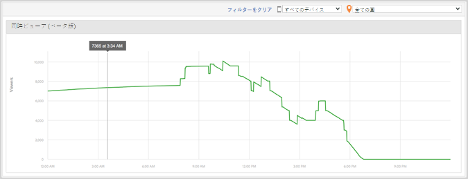

# メディア同時閲覧者数 {#media-concurrent-viewers}

メディア同時閲覧者数ダッシュボードには、1 日の同時閲覧者が表示されます。データは、コンテンツ、デバイスタイプまたは国でフィルターできます。

>[!TIP]
>
> このレポートは、同時にアクティブなメディアセッションに基づいています。  個別訪問者ごとの同時視聴者を表示し、セグメントを適用し、分解して比較するには、[Analysis Workspace のメディア同時視聴者数パネル](https://docs.adobe.com/content/help/ja-JP/analytics/analyze/analysis-workspace/panels/media-concurrent-viewers.html).を使用します。

## レポートの各機能 {#report-features}

このレポートには、次のような機能があります。

* リアルタイムではありません。通常の Adobe Analytics の遅延があります。
* このレポートは 24 時間の期間を対象としています。X 軸は、レポートスイートのタイムゾーンに基づく時間帯です。
* 分単位の詳細度で同時視聴者数を表示します。
* *メディア同時閲覧者数レポート*&#x200B;には、すべてのコンテンツの視聴者数が表示されます。
* *メディアの詳細*&#x200B;レポート内には同時閲覧者数レポートがあります。このレポートは、1 つの特定のメディアアイテムの視聴者数を示します。
* レポートの対象期間は 1 日のみです。
* お客様は、過去の同時ビューアレポートを参照できます（1 日に制限）。

## 制限事項 {#limitations}

このレポートの主な制限事項は次のとおりです。

* 選択したインターバルが 1 日ではない場合、データは表示されません。
* ReportBuilder などのデータをエクスポートすることはできません。
* データは表形式では表示できません。
* 電子メールでレポートを送信することはできません。
* 広告を追跡しない場合でも、メディアトラッキングを再度有効にしてメディア広告モジュールを選択する必要があります。
* この機能では、一時停止トラッキング機能を含むメディアハートビートライブラリを使用すると、正確なデータを参照できます。
