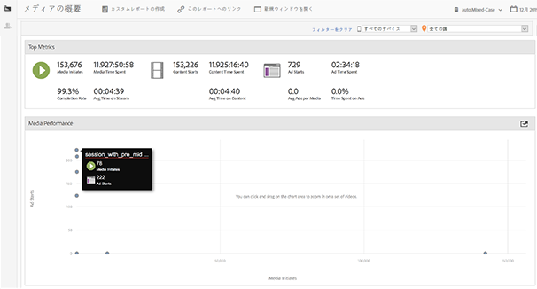
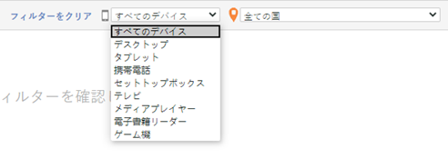
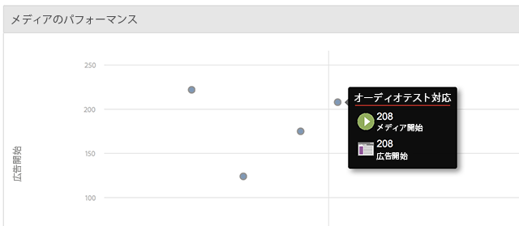

# メディアの概要 {#media-overview}

メディアの概要ダッシュボードは、サイト全体のメディアを監視できるように設計されています。メディアの概要画面には、いくつかの測定値が集約されて表示されるので、メディアのパフォーマンスが正常であるかどうかをすばやく確認できます。グラフは、広告開始の隣にコンテンツ開始を表示して、各メディアアイテムのこれらの指標をすばやく表示できるようにします。

{width="672px"}

## クイックフィルター {#quick-filters}

デバイスまたは地域や国ごとのメディア指標をすばやく表示します。

{width="400px"}

## メディアのパフォーマンス {#media-performance}

クリックおよびドラッグしてズームインし、マウスポインターを置いて特定のメディアの詳細な指標を表示します。ズーム後に 

 をクリックして、表示をリセットします。

{width="400px"}

