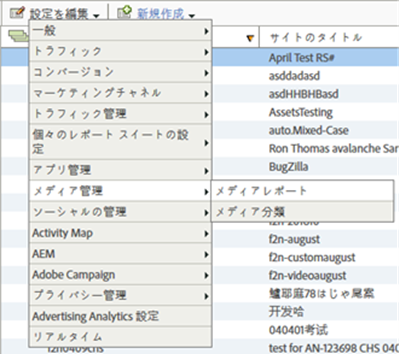

# メディアレポートの有効化 {#media-reports-enablement}

メディア指標を収集する各レポートスイートは、メディアデータが送信される前に設定されている必要があります。

>[!TIP]
>
>新機能を活用するために、既存の Media Analytics のお客様は、RSID のビデオトラッキングを再有効化する必要があります。

1. [Reports &amp; Analytics](https://my.omniture.com/login/) で、**[!UICONTROL 管理者／レポートスイートをクリックします]。**
1. メディアデータを収集するレポートスイートを選択して、**[!UICONTROL 設定を編集／メディア管理／メディアレポート]をクリックします。**

   {width=&quot;400px&quot;}

1. **[!UICONTROL メディアレポート]**&#x200B;ページで、**[!UICONTROL メディアコア]を**&#x200B;有効にして、オプションで&#x200B;**[!UICONTROL メディア広告]**、**[!UICONTROL メディアチャプター]**&#x200B;および&#x200B;**[!UICONTROL メディア画質]**&#x200B;を有効にします。

   メディア測定には、以下のモジュールが含まれます。

   * **メディアコア**

      コアメディア指標は、メディアコンテンツに使用されます。これは、ソリューション（またはカスタム）eVar を使用して、コンテンツ、コンテンツタイプ、コンテンツプレイヤー名およびコンテンツチャネルを追跡します。ソリューション（またはカスタム）イベントは、メディア開始、コンテンツ開始、コンテンツ完了およびコンテンツ視聴時間に対して使用されます。

   * **メディア広告**

      メディア広告指標は、メディアコンテンツ内の広告の測定に使用されます。これにより、ソリューション eVar を使用して、広告、広告プレイヤー名、広告ポッドおよびポッド位置の広告を測定します。ソリューションイベントは、広告開始、広告完了、広告滞在時間およびビデオ滞在時間に使用されます。

   * **メディアチャプター**

      ビデオチャプター指標は、チャプターの測定に使用されます。チャプターは、1 つのメディア内のコンテンツの区切りです。チャプター ID はソリューション eVar を使用して保存されます。ソリューションイベントは、チャプター開始、チャプター完了およびチャプター閲覧時間に使用されます。チャプター名とチャプター位置の追加のチャプターメタデータは、チャプター ID の分類として提供されます。

   * **メディア画質**

      ビデオ画質指標は、コンテンツ再生の品質の測定に使用されます。これは、ソリューション eVar を使用して、開始時間、バッファーイベント、合計バッファー時間、ビットレート切り替え、平均ビットレート、エラーおよびドロップフレームを保存します。ソリューションイベントは開始時間、開始前にドロップ、バッファーの影響を受けたストリーム、バッファーイベント、合計バッファー時間、ビットレート変更の影響を受けたストリーム、ビットレート変更、平均ビットレート、エラーの影響を受けたストリーム、エラーイベント、ドロップフレームの影響を受けたストリームおよびドロップフレーム

   * **ビデオおよびビデオ広告メタデータ**

      メディアや広告にメタデータを付加して、そのメディアや広告をさらに説明したり、分類したりすることができます。ソリューション変数および分類を使用して、標準化されたメディアおよび広告メタデータを収集します。含まれる値：番組、シーズン、エピソード、アセット ID、ジャンル、初回放送日、コンテンツ評価、作成者、ネットワーク、番組タイプ、広告読み込み、MVPD、認証済み、日パート、メディアセッション ID、広告主、キャンペーン ID、クリエイティブ ID

   * **オーディオおよびオーディオ広告メタデータ**

      オーディオ / 広告を詳しく説明して分類するために、メタデータをオーディオや広告に添付できます。標準化したオーディオや広告のメタデータは、ソリューション変数と分類を使用して収集されます。含める値は、アーティスト、アルバム、ラベル、作成者、発行者、ステーション、番組、シーズン、エピソード、アセット ID、ジャンル、初回放送日、初回デジタル日、コンテンツ評価、作成者、番組タイプ、広告読み込み、日パート、メディアセッション ID、広告主、キャンペーン ID、クリエイティブ ID です。
   各モジュールを有効にすると、変数のセットが予約され、新しいレポートのセットが作成されます。画質を例外として、対応する実装が完了するまで、レポートにデータがありません。また、画質モジュールを有効にした場合、コアモジュールを実装すると、画質モジュールを実装します。

   まだ広告、チャプターまたは再生品質を追跡していない場合は、いつでも追加のオプションを有効にできます。

1. 「**[!UICONTROL 保存]」をクリックします。**

   このレポートスイートが既にメディアデータを収集するように設定されている場合は、「**[!UICONTROL 保存]**」をクリックした後に、追加の設定ページが表示されます。**[!UICONTROL メディアコア指標]**&#x200B;ページが表示されたら、次のステップへと進みます。

1. （条件付き）**[!UICONTROL メディアコア指標]**&#x200B;ページで、カスタム変数を使用し続けるかソリューション変数を使用するかを選択します。

   | オプション | メモ |
   | --- | --- |
   | カスタム変数を使用し続ける | 長所と短所：<ul> <li> **長所：**&#x200B;移行後もコンテンツトレンドが機能し続けます。 </li> <li> **短所：**&#x200B;メディアに割り当てた 2 つのカスタム eVars および 3 つのカスタムイベントを維持する必要があります。1 つのカスタム eVar と 1 つのカスタムイベントを再び使用できるようになります。 </li> </ul> カスタム変数を使用し続けるには、次の手順を実行します。 <ol> <li>「**[!UICONTROL カスタム変数を使用]**」を選択して、「**[!UICONTROL 保存]**」をクリックします。 </li> <li>プロンプトが表示されたら、現在のカスタム eVar およびイベントをマッピングして、「**[!UICONTROL 保存]**」をクリックします。 </li> </ol> |
   | ソリューション変数に移行する | 長所と短所：<ul> <li> **長所：** 3 つのカスタム eVar と 4 つのカスタムイベントを再び使用できるようになります。 </li> <li> **短所：**&#x200B;メディアレポートのトレンドと比較の履歴は&#x200B;**すべて**&#x200B;失われます。つまり、ハートビートに移行する前のコンテンツビューやコンテンツ再生時間のトレンドを表示することはできません。 </li> </ul> **制限事項：**&#x200B;このトレンド情報を保持しなくてもよいことが確実でない限り、ソリューション変数に移行しないでください。以前からの持続性を保持する必要がある場合のみ、すべてのお客様がソリューション変数および処理ルールを使用して、メディアデータを既存の prop および eVar に移行する必要があります。ソリューション変数に移行するには：「**[!UICONTROL ソリューション変数を使用]**」を選択して、「**[!UICONTROL 保存]」をクリックします。**   重要：ソリューション変数への移行により、ビデオレポートの **すべての** 履歴トレンドおよび比較が失われます。 |

>[!IMPORTANT]
>
>指標およびメタデータ表（例：[オーディオおよびビデオパラメーター](/help/metrics-and-metadata/audio-video-parameters.md)）で、レポート／予約変数に「分類」と説明されている変数の分類名を変更しないでください。メディア分類は、レポートスイートでメディアトラッキングが有効にされる際に定義されます。アドビは新しいプロパティを追加することがありますが、その場合、新しいメディアプロパティにアクセスするには、レポートスイートを再有効化する必要があります。更新処理の際に、アドビは、変数の名前をチェックすることで、分類が有効にされているかどうかを判別します。見つからない変数名がある場合、アドビは、分類を再追加します。
