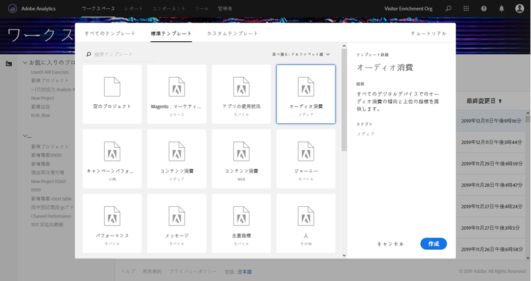
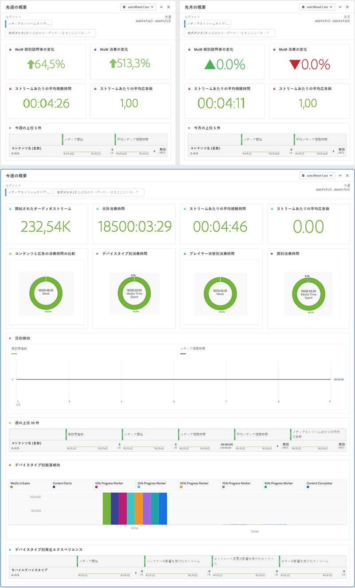

# メディアワークスペースのテンプレート{#media-workspace-templates}

Adobe Analytics のワークスペースを利用すると、トラッキングデータを分析するためのダッシュボードをすばやくセットアップすることができます。新しいプロジェクトを作成する際や、ワークスペースに移動して既存のプロジェクトを管理する際に、よく利用する一般的な追跡シナリオ（獲得、オーディオおよびビデオの視聴など）に対応した標準のテンプレートから選択することができます。または、独自のカスタムテンプレートの作成、変更、保存をおこなうこともできます。

テンプレートの操作は、プロジェクトの作成や管理をおこなう際に Adobe Analytics の「ワークスペース」タブでおこないます。最初にワークスペースに移動すると、新規プロジェクトを作成するのか既存のプロジェクトを開くのかを選択できます。

* **新規プロジェクトの作成** - ワークスペースで「**[!UICONTROL 新規プロジェクトの作成]」ボタンをクリックすると、ダイアログが表示されます。このダイアログで、（標準とカスタムを含む）テンプレートのコレクションから選択できます。**

   

   例えば、オーディオ消費テンプレートを選択すると、以下のオーディオ向けダッシュボードが表示されます。

   

* **プロジェクト管理** - 既存のプロジェクトで、データの表示を変更し、名前を付けて保存して、カスタムテンプレートの独自のコレクションを作成できます。

