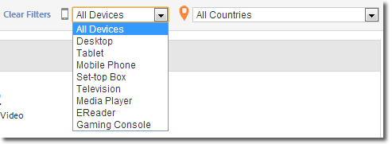

# メディアの概要{#media-overview}

メディア概要ダッシュボードは、サイト全体のメディアを監視できるように設計されています。 メディアの概要ディスプレイには、複数の集計された測定値が表示されるので、メディアのパフォーマンスが期待どおりに行われていることを素早く監視できます。 グラフには、広告開始の横にコンテンツ開始が表示され、各メディア項目のこれらの指標をすばやく表示できます。

<!--
{width="672px"}
-->

## クイックフィルター {#quick-filters}

デバイスまたは地域や国ごとのメディア指標をすばやく表示します。

<!--
{width="400px"}
-->

## メディアのパフォーマンス {#media-performance}

クリックおよびドラッグしてズームインし、マウスポインターを置いて特定のメディアの詳細な指標を表示します。 ズーム後に 

をクリックして、表示をリセットします。

<!--
{width="400px"}
-->
