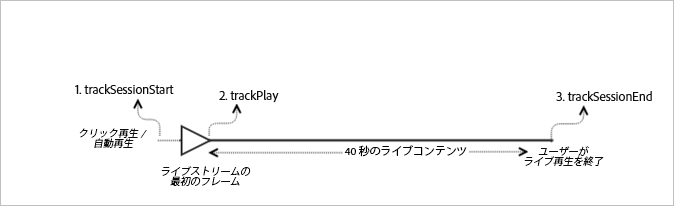

# ライブメインコンテンツ {#live-main-content}

## シナリオ {#scenario}

このシナリオでは、ライブストリームに参加後、40 秒間広告が再生されていない、1 つのライブアセットがあります。

| トリガー | ハートビートメソッド | ネットワーク呼び出し | メモ   |
|---|---|---|---|
| ユーザーが&#x200B;**[!UICONTROL 再生]**&#x200B;をクリックする | `trackSessionStart` | Analytics Content Start、Heartbeat Content Start | これは、**[!UICONTROL 再生]**&#x200B;をクリックするユーザーか、自動再生イベントである可能性があります。 |
| メディア再生の最初のフレーム。 | `trackPlay` | Heartbeat Content Play | このメソッドは、タイマーをトリガーします。ハートビートは、再生が続く限り、10 秒ごとに送信されます。 |
| コンテンツが再生されます。 |  | Content Heartbeats |  |
| セッションが終了します。 | `trackSessionEnd` |  | `SessionEnd` は、表示セッションの終端を意味します。この API は、ユーザーが最後までメディアを再生していなくても、呼び出される必要があります。 |

## パラメーター {#parameters}

Adobe Analytics Content Start 呼び出し時に確認される同じ値の多くは、Heartbeat Content Start 呼び出し時にも確認されます。また、Adobe Analytics の様々なメディアレポートに設定するためにアドビが使用するその他のパラメーターの多くも確認されます。ここではすべては取り上げません。本当に重要なものだけを示します。

### Heartbeat Content Start

| パラメーター | 値 | メモ |
|---|---|---|
| `s:sc:rsid` | &lt;Adobe レポートスイート ID> |  |
| `s:sc:tracking_serve` | &lt;Analytics トラッキングサーバー URL> |  |
| `s:user:mid` | `s:user:mid` | Adobe Analytics Content Start 呼び出しの mid 値と一致する必要がある |
| `s:event:type` | &quot;start&quot; |  |
| `s:asset:type` | &quot;main&quot; |  |
| `s:asset:mediao_id` | &lt;メディア名> |  |
| `s:stream:type` | live |  |
| `s:meta:*` | オプション | メディアに設定されたカスタムメタデータ |

## Content Heartbeats {#content-heartbeats}

メディア再生中に、1 つ以上のハートビート（または ping）を 10 秒ごと（メインコンテンツ）および 1 秒ごと（広告）に送信するタイマーがあります。それらのハートビートには、再生、広告、バッファーおよびその他多くに関する情報が含まれます。各ハートビートの厳密なコンテンツは、このドキュメントの範囲外であり、検証に重要なことは、ハートビートは、再生が続く間、常にトリガーされるということです。

Content Heartbeats では、いくつかの特定の事柄を探します。

| パラメーター | 値 | メモ |
|---|---|---|
| `s:event:type` | &quot;play&quot; |  |
| `l:event:playhead` | &lt;再生ヘッドの位置> 例：50、60、70 | これは、再生ヘッドの現在の位置を反映する必要があります。 |

## Heartbeat Content Complete {#heartbeat-content-complete}

ライブストリームが完了することはないので、このシナリオでは、完了呼び出しはありません。

## 再生ヘッド値の設定

ライブストリームでは、プルグラムが開始したときからのオフセットに再生ヘッドを設定して、レポートで 24 時間表示のどの時点でユーザーがライブストリームに参加および離脱したかをアナリストが判断できるようにします。

### 開始時

ライブメディアでは、ユーザーがストリーミングの再生を開始する際に、現在のオフセット（秒単位）に `l:event:playhead` を設定する必要があります。これは、VOD とは対照的です（VOD では再生ヘッドを「0」に設定します）。

例えば、ライブストリーミングイベントが午前 0 時に開始し、24 時間実行するとします（`a.media.length=86400`; `l:asset:length=86400`）。次に、ユーザーが午後 12：00 にそのライブストリームの再生を開始するとします。このシナリオでは、`l:event:playhead` を 43200（12 時間）に設定する必要があります。

### 一時停止時

ユーザーが再生を一時停止する場合、再生の開始時に適用されたのと同じ「ライブ再生ヘッド」ロジックが適用される必要があります。ユーザーがライブストリームの再生に戻る場合、ユーザーがライブストリームを一時停止した時点&#x200B;_ではなく_、新しいオフセット再生ヘッド位置に `l:event:playhead` 値を設定する必要があります。

## サンプルコード {#sample-code}



### Android

以下に、期待される API 呼び出し順序を示します。

```java
// Set up mediaObject 
MediaObject mediaInfo = MediaHeartbeat.createMediaObject( 
  Configuration.MEDIA_NAME,  
  Configuration.MEDIA_ID,  
  Configuration.MEDIA_LENGTH,  
  MediaHeartbeat.StreamType.LIVE 
); 

HashMap<String, String> mediaMetadata = new HashMap<String, String>(); 
mediaMetadata.put(CUSTOM_VAL_1, CUSTOM_KEY_1); 
mediaMetadata.put(CUSTOM_VAL_2, CUSTOM_KEY_2); 

// 1. Call trackSessionStart() when the user clicks Play or if autoplay is used,  
//    i.e., there is an intent to start playback.  
_mediaHeartbeat.trackSessionStart(mediaInfo, mediaMetadata); 

...... 
...... 

// 2. Call trackPlay() when the playback actually starts, i.e., when the first  
//    frame of main content is rendered on the screen. 
_mediaHeartbeat.trackPlay(); 

....... 
....... 

// 3. Call trackSessionEnd() when user ends the playback session.  
//    Since the user does not watch live media to completion, there  
//    is no need to call trackComplete().  
_mediaHeartbeat.trackSessionEnd(); 
....... 
....... 
```

### iOS

以下に、期待される API 呼び出し順序を示します。

```
// Set up mediaObject 
ADBMediaObject *mediaObject =  
[ADBMediaHeartbeat createMediaObjectWithName:MEDIA_NAME  
                   length:MEDIA_LENGTH  
                   streamType:ADBMediaHeartbeatStreamTypeLIVE]; 
 
NSMutableDictionary *mediaContextData = [[NSMutableDictionary alloc] init]; 
[mediaContextData setObject:CUSTOM_VAL_1 forKey:CUSTOM_KEY_1]; 
[mediaContextData setObject:CUSTOM_VAL_2 forKey:CUSTOM_KEY_2]; 
 
// 1. Call trackSessionStart when the user clicks Play or if autoplay is used,  
//    i.e., there is an intent to start playback. 
[_mediaHeartbeat trackSessionStart:mediaObject data:mediaContextData]; 
...... 
...... 
 
// 2. Call trackPlay when the playback actually starts, i.e., when the first  
//    frame of the main content is rendered on the screen. 
[_mediaHeartbeat trackPlay]; 
....... 
....... 
 
// 3. Call trackSessionEnd when user ends the playback session. Since the user  
//    does not watch live media to completion, there is no need to call  
//    trackComplete. 
[_mediaHeartbeat trackSessionEnd]; 
........ 
........ 
```

### JavaScript

以下に、期待される API 呼び出し順序を示します。

```js
// Set up mediaObject 
var mediaInfo =  
MediaHeartbeat.createMediaObject(Configuration.MEDIA_NAME,  
                                 Configuration.MEDIA_ID,  
                                 Configuration.MEDIA_LENGTH,  
                                 MediaHeartbeat.StreamType.VOD); 

var mediaMetadata = { 
  CUSTOM_KEY_1 : CUSTOM_VAL_1,  
  CUSTOM_KEY_2 : CUSTOM_VAL_2,  
  CUSTOM_KEY_3 : CUSTOM_VAL_3 
}; 

// 1. Call trackSessionStart() when Play is clicked or if autoplay  
//    is used, i.e., there's an intent to start playback. 
this._mediaHeartbeat.trackSessionStart(mediaInfo, mediaMetadata); 

...... 
...... 

// 2. Call trackPlay() when the playback actually starts, i.e., when the  
//    first frame of media is rendered on the screen. 
this._mediaHeartbeat.trackPlay(); 

....... 
....... 

// 3. Call trackSessionEnd() when user ends the playback session.  
//    Since user does not watch live media to completion, there is  
//    no need to call trackComplete(). 
this._mediaHeartbeat.trackSessionEnd(); 

........ 
........ 
```
