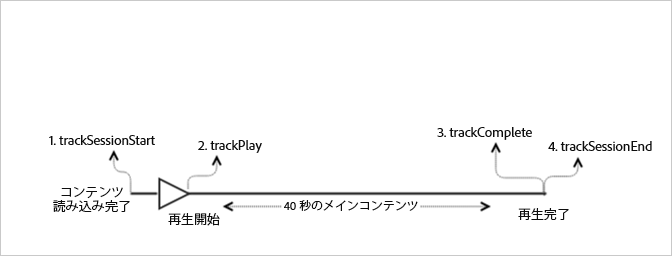

# 広告のない VOD 再生{#vod-playback-with-no-ads}

## シナリオ {#scenario}

このシナリオには、広告のない 1 つの VOD アセットが含まれ、最初から最後まで 1 回再生されます。

| トリガー | ハートビートメソッド | ネットワーク呼び出し | メモ   |
|---|---|---|---|
| ユーザーが&#x200B;**[!UICONTROL 再生]**&#x200B;をクリックする | `trackSessionStart` | Analytics Content Start、Heartbeat Content Start | これは、再生をクリックするユーザーか、自動再生イベントである可能性があります。 |
| メディアの最初のフレーム | `trackPlay` | Heartbeat Content Play | このメソッドは、タイマーをトリガーし、以降、再生中 10 秒ごとにハートビートが送信されます。 |
| コンテンツ再生 |  | Content Heartbeats |  |
| コンテンツ完了 | `trackComplete` | Heartbeat Content Complete | *Complete* は、再生ヘッドの終わりに達したことを意味します。 |

## パラメーター {#parameters}

Heartbeat 呼び出し時に確認される同じ値の多くは、Adobe Analytics `Content Start`Content Start 呼び出し時にも確認されます。様々なメディアレポートに設定するためにアドビが使用する多くのパラメーターがありますが、最も重要なパラメーターのみを以下の表に示します。

### Heartbeat Content Start

| パラメーター | 値 | メモ   |
|---|---|---|
| `s:sc:rsid` | &lt;Adobe レポートスイート ID> |  |
| `s:sc:tracking_server` | &lt;Analytics トラッキングサーバー URL> |  |
| `s:user:mid` | 設定される必要がある | `Adobe Analytics Content Start` 呼び出しの mid 値と一致する必要がある。 |
| `s:event:type` | `"start"` |  |
| `s:asset:type` | `"main"` |  |
| `s:asset:media_id` | &lt;メディア名> |  |
| `s:meta:*` | オプション | メディアに設定されたカスタムメタデータ。 |

## Heartbeat Content Play {#heartbeat-content-play}

これらのパラメーターは、`Heartbeat Content Start` 呼び出しとほとんど同じように見えますが、重要な違いは `s:event:type` パラメーターです。その他のパラメーターはすべて必要です。

| パラメーター | 値 | メモ   |
|---|---|---|
| `s:event:type` | `"play"` |  |
| `s:asset:type` | `"main"` |  |

## Content Heartbeats {#content-heartbeats}

メディア再生中に、タイマーが少なくとも 1 つのハートビートを 10 秒ごとに送信します。これらのハートビートには、再生、広告、バッファリングなどに関する情報が含まれます。各ハートビートの厳密なコンテンツは、このドキュメントの範囲外ですが、重要な問題は、ハートビートは、再生が続く間、常にトリガーされるということです。

コンテンツハートビートで、次のパラメーターを探します。

| パラメーター | 値 | メモ   |
|---|---|---|
| `s:event:type` | `"play"` |  |
| `l:event:playhead` | &lt;再生ヘッドの位置> 例：50、60、70 | このパラメーターは、再生ヘッドの現在の位置を反映します。 |

## Heartbeat Content Complete {#heartbeat-content-complete}

再生が完了した場合、つまり、再生ヘッドの終わりに達した場合、`Heartbeat Content Complete` 呼び出しが送信されます。この呼び出しは、他のハートビート呼び出しに似ていますが、特定のパラメーターがいくつか含まれています。

| パラメーター | 値 | メモ   |
|---|---|---|
| `s:event:type` | `"complete"` |  |
| `s:asset:type` | `"main"` |  |

## サンプルコード {#sample-code}

このシナリオでは、コンテンツの長さは 40 秒です。最後まで途切れずに再生されます。



### Android

```java
// Set up  mediaObject 
MediaObject mediaInfo = MediaHeartbeat.createMediaObject( 
  Configuration.MEDIA_NAME,  
  Configuration.MEDIA_ID,  
  Configuration.MEDIA_LENGTH,  
  MediaHeartbeat.StreamType.VOD 
); 

HashMap<String, String> mediaMetadata = new HashMap<String, String>(); 
mediaMetadata.put(CUSTOM_VAL_1, CUSTOM_KEY_1); 
mediaMetadata.put(CUSTOM_VAL_2, CUSTOM_KEY_2); 

// 1. Call trackSessionStart() when the user clicks Play or if autoplay  
//    is used, i.e., there's an intent to start playback.  
_mediaHeartbeat.trackSessionStart(mediaInfo, mediaMetadata); 

...... 
...... 

// 2. Call trackPlay() when the playback actually starts,  
//    i.e., the first frame of media is rendered on the screen.  
_mediaHeartbeat.trackPlay(); 

....... 
....... 

// 3. Call trackComplete() when the playback reaches the end,  
//    i.e., when the media completes and finishes playing.  
_mediaHeartbeat.trackComplete(); 

........ 
........ 

// 4. Call trackSessionEnd() when the playback session is over.  
//    This method must be called even if the user does not watch  
//    the media to completion.  
_mediaHeartbeat.trackSessionEnd(); 

........ 
........ 
```

### iOS

```
when the user clicks Play 
ADBMediaObject *mediaObject =  
[ADBMediaHeartbeat createMediaObjectWithName:MEDIA_NAME  
                   length:MEDIA_LENGTH  
                   streamType:ADBMediaHeartbeatStreamTypeVOD]; 

NSMutableDictionary *mediaContextData = [[NSMutableDictionary alloc] init]; 
[mediaContextData setObject:CUSTOM_VAL_1 forKey:CUSTOM_KEY_1]; 
[mediaContextData setObject:CUSTOM_VAL_2 forKey:CUSTOM_KEY_2]; 

// 1. Call trackSessionStart when the user clicks Play or if autoplay is used,  
//    i.e., there's an intent to start playback. 
[_mediaHeartbeat trackSessionStart:mediaObject data:mediaContextData]; 
...... 
...... 

// 2. Call trackPlay when the playback actually starts, i.e., when the  
//    first frame of main content is rendered on the screen. 
[_mediaHeartbeat trackPlay]; 
....... 
....... 

// 3. Call trackComplete when the playback reaches the end, i.e.,  
//    when the media completes and finishes playing. 
[_mediaHeartbeat trackComplete]; 
........ 
........ 

// 4. Call trackSessionEnd when the playback session is over. This method  
//    must be called even if the user does not watch the media to completion. 
[_mediaHeartbeat trackSessionEnd]; 
........ 
........ 
```

### JavaScript

```js
// Set up mediaObject 

var mediaInfo = MediaHeartbeat.createMediaObject(Configuration.MEDIA_NAME, Configuration.MEDIA_ID,  
Configuration.MEDIA_LENGTH,MediaHeartbeat.StreamType.VOD); 
var mediaMetadata = { 
  CUSTOM_KEY_1 : CUSTOM_VAL_1,  
  CUSTOM_KEY_2 : CUSTOM_VAL_2,  
  CUSTOM_KEY_3 : CUSTOM_VAL_3 

}; 

// 1. Call trackSessionStart() when the user clicks play, or when autoplay is used,  
//    i.e., there's an intent to start playback. 
this._mediaHeartbeat.trackSessionStart(mediaInfo, mediaMetadata); 

...... 
...... 

// 2. Call trackPlay() when the main content starts, i.e.,  
//    the first frame of the media content is rendered on the screen. 
this._mediaHeartbeat.trackPlay(); 

....... 
....... 

// 3. Call trackComplete() when the playback reaches the end,  
    i.e., the media completes and finishes playing. 
this._mediaHeartbeat.trackComplete(); 

........ 
........ 

// 4. Call trackSessionEnd() when the playback session is over.  
//    This method must be called even if the user does not  
//    watch the media to completion. 
this._mediaHeartbeat.trackSessionEnd(); 

........ 
........
```
