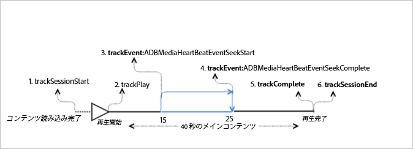

# メインコンテンツでシークのある VOD 再生{#vod-playback-with-seeking-in-the-main-content}

## シナリオ {#scenario}

このシナリオには、再生中にメインコンテンツでのシークがあります。

これは、[広告のない VOD 再生](/help/sdk-implement/tracking-scenarios/vod-no-intrs-details.md)シナリオと同じシナリオですが、コンテンツの一部はスクラブされ、メインコンテンツのあるポイントから別のポイントまでのシークが完了します。

| トリガー   | ハートビートメソッド   | ネットワーク呼び出し   | メモ   |
| --- | --- | --- | --- |
| ユーザーが[!UICONTROL 再生]をクリックする | `trackSessionStart` | Analytics Content Start、Heartbeat Content Start | Measurement Library は、プリロール広告があることに気づかないので、これらのネットワーク呼び出しは、[広告のない VOD 再生](/help/sdk-implement/tracking-scenarios/vod-no-intrs-details.md)シナリオと同一です。 |
| コンテンツ再生の最初のフレーム。 | `trackPlay` | Heartbeat Content Play | メインコンテンツの前にチャプターコンテンツを再生する場合、ハートビートは、チャプターが開始する際に開始されます。 |
| コンテンツ再生 |  | Content Heartbeats | このネットワーク呼び出しは、[広告のない VOD 再生](/help/sdk-implement/tracking-scenarios/vod-no-intrs-details.md)シナリオとまったく同じです。 |
| ユーザーがコンテンツでシーク操作を開始する | `trackSeekStart` |  | シークが完了する（例えば、`trackSeekComplete`）まで、ハートビートは終わりません。 |
| シーク操作が完了する | `trackSeekComplete` |  | シークが完了したので、ハートビートは終わり始めます。ヒント：再生ヘッド値は、シーク後に修正された新しい再生ヘッドを表す必要があります。 |
| コンテンツの完了 | `trackComplete` | Heartbeat Content Complete | このネットワーク呼び出しは、[広告のない VOD 再生](/help/sdk-implement/tracking-scenarios/vod-no-intrs-details.md)シナリオとまったく同じです。 |
| セッション終了 | `trackSessionEnd` |  | `SessionEnd` |

## サンプルコード {#sample-code}

このシナリオでは、メインコンテンツの再生中にユーザーがシークしています。



### Android

Android でこのシナリオを表示するには、以下のコードを設定します。

```java
// Set up mediaObject 
MediaObject mediaInfo = MediaHeartbeat.createMediaObject( 
  Configuration.MEDIA_NAME,  
  Configuration.MEDIA_ID,  
  Configuration.MEDIA_LENGTH,  
  MediaHeartbeat.StreamType.VOD 
); 

HashMap<String, String> mediaMetadata = new HashMap<String, String>(); 
mediaMetadata.put(CUSTOM_KEY_1, CUSTOM_VAL_1); 
mediaMetadata.put(CUSTOM_KEY_2, CUSTOM_VAL_2); 

// 1. Call trackSessionStart() when the user clicks Play or if autoplay is used,  
//    i.e., there is an intent to start playback.  
_mediaHeartbeat.trackSessionStart(mediaInfo, mediaMetadata); 

...... 
...... 

// 2. Call trackPlay() when the playback actually starts, i.e., whn the first frame  
//    of the main content is rendered on the screen.  
_mediaHeartbeat.trackPlay(); 

....... 
....... 

// 3. Track the MediaHeartbeat.Event.SeekStart event when the user begins to seek.  
_mediaHeartbeat.trackEvent(MediaHeartbeat.Event.SeekStart, null, null); 

....... 
....... 

// 4. Track the MediaHeartbeat.Event.SeekComplete event when the user completes seeking 
_mediaHeartbeat.trackEvent(MediaHeartbeat.Event.SeekComplete, null, null); 

....... 
....... 

// 5. Call trackComplete() when the playback reaches the end, i.e., when the media 
//    completes and finishes playing. 
_mediaHeartbeat.trackComplete(); 

........ 
........ 

// 6. Call trackSessionEnd() when the playback session is over. This method must be  
//    called even if the user does not watch the media to completion.  
_mediaHeartbeat.trackSessionEnd(); 

........ 
........ 
```

### iOS

iOS でこのシナリオを表示するには、以下のコードを設定します。

```
// Set up mediaObject 
ADBMediaObject *mediaObject =  
[ADBMediaHeartbeat createMediaObjectWithName:MEDIA_NAME o 
                   length:MEDIA_LENGTH  
                   streamType:ADBMediaHeartbeatStreamTypeVOD]; 
 
NSMutableDictionary *mediaContextData = [[NSMutableDictionary alloc] init]; 
[mediaContextData setObject:CUSTOM_VAL_1 forKey:CUSTOM_KEY_1]; 
[mediaContextData setObject:CUSTOM_VAL_2 forKey:CUSTOM_KEY_2]; 

// 1. Call trackSessionStart when the user clicks Play or if autoplay is used,  
//    i.e., there is an intent to start playback. 
[_mediaHeartbeat trackSessionStart:mediaObject data:mediaContextData]; 
....... 
....... 

// 2. Call trackPlay when the playback actually starts, i.e., when the 
//    first frame of the main content is rendered on the screen. 
[_mediaHeartbeat trackPlay];  
....... 
....... 

// 3. Track the trackEvent:ADBMediaHeartbeatEventSeekStart event when the user  
//    begins to seek out of the chapter with the intent to skip it. 
[_mediaHeartbeat trackEvent:ADBMediaHeartbeatEventSeekStart  
               mediaObject:nil  
               data:nil]; 
....... 
....... 

// 4. Track the trackEvent:ADBMediaHeartbeatEventSeekComplete event when the  
//    user seeks out of the chapter with the intent to skip it. 
[_mediaHeartbeat trackEvent:ADBMediaHeartbeatEventSeekComplete  
               mediaObject:nil  
               data:nil]; 
....... 
....... 

// 5. Call trackComplete when the playback reaches the end, i.e., completes  
//    and finishes playing. 
[_mediaHeartbeat trackComplete]; 
....... 
....... 

// 6. Call trackSessionEnd when the playback session is over. This method must  
//    be called even if the user does not watch the media to completion. 
[_mediaHeartbeat trackSessionEnd]; 
....... 
....... 
```

### JavaScript

このシナリオを表示するには、以下のテキストを入力します。

```js
// Set up mediaObject 
var mediaInfo = MediaHeartbeat.createMediaObject( 
  Configuration.MEDIA_NAME,  
  Configuration.MEDIA_ID,  
  Configuration.MEDIA_LENGTH,  
  MediaHeartbeat.StreamType.VOD 

); 

var mediaMetadata = { 
  CUSTOM_KEY_1 : CUSTOM_VAL_1,  
  CUSTOM_KEY_2 : CUSTOM_VAL_2,  
  CUSTOM_KEY_3 : CUSTOM_VAL_3 

}; 

// 1. Call trackSessionStart() when Play is clicked or if autoplay is used,  
//    i.e., there's an intent to start playback. 
this._mediaHeartbeat.trackSessionStart(mediaInfo, mediaMetadata); 

...... 
...... 

// 2. Call trackPlay() when the playback actually starts, i.e., when the  
//    first frame of the ad media is rendered on the screen. 
this._mediaHeartbeat.trackPlay(); 

....... 
....... 

// 3. Track the MediaHeartbeat.Event.SeekStart event when the user  
//    begins to seek. 
this._mediaHeartbeat.trackEvent(MediaHeartbeat.Event.SeekStart); 

....... 
....... 

// 4. Track the MediaHeartbeat.Event.SeekComplete event when the user  
//    completes seeking. 
this._mediaHeartbeat.trackEvent(MediaHeartbeat.Event.SeekComplete); 

....... 
....... 

// 5. Call trackComplete() when the playback reaches the end, i.e., when 
//    playback completes and finishes playing. 
this._mediaHeartbeat.trackComplete(); 

........ 
........ 

// 6. Call trackSessionEnd() when the playback session is over. This method must be called  
//    even if the user does not watch the media to completion. 
this._mediaHeartbeat.trackSessionEnd(); 

........ 
........ 
```
