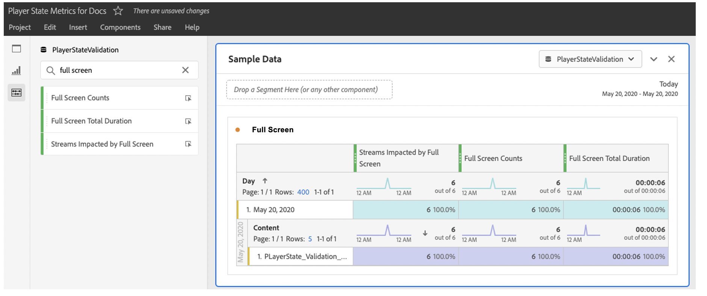

# 実装とレポート

再生セッション中は、各ステートの発生（最初から最後まで）を個別に追跡する必要があります。Media SDKと Media Collection API は、この機能のトラッキングメソッドを提供します。

Media SDKには、カスタム状態トラッキング用の 2 つのメソッドがあります。

`trackStateStart("state_name")`

`trackStateClose("state_name")`


Media Collection API には、必須パラメーターとして `media.stateName` を持つ 2 つのイベントが含まれています。

`stateStart` と `stateEnd`

## メディア SDK の実装

プレーヤーステートトラッキング

```
// StateStart (ex: Mute is switched on)
var stateObject = ADB.Media.createStateObject(ADB.Media.PlayerState.Mute);
tracker.trackEvent(ADB.Media.Event.StateStart, stateObject);
```

プレーヤーステートの終了

```
// StateEnd (ex: Mute is switched off)
tracker.trackEvent(ADB.Media.Event.StateEnd, stateObject);
```


## メディアコレクション API の実装

プレーヤーステートトラッキング

```
// StateStart (ex: Mute is switched on)
http(s)://<Analytics_Visitor_Namespace>.hb-api.omtrdc.net/api/v1/sessions/<SID>/events
{
  "eventType": "stateStart",
  "params": {
    "media.state.name": "mute"
  },
  "playerTime": {
    "playhead": 0,
    "ts": 1569999130627
  }
}
```

プレーヤーステートの終了

```
// StateEnd (ex: Mute is switched off)
http(s)://<Analytics_Visitor_Namespace>.hb-api.omtrdc.net/api/v1/sessions/<SID>/events

{
  "eventType": "stateEnd",
  "params": {
    "media.state.name": "mute"
  },
  "playerTime": {
    "playhead": 600,
    "ts": 1569999730638
  }
}
```

## ステートの指標

個々のステートに対して提供される指標は、データパラメーターとして計算して Adobe Analytics にプッシュされ、レポート目的で保存されます。各ステートに対して 3 つの指標を使用できます。

* `a.media.states.[state.name].set = true`：ストリームの特定の再生 1 回あたり、ステートが 1 回以上設定された場合は、true に設定します。
* `a.media.states.[state.name].count = 4`：ストリームを 1 回再生する間に、ステートが発生した回数を識別します。
* `a.media.states.[state.name].time = 240`：ストリームの再生 1 回あたりの、ステートの合計時間を秒単位で識別します。

## レポート

レポートスイートでプレーヤーステートトラッキングが有効にされると、すべてのプレーヤーステート指標を、Analysis Workspace で使用可能な任意のレポートビジュアライゼーションやコンポーネント（セグメント、計算指標）に使用できます。これらの指標は、メディアレポート設定（設定を編集/メディア管理/メディアレポート）を使用して、個々のレポートのAdmin Consoleから有効にできます。


Analysis Workspaceでは、新しいプロパティはすべて指標パネルにあります。 例えば、`full screen` で検索し、指標パネルにフルスクリーンデータを表示できます。



## Adobe Experience Platform にプレーヤーステート指標を読み込む

Analytics に保存されたデータはどのような目的でも使用でき、プレーヤーステート指標は XDM を使用して Adobe Experience Platform に読み込み、Customer Journey Analytics で使用することができます。標準ステートのプロパティには固有のプロパティがあります。カスタムステートのプロパティは、カスタムイベントを介して使用できます。標準のステートプロパティについて詳しくは、[プレーヤーステートパラメーター](/help/implementation/variables/player-state-parameters.md) ページで、*XDM ID のプロパティリスト*&#x200B;の節を参照してください。
