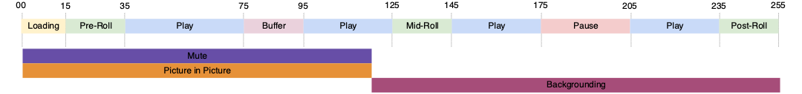

# 複数プレーヤーの状態のトラッキング

次の図に示すように、2 つのプレーヤーの状態が同時に開始および終了したり、状態の終了が別の状態の開始になったりする場合があります。



現在の実装では、次の両方のシナリオを使用できます。
- `stateStart(pictureInPicture)` - t0
- `stateStart(mute)` - t0
- `stateEnd(mute)` - t1
- `stateEnd(pictureInPicture)` - t1
- `stateStart(fullScreen)` - t1
- `stateEnd(fullScreen)` - t2

ただし、この場合は、複数の `stateStart` および `stateEnd` イベントを発行して、複数の同時状態変化を通知する必要があります。 次に含まれる
この一般的な動作を最適化するために、新しい`statesUpdate` イベントタイプが実装され、状態のリストが終了しました
新しい状態のリストを開始します。

新しい `statesUpdate` イベントを使用すると、上記のイベントのリストは次のようになります。
- `statesUpdate(statesEnd=[], statesStart=[pictureInPicture, mute])` - t0
- `statesUpdate(statesEnd=[mute, pictureInPicture], statesStart=[fullScreen])` - t1
- `statesUpdate(statesEnd=[fullScreen], statesStart=[])` - t2

同じ動作に対して、状態更新呼び出しの数が 6 から 3 に減少しました。 最後のイベント
単純な`stateEnd(fullScreen)`でもかまいません。

## Media Collection API の実装 {#mpst-api}

Media Collection API を使用して、複数プレーヤーの状態のトラッキングを実装できます。

### 例

次に、複数プレーヤーの状態のトラッキング用の Media Collection API の実装例を示します。

```
// statesUpdate (ex: mute and pictureInPicture are switched on)
http(s)://<Analytics_Visitor_Namespace>.hb-api.omtrdc.net/api/v1/sessions/<SID>/events
{
  "eventType": "statesUpdate",
  "params": {
    "statesStart": [
      {
        "media.state.name": "mute"
      },
      {
        "media.state.name": "pictureInPicture"
      }
    ]
  },
  "playerTime": {
    "playhead": 0,
    "ts": 1569999130627
  }
}
```

```
// statesUpdate (ex: mute and pictureInPicture are switched off, fullScreen is switched on)
http(s)://<Analytics_Visitor_Namespace>.hb-api.omtrdc.net/api/v1/sessions/<SID>/events
{
  "eventType": "statesUpdate",
  "params": {
    "statesEnd": [
      {
        "media.state.name": "mute"
      },
      {
        "media.state.name": "pictureInPicture"
      }
    ],
    "statesStart": [
      {
        "media.state.name": "fullScreen"
      }
    ]
  },
  "playerTime": {
    "playhead": 0,
    "ts": 1569999130627
  }
}
```

```
// statesUpdate (ex: fullScreen is switched off)
http(s)://<Analytics_Visitor_Namespace>.hb-api.omtrdc.net/api/v1/sessions/<SID>/events
{
  "eventType": "statesUpdate",
  "params": {
    "statesEnd": [
      {
        "media.state.name": "fullScreen"
      }
    ]
  },
  "playerTime": {
    "playhead": 0,
    "ts": 1569999130627
  }
}
```

## メディア SDK の実装

メディア SDK の実装はありません。
