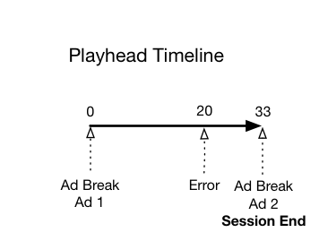
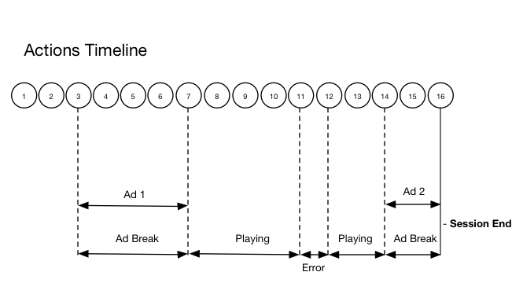

# タイムライン 2 - ユーザーが中断したセッション {#timeline--2-user-abandons-session}

## VOD、プリロール広告、ミッドロール広告、ユーザーがコンテンツを早い時点で中断

次の図に、再生ヘッドタイムラインおよびユーザーのアクションに対応するタイムラインを示します。各アクションおよびそれに伴うリクエストを次に示します。





## アクションの詳細

### アクション 1 - セッションの開始 {#Action-1}

| アクション | アクションのタイムライン（秒） | 再生ヘッドの位置（秒） | クライアントリクエスト |
| --- | :---: | :---: | --- |
| 自動再生または再生ボタンが押された | 0 | 0 | `/api/v1/sessions` |

この呼び出しは、ビデオを&#x200B;_再生しようとするユーザーの意図_&#x200B;を示します。セッション内の後続のすべてのトラッキングコールを識別するために使用されるセッション ID（`{sid}`）がクライアントに返されます。プレーヤーの状態はまだ「再生中」ではなく、「開始中」です。必須のセッションパラメーターをリクエスト本文の `params` マップに含める必要があります。バックエンドでは、この呼び出しによって Adobe Analytics の開始呼び出しが生成されます。セッションについて詳しくは、メディアコレクション API のドキュメントを参照してください。

```json
{
    "playerTime": {
        "playhead": 0,
        "ts": "<timestamp>"
    },
    "eventType": "sessionStart",
    "params": {
        "media.playerName": "sample-html5-api-player",
        "analytics.trackingServer": "[ _YOUR-TS_ ]",
        "analytics.reportSuite": "[ _YOUR-RSID_ ]",
        "analytics.visitorId": "[ _YOUR-VISITOR-ID_ ]",
        "media.contentType": "VOD",
        "media.length": 60.3333333333333,
        "media.id": "VA API Sample Player",
        "visitor.marketingCloudOrgId": "[YOUR-MCID]",
        "media.name": "ClickMe",
        "media.channel": "sample-channel",
        "media.sdkVersion": "va-api-0.0.0",
        "analytics.enableSSL": false
    }
}
```

### アクション 2 - ping タイマー開始 {#Action-2}

| アクション | アクションのタイムライン（秒） | 再生ヘッドの位置（秒） | クライアントリクエスト |
| --- | :---: | :---: | --- |
| アプリ開始 ping イベントタイマー | 0 | 0 | |

アプリの ping タイマーを開始します。最初の ping イベントは、プリロール広告がある場合は 1 秒、その他の場合は 10 秒で発生させる必要があります。

### アクション 3 - 広告ブレーク開始 {#Action-3}

| アクション | アクションのタイムライン（秒） | 再生ヘッドの位置（秒） | クライアントリクエスト |
| --- | :---: | :---: | --- |
| プリロール広告ブレークの開始を追跡する | 0 | 0 | `/api/v1/sessions/{sid}/events` |

プリロール広告を追跡する必要があります。広告は、広告ブレーク内でのみ追跡できます。

```json
{
    "playerTime": {
        "playhead": 0,
        "ts": "<timestamp>"
    },
    "eventType": "adBreakStart",
    "params": {
        "media.ad.podFriendlyName": "ad_pod1",
        "media.ad.podIndex": 0,
        "media.ad.podSecond": 0
    }
}
```

### アクション 4 - 広告開始 {#Action-4}

| アクション | アクションのタイムライン（秒） | 再生ヘッドの位置（秒） | クライアントリクエスト |
| --- | :---: | :---: | --- |
| プリロール広告 #1 の開始を追跡する | 0 | 0 | `/api/v1/sessions/{sid}/events` |

12 秒の広告が開始します。

```json
{
    "playerTime": {
        "playhead": 0,
        "ts": "<timestamp>"
    },
    "eventType": "adStart",
    "params": {
        "media.ad.podFriendlyName": "ad_pod1",
        "media.ad.name": "Ad 1",
        "media.ad.id": "002",
        "media.ad.length": 7,
        "media.ad.podPosition": 1,
        "media.ad.playerName": "Sample Player",
        "media.ad.advertiser": "Ad Guys",
        "media.ad.campaignId": "1",
        "media.ad.creativeId": "42",
        "media.ad.siteId": "XYZ",
        "media.ad.creativeURL": "https://xyz-creative.com",
        "media.ad.placementId": "sample-placement2"
    },
}
```

### アクション 5 - 広告 ping {#Action-5}

| アクション | アクションのタイムライン（秒） | 再生ヘッドの位置（秒） | クライアントリクエスト |
| --- | :---: | :---: | --- |
| アプリが ping イベントを送信する | 1 | 0 | `/api/v1/sessions/{sid}/events` |

バックエンドに対する ping を 1 秒ごとに実行します。（簡潔にするために、後続の広告 ping は示しません。）

```json
{
    "playerTime": {
        "playhead": 0,
        "ts": "<timestamp>"
    },
    "eventType": "ping"
}
```

### アクション 6 - 広告完了 {#Action-6}

| アクション | アクションのタイムライン（秒） | 再生ヘッドの位置（秒） | クライアントリクエスト |
| --- | :---: | :---: | --- |
| プリロール広告 #1 の完了を追跡する | 12 | 0 | `/api/v1/sessions/{sid}/events` |

最初のプリロール広告が終了します。

```json
{
    "playerTime": {
        "playhead": 0,
        "ts": "<timestamp>"
    },
    "eventType": "adComplete"
}
```

### アクション 7 - 広告ブレーク完了 {#Action-7}

| アクション | アクションのタイムライン（秒） | 再生ヘッドの位置（秒） | クライアントリクエスト |
| --- | :---: | :---: | --- |
| プリロール広告ブレークの完了を追跡する | 12 | 0 | `/api/v1/sessions/{sid}/events` |

広告ブレークが終了します。広告ブレーク中、プレーヤーの状態は「再生中」のままになります。

```json
{
    "playerTime": {
        "playhead": 0,
        "ts": "<timestamp>"
    },
    "eventType": "adBreakComplete"
}
```

### アクション 8 - コンテンツの再生 {#Action-8}

| アクション | アクションのタイムライン（秒） | 再生ヘッドの位置（秒） | クライアントリクエスト |
| --- | :---: | :---: | --- |
| 再生イベントを追跡する | 12 | 0 | `/api/v1/sessions/{sid}/events` |

プレーヤーを「再生中」状態に移行します。コンテンツ再生の開始の追跡を開始します。

```json
{
    "playerTime": {
        "playhead": 0,
        "ts": "<timestamp>"
    },
    "eventType": "play",
    "qoeData": {
        "bitrate": 10000
    }
}
```

### アクション 9 - ping {#Action-9}

| アクション | アクションのタイムライン（秒） | 再生ヘッドの位置（秒） | クライアントリクエスト |
| --- | :---: | :---: | --- |
| アプリが ping イベントを送信する | 20 | 8 | `/api/v1/sessions/{sid}/events` |

バックエンドに対する ping を 10 秒ごとに実行します。

```json
{
    "playerTime": {
        "playhead": 8,
        "ts": "<timestamp>"
    },
    "eventType": "ping"
}
```

### アクション 10 - ping {#Action-10}

| アクション | アクションのタイムライン（秒） | 再生ヘッドの位置（秒） | クライアントリクエスト |
| --- | :---: | :---: | --- |
| アプリが ping イベントを送信する | 30 | 18 | `/api/v1/sessions/{sid}/events` |

バックエンドに対する ping を 10 秒ごとに実行します。

```json
{
    "playerTime": {
        "playhead": 18,
        "ts": "<timestamp>"
    },
    "eventType": "ping"
}
```

### アクション 11 - エラー {#Action-11}

| アクション | アクションのタイムライン（秒） | 再生ヘッドの位置（秒） | クライアントリクエスト |
| --- | :---: | :---: | --- |
| エラーが発生し、アプリがエラー情報を送信する | 32 | 20 | `/api/v1/sessions/{sid}/events` |

```json
{
    "playerTime": {
        "playhead": 20,
        "ts": "<timestamp>"
    },
    "eventType": "error"
}
```

### アクション 12 - コンテンツの再生 {#Action-12}

| アクション | アクションのタイムライン（秒） | 再生ヘッドの位置（秒） | クライアントリクエスト |
| --- | :---: | :---: | --- |
| アプリがエラーから回復し、ユーザーが再生を押す | 37 | 20 | `/api/v1/sessions/{sid}/events` |

```json
{
    "playerTime": {
        "playhead": 18,
        "ts": "<timestamp>"
    },
    "eventType":"play",
    "qoeData": {
        "bitrate": 10000
    }
}
```

### アクション 13 - ping {#Action-13}

| アクション | アクションのタイムライン（秒） | 再生ヘッドの位置（秒） | クライアントリクエスト |
| --- | :---: | :---: | --- |
| アプリが ping イベントを送信する | 40 | 28 | `/api/v1/sessions/{sid}/events` |

バックエンドに対する ping を 10 秒ごとに実行します。

```json
{
    "playerTime": {
        "playhead": 28,
        "ts": "<timestamp>"
    },
    "eventType": "ping"
}
```

### アクション 14 - 広告ブレーク開始 {#Action-14}

| アクション | アクションのタイムライン（秒） | 再生ヘッドの位置（秒） | クライアントリクエスト |
| --- | :---: | :---: | --- |
| ミッドロール広告ブレークの開始を追跡する | 45 | 33 | `/api/v1/sessions/{sid}/events` |

デュレーションが 8 秒のミッドロール広告：`adBreakStart` を送信します。

```json
{
    "playerTime": {
        "playhead": 33,
        "ts": "<timestamp>"
    },
    "eventType":"adBreakStart",
    "params": {
        "media.ad.podFriendlyName": "ad_pod2",
        "media.ad.podIndex": 1,
        "media.ad.podSecond": 33
    }
}
```

### アクション 15 - 広告開始 {#Action-15}

| アクション | アクションのタイムライン（秒） | 再生ヘッドの位置（秒） | クライアントリクエスト |
| --- | :---: | :---: | --- |
| ミッドロール広告 #1 の開始を追跡する | 45 | 33 | `/api/v1/sessions/{sid}/events` |

ミッドロール広告を追跡します。

```json
{
    "playerTime": { "playhead": 33, "ts": "<timestamp>"
    },
    "eventType": "adStart",
    "params": {
        "media.ad.podFriendlyName": "ad_pod1",
        "media.ad.name": "Ad 1",
        "media.ad.id": "002",
        "media.ad.length": 8,
        "media.ad.podPosition": 1,
        "media.ad.playerName": "Sample Player",
        "media.ad.advertiser": "Ad Guys",
        "media.ad.campaignId": "7",
        "media.ad.creativeId": "40",
        "media.ad.siteId": "XYZ",
        "media.ad.creativeURL": "https://example.com",
        "media.ad.placementId": "sample_placement2"
    },
}
```

### アクション 16 - アプリを閉じる {#Action-16}

| アクション | アクションのタイムライン（秒） | 再生ヘッドの位置（秒） | クライアントリクエスト |
| --- | :---: | :---: | --- |
| ユーザーがアプリを閉じ、視聴を中断したユーザーがこのセッションに戻らないとアプリが判断する。 | 48 | 33 | `/api/v1/sessions/{sid}/events` |

`sessionEnd` を VA バックエンドに送信して、それ以上の処理を行うことなくセッションを即座に終了する必要があることを示します。

```json
{
    "playerTime": {
        "playhead": 33,
        "ts": "<timestamp>"
    },
    "eventType": "sessionEnd"
}
```
