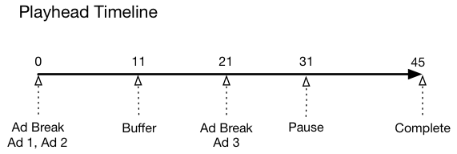

# タイムライン 1 - コンテンツの最後まで視聴{#timeline-view-to-end-of-content}

## VOD、プリロール広告、一時停止、バッファリング、コンテンツの最後まで視聴

次の図に、再生ヘッドタイムラインおよびユーザーのアクションに対応するタイムラインを示します。各アクションおよびそれに伴うリクエストを次に示します。




## アクションの詳細

### アクション 1 - セッションの開始 {#Action-1}

| アクション | アクションのタイムライン（秒） | 再生ヘッドの位置（秒） | クライアントリクエスト |
| --- | :---: | :---: | --- |
| 自動再生または再生ボタンが押され、ビデオの読み込みが開始される。 | 0 | 0 | `/api/v1/sessions` |

この呼び出しは、ビデオを&#x200B;_再生しようとするユーザーの意図_&#x200B;を示します。

セッション内の後続のすべてのトラッキングコールを識別するために使用されるセッション ID（`{sid}`）がクライアントに返されます。プレーヤーの状態はまだ「再生中」ではなく、「開始中」です。

必須のセッションパラメーターをリクエスト本文の `params` マップに含める必要があります。セッションについて詳しくは、メディアコレクション API のドキュメントを参照してください。

バックエンドでは、この呼び出しによって Adobe Analytics の開始呼び出しが生成されます。

```json
{
    "playerTime": {
        "playhead": 0,
        "ts": "<timestamp>"
    },
    "eventType":"sessionStart, params" {
        "media.playerName": "sample-html5-api-player",
        "analytics.trackingServer": "[ _YOUR_TS_ ]",
        "analytics.reportSuite": "[ _YOUR_RSID_ ]",
        "analytics.visitorId": "[ _YOUR_VISITOR_ID_ ]",
        "media.contentType": "VOD",
        "media.length": 60.3333333333333,
        "media.id": "VA API Sample Player",
        "visitor.marketingCloudOrgId": "[YOUR_MCID]",
        "media.name": "ClickMe",
        "media.channel": "sample-channel",
        "media.sdkVersion": "va-api-0.0.0",
        "analytics.enableSSL": false
    }
}
```

### アクション 2 - ping タイマー開始 {#Action-2}

| アクション | アクションのタイムライン（秒） | 再生ヘッドの位置（秒） | クライアントリクエスト |
| --- | :---: | :---: | --- |
| アプリ開始 ping イベントタイマー | 0 | 0 | `/api/v1/sessions/{sid}/events` |

アプリの ping タイマーを開始します。最初の ping イベントは、プリロール広告がある場合は 1 秒、その他の場合は 10 秒で発生させる必要があります。

### アクション 3 - 広告ブレーク開始 {#Action-3}

| アクション | アクションのタイムライン（秒） | 再生ヘッドの位置（秒） | クライアントリクエスト |
| --- | :---: | :---: | --- |
| プリロール広告ブレークの開始を追跡する | 0 | 0 | `/api/v1/sessions/{sid}/events` |

広告は、広告ブレーク内でのみ追跡できます。

```json
{
    "playerTime": {
        "playhead": 0,
        "ts": "<timestamp>"
    },
    "eventType":"adBreakStart",
    "params": {
        "media.ad.podFriendlyName": "ad_pod1",
        "media.ad.podIndex": 0,
        "media.ad.podSecond": 0
    }
}
```

### アクション 4 - 広告開始 {#Action-4}

| アクション | アクションのタイムライン（秒） | 再生ヘッドの位置（秒） | クライアントリクエスト |
| --- | :---: | :---: | --- |
| プリロール広告 #1 の開始を追跡する | 0 | 0 | `/api/v1/sessions/{sid}/events` |

長さが 15 秒の最初のプリロール広告の追跡を開始します。この `adStart` を使用してカスタムメタデータを含めます。

```json
{
    "playerTime": {
        "playhead": 0,
        "ts": "<timestamp>"
    },
    "eventType":"adStart",
    "params": {
        "media.ad.podFriendlyName": "ad_pod1",
        "media.ad.name": "Ad 1",
        "media.ad.id": "001",
        "media.ad.length": 15,
        "media.ad.podPosition": 1,
        "media.ad.playerName": "Sample Player",
        "media.ad.advertiser": "Ad Guys",
        "media.ad.campaignId": "1",
        "media.ad.creativeId": "42",
        "media.ad.siteId": "XYZ",
        "media.ad.creativeURL": "https://example.com",
        "media.ad.placementId": "sample_placement"
    },
    "customMetadata": {
        "myCustomData1": "CustomData1",
        "myCustomData2": "CustomData2"
    }
}
```

**メモ：AdBreakStart イベントと AdStart イベントの間に、追加の再生イベントを設定しないでください。**

### アクション 5 - 広告 ping {#Action-5}

#### アクション 5.1 - 広告 ping 1 {#Action-5-1}

| アクション | アクションのタイムライン（秒） | 再生ヘッドの位置（秒） | クライアントリクエスト |
| --- | :---: | :---: | --- |
| アプリが ping イベントを送信する | 1 | 0 | `/api/v1/sessions/{sid}/events` |

広告を表示している間、バックエンドに対する ping を 1 秒ごとに実行します。

```json
{
    "playerTime": {
        "playhead": 0,
        "ts": "<timestamp>"
    },
    "eventType": "ping"
}
```

#### アクション 5.2 - 広告 ping 2 {#Action-5-2}

| アクション | アクションのタイムライン（秒） | 再生ヘッドの位置（秒） | クライアントリクエスト |
| --- | :---: | :---: | --- |
| アプリが ping イベントを送信する | 2 | 0 | `/api/v1/sessions/{sid}/events` |

広告を表示している間、バックエンドに対する ping を 1 秒ごとに実行します。

```json
{
    "playerTime": {
        "playhead": 0,
        "ts": "<timestamp>"
    },
    "eventType": "ping"
}
```

#### アクション 5.3 - 広告 ping 3 {#Action-5-3}

| アクション | アクションのタイムライン（秒） | 再生ヘッドの位置（秒） | クライアントリクエスト |
| --- | :---: | :---: | --- |
| アプリが ping イベントを送信する | 3 | 0 | `/api/v1/sessions/{sid}/events` |

広告を表示している間、バックエンドに対する ping を 1 秒ごとに実行します。

>[!NOTE]
>
>簡略にするために、タイムラインの後続の広告では、一連の 1 秒の ping を示すのを省略します。
> 簡潔性を重視する場合

```json
{
    "playerTime": {
        "playhead": 0,
        "ts": "<timestamp>"
    },
    "eventType": "ping"
}
```

### アクション 6 - 広告完了 {#Action-6}

| アクション | アクションのタイムライン（秒） | 再生ヘッドの位置（秒） | クライアントリクエスト |
| --- | :---: | :---: | --- |
| プリロール広告 #1 の完了を追跡する | 15 | 0 | `/api/v1/sessions/{sid}/events` |

最初のプレロール広告の終わりを追跡します。

```json
{
    "playerTime": {
        "playhead": 0,
        "ts": "<timestamp>"
    },
    "eventType": "adComplete"
}
```

### アクション 7 - 広告開始 {#Action-7}

| アクション | アクションのタイムライン（秒） | 再生ヘッドの位置（秒） | クライアントリクエスト |
| --- | :---: | :---: | --- |
| プリロール広告 #2 の開始を追跡する | 15 | 0 | `/api/v1/sessions/{sid}/events` |

2 番目のプレロール広告（長さが 7 秒）の開始を追跡します。

```json
{
    "playerTime": {
        "playhead": 0,
        "ts": "<timestamp>"
    },
    "eventType": "adStart",
    "params": {
        "media.ad.podFriendlyName": "ad_pod1",
        "media.ad.name": "Ad 2",
        "media.ad.id": "002",
        "media.ad.length": 7,
        "media.ad.podPosition": 1,
        "media.ad.playerName": "Sample Player",
        "media.ad.advertiser": "Ad Guys",
        "media.ad.campaignId": "2",
        "media.ad.creativeId": "44",
        "media.ad.siteId": "XYZ",
        "media.ad.creativeURL": "https://example.com",
        "media.ad.placementId": "sample_placement2"
    },
}
```

### アクション 8 - 広告 ping {#Action-8}

| アクション | アクションのタイムライン（秒） | 再生ヘッドの位置（秒） | クライアントリクエスト |
| --- | :---: | :---: | --- |
| アプリが ping イベントを送信する | 20 | 0 | `/api/v1/sessions/{sid}/events` |

バックエンドに対する ping を 1 秒ごとに実行します。

```json
{
    "playerTime": {
        "playhead": 0,
        "ts": "<timestamp>"
    },
    "eventType": "ping"
}
```

### アクション 9 - 広告完了 {#Action-9}

| アクション | アクションのタイムライン（秒） | 再生ヘッドの位置（秒） | クライアントリクエスト |
| --- | :---: | :---: | --- |
| プリロール広告 #2 の完了を追跡する | 22 | 0 | `/api/v1/sessions/{sid}/events` |

2 番目のプレロール広告の終わりを追跡します。

```json
{
    "playerTime": {
        "playhead": 0,
        "ts": "<timestamp>"
    },
    "eventType": "adComplete"
}
```

### アクション 10 - 広告ブレーク完了 {#Action-10}

| アクション | アクションのタイムライン（秒） | 再生ヘッドの位置（秒） | クライアントリクエスト |
| --- | :---: | :---: | --- |
| プリロール広告ブレークの完了を追跡する | 22 | 0 | `/api/v1/sessions/{sid}/events` |

広告ブレークは終了しました。

```json
{
    "playerTime": {
        "playhead": 0,
        "ts": "<timestamp>"
    },
    "eventType": "adBreakComplete"
}
```

### アクション 11 - コンテンツの再生 {#Action-11}

| アクション | アクションのタイムライン（秒） | 再生ヘッドの位置（秒） | クライアントリクエスト |
| --- | :---: | :---: | --- |
| 再生イベントを追跡する | 22 | 0 | `/api/v1/sessions/{sid}/events` |

`adBreakComplete` イベントの後、`play` イベントを使用してプレーヤーを「再生中」状態にします。

```json
{
    "playerTime": {
        "playhead": 0,
        "ts": "<timestamp>"
    },
    "eventType": "play"
}
```

### アクション 12 - ping {#Action-12}

| アクション | アクションのタイムライン（秒） | 再生ヘッドの位置（秒） | クライアントリクエスト |
| --- | :---: | :---: | --- |
| アプリが ping イベントを送信する | 30 | 8 | `/api/v1/sessions/{sid}/events` |

バックエンドに対する ping を 10 秒ごとに実行します。

```json
{
    "playerTime": {
        "playhead": 8,
        "ts": "<timestamp>"
    },
    "eventType": "ping"
}
```

### アクション 13 - バッファー開始 {#Action-13}

| アクション | アクションのタイムライン（秒） | 再生ヘッドの位置（秒） | クライアントリクエスト |
| --- | :---: | :---: | --- |
| バッファー開始イベントが発生した | 33 | 11 | `/api/v1/sessions/{sid}/events` |

プレーヤーの「バッファリング」状態への移行を追跡します。

```json
{
    "playerTime": {
        "playhead": 11,
        "ts": "<timestamp>"
    }, "eventType": "bufferStart"
}
```

### アクション 14 - バッファー終了 {#Action-14}

| アクション | アクションのタイムライン（秒） | 再生ヘッドの位置（秒） | クライアントリクエスト |
| --- | :---: | :---: | --- |
| バッファリングが終了し、アプリがコンテンツの再開を追跡する | 36 | 11 | `/api/v1/sessions/{sid}/events` |

バッファリングが 3 秒後に終了するので、プレーヤーを「再生中」状態に戻します。バッファリングが終了したら再生イベントの追跡をもう 1 件送信する必要があります。**`bufferStart` の後の `play` 呼び出しがバックエンドへの「bufferEnd」呼び出しと解釈されるので、** `bufferEnd` イベントは必要ありません。

```json
{
    "playerTime": {
        "playhead": 11,
        "ts": "<timestamp>"
    },
    "eventType": "play"
}
```

### アクション 15 - ping {#Action-15}

| アクション | アクションのタイムライン（秒） | 再生ヘッドの位置（秒） | クライアントリクエスト |
| --- | :---: | :---: | --- |
| アプリが ping イベントを送信する | 40 | 15 | `/api/v1/sessions/{sid}/events` |

バックエンドに対する ping を 10 秒ごとに実行します。

```json
{
    "playerTime": {
        "playhead": 15,
        "ts": "<timestamp>"
    }, "eventType": "ping"
}
```

### アクション 16 - 広告ブレーク開始 {#Action-16}

| アクション | アクションのタイムライン（秒） | 再生ヘッドの位置（秒） | クライアントリクエスト |
| --- | :---: | :---: | --- |
| ミッドロール広告ブレークの開始を追跡する | 46 | 21 | `/api/v1/sessions/{sid}/events` |

期間が 8 秒のミッドロール広告。`adBreakStart` を送信します。

```json
{
    "playerTime": {
        "playhead": 21,
        "ts": "<timestamp>"
    },
    "eventType": "adBreakStart",
    "params": {
        "media.ad.podFriendlyName": "ad_pod2",
        "media.ad.podIndex": 1,
        "media.ad.podSecond": 21
    }
}
```

### アクション 17 - 広告開始 {#Action-17}

| アクション | アクションのタイムライン（秒） | 再生ヘッドの位置（秒） | クライアントリクエスト |
| --- | :---: | :---: | --- |
| ミッドロール広告 #3 の開始を追跡する | 46 | 21 | `/api/v1/sessions/{sid}/events` |

ミッドロール広告を追跡します。

```json
{
    "playerTime": {
        "playhead": 21,
        "ts": "<timestamp>"
    },
    "eventType": "adStart",
    "params": {
        "media.ad.podFriendlyName": "ad_pod2",
        "media.ad.name": "Ad 3",
        "media.ad.id": "003",
        "media.ad.length": 8,
        "media.ad.podPosition": 2,
        "media.ad.playerName": "Sample Player",
        "media.ad.advertiser": "Ad Guys",
        "media.ad.campaignId": "7",
        "media.ad.creativeId": "40",
        "media.ad.siteId": "XYZ",
        "media.ad.creativeURL": "https://example.com",
        "media.ad.placementId": "sample_placement2"
    },
}
```

### アクション 18 - 広告 ping {#Action-18}

| アクション | アクションのタイムライン（秒） | 再生ヘッドの位置（秒） | クライアントリクエスト |
| --- | :---: | :---: | --- |
| アプリが ping イベントを送信する | 50 | 21 | `/api/v1/sessions/{sid}/events` |

バックエンドに対する ping を 10 秒ごとに実行します。

```json
{
    "playerTime": {
        "playhead": 21,
        "ts": "<timestamp>"
    }, "eventType": "ping"
}
```

### アクション 19 - 広告完了 {#Action-19}

| アクション | アクションのタイムライン（秒） | 再生ヘッドの位置（秒） | クライアントリクエスト |
| --- | :---: | :---: | --- |
| ミッドロール広告 #1 の完了を追跡する | 54 | 21 | `/api/v1/sessions/{sid}/events` |

ミッドロール広告が完了します。

```json
{
    "playerTime": {
        "playhead": 21,
        "ts": "<timestamp>"
    },
    "eventType": "adComplete"
}
```

### アクション 20 - 広告ブレーク完了 {#Action-20}

| アクション | アクションのタイムライン（秒） | 再生ヘッドの位置（秒） | クライアントリクエスト |
| --- | :---: | :---: | --- |
| ミッドロール広告ブレークの完了を追跡する | 54 | 21 | `/api/v1/sessions/{sid}/events` |

広告ブレークが完了します。

```json
{
    "playerTime": {
        "playhead": 21,
        "ts": "<timestamp>"
    },
    "eventType": "adBreakComplete"
}
```

### アクション 21 - ping {#Action-21}

| アクション | アクションのタイムライン（秒） | 再生ヘッドの位置（秒） | クライアントリクエスト |
| --- | :---: | :---: | --- |
| アプリが ping イベントを送信する | 60 | 27 | `/api/v1/sessions/{sid}/events` |

バックエンドに対する ping を 10 秒ごとに実行します。

```json
{
    "playerTime": {
        "playhead": 27,
        "ts": "<timestamp>"
    },
    "eventType": "ping"
}
```

### アクション 22 - 一時停止 {#Action-22}

| アクション | アクションのタイムライン（秒） | 再生ヘッドの位置（秒） | クライアントリクエスト |
| --- | :---: | :---: | --- |
| ユーザーが一時停止を押した | 64 | 31 | `/api/v1/sessions/{sid}/events` |

ユーザーのアクションにより、再生状態が「一時停止」に移行します。

```json
{
    "playerTime": {
        "playhead": 31,
        "ts": "<timestamp>"
    },
    "eventType": "pauseStart"
}
```

### アクション 23 - ping {#Action-23}

| アクション | アクションのタイムライン（秒） | 再生ヘッドの位置（秒） | クライアントリクエスト |
| --- | :---: | :---: | --- |
| アプリが ping イベントを送信する | 70 | 31 | `/api/v1/sessions/{sid}/events` |

バックエンドに対する ping を 10 秒ごとに実行します。プレーヤーはまだ「バッファリング」状態になっています。ユーザーは、コンテンツの 20 秒時点で停止しています。待機中...

```json
{
    "playerTime": {
        "playhead": 31,
        "ts": "<timestamp>"
    }, "eventType": "ping"
}
```

### アクション 24 - 再生 {#Action-24}

| アクション | アクションのタイムライン（秒） | 再生ヘッドの位置（秒） | クライアントリクエスト |
| --- | :---: | :---: | --- |
| ユーザーが再生を押してメインコンテンツを再開する | 74 | 31 | `/api/v1/sessions/{sid}/events` |

再生状態を「再生中」に移行します。**`pauseStart` の後の `play` 呼び出しがバックエンドへの「resume」呼び出しと解釈されるので**、`resume` イベントは必要ありません。

```json
{
    "playerTime": {
        "playhead": 31,
        "ts": "<timestamp>"
    }, "eventType": "play"
}
```

### アクション 25 - ping {#Action-25}

| アクション | アクションのタイムライン（秒） | 再生ヘッドの位置（秒） | クライアントリクエスト |
| --- | :---: | :---: | --- |
| アプリが ping イベントを送信する | 80 | 37 | `/api/v1/sessions/{sid}/events` |

バックエンドに対する ping を 10 秒ごとに実行します。

```json
{
    "playerTime": {
        "playhead": 37,
        "ts": "<timestamp>"
    }, "eventType": "ping"
}
```

### アクション 26 - セッション完了 {#Action-26}

| アクション | アクションのタイムライン（秒） | 再生ヘッドの位置（秒） | クライアントリクエスト |
| --- | :---: | :---: | --- |
| ユーザーがコンテンツを最後まで視聴する | 88 | 45 | `/api/v1/sessions/{sid}/events` |

`sessionComplete` をバックエンドに送信して、ユーザーがコンテンツ全体の視聴を終了したことを示します。

```json
{
    "playerTime": {
        "playhead": 45,
        "ts": "<timestamp>"
    }, "eventType": "sessionComplete"
}
```

>[!NOTE]
>
>**シークイベントがない-** メディアコレクション API では、`seekStart` および `seekComplete` イベントの明示的なサポートはありません。これは、特定のプレーヤーではエンドユーザーがスクラビングすると、これらのイベントが大量に生成され、数百人のユーザーであってもバックエンドサービスのネットワーク帯域幅のボトルネックになり得るからです。アドビでは、再生ヘッドの位置ではなく、デバイスのタイムスタンプに基づいてハートビート期間を計算することで、シークイベントの明示的なサポートの代わりとしています。
