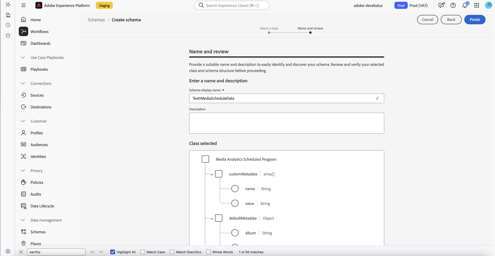

# スケジュールデータをアップロードしてライブコンテンツを追跡

>[!AVAILABILITY]
>
>この記事で説明している機能は、リリースの限定的テスト段階にあり、お使いの環境ではまだ使用できない可能性があります。 機能が一般公開されたら、このメモは削除されます。 リリースプロセスについて詳しくは、[Customer Journey Analytics機能リリース &#x200B;](https://experienceleague.adobe.com/ja/docs/analytics-platform/using/releases/releases)を参照してください。

過去のライブストリーミングメディアコンテンツのスケジュールデータをアップロードして、ライブコンテンツの視聴者をより簡単かつ正確に追跡できます。 個々のプログラムや、特定のトピックやプログラムセグメントの視聴率を追跡できます。

以下は、スケジュールデータのアップロードでサポートされるライブコンテンツの例です。

* FAST（無料広告サポート TV）プラットフォーム

* ローカルストリーム

* ライブスポーツ

* ニュース番組

## 機能

過去のライブストリーミングメディアコンテンツのスケジュールデータアップロードを使用する場合は、さまざまな機能を利用できます。 ここでは、プログラムのパフォーマンスを分析するのに役立つ主な機能について説明します。

これらの機能は、ストリーミングメディアコレクションの実装方法に関係なく使用できます。

* **プログラムのスケジュールを正確に追跡**：分析する期間について、ライブストリームの各プログラムの開始時間と終了時間を特定します。 正確な開始時間と終了時間により、正確な実行時間が正確に反映され、各ビューアセッションに対して分析することができます。

  例えば、ライブスポーツイベントの開始時間と終了時間が正確であっても、イベントが終了するまでは必ずしも把握されているわけではありません。 スケジュールされたデータのアップロードにより、プログラムの終了後に開始時間と終了時間を更新することで、正確なレポートを取得できます。

* **個々のトピックまたはプログラムセグメントを追跡**：特定のプログラム内の特定のトピックまたはプログラムセグメント（タイムスロット）に対する新しい時間ベースのディメンションを作成します。 そうした時間ベースのディメンションにより、より具体的なレベルでプログラムの視聴状況を分析し、どのトピックやプログラムセグメントが最も効果的であったのかを把握できます。

  たとえば、サッカーの試合などのライブスポーツイベントを分析する場合、前半、ハーフタイム、後半のディメンションを別々に作成できます。 このようにしてプログラム内の特定のトピックまたはセグメントを追跡することで、視聴者の行動をより詳細に把握することができます。

* **Journey Optimizerでユーザージャーニーを構築**：特定のセッションでユーザーが閲覧したプログラム（または閲覧したトピックやプログラムセグメントも含む）を追跡し、Adobe Journey Optimizerでこのデータを使用して、特定のプログラムを視聴した顧客や特定のトピックに興味を示した顧客のユーザージャーニーを構築します。

## ストリーミングメディアでのスケジュールデータの仕組みを理解する

ストリーミングメディアのスケジュールデータ機能は、次のように機能します。

1. スケジュール プログラム レコードのスケジュール プログラム データセットから読み取り、スケジュールの日付でフィルタリングします。

   過去24時間から48時間前に発生したプログラムでのみ機能します。

2. メディアデータセットからメディア終了イベントを読み取り、スケジュール プログラムレコードの日付およびXDM パスでフィルタリングします。

3. メディア終了イベントごとに、メディアセッションと重なる番組と同じ数のメディアスケジュール開始イベントが生成されます。

   各メディアスケジュール開始イベントには、スケジュールの名前と長さが含まれます。

   また、**scheduleTimePlayed**&#x200B;という新しい時間指標には、メディアセッションがスケジュールされたプログラムと重なった秒数が含まれます。 スケジュール開始イベントのタイムスタンプは、番組が開始されたときのタイムスタンプです。

4. 新しいスケジュール開始イベントをAEP メディアデータセットに書き込みます。

## 前提条件

過去のライブコンテンツのスケジュールデータをアップロードするには、Streaming Media環境が次の前提条件を満たしている必要があります。

* 「[&#x200B; トラッキングの概要](/help/use-cases/track-av-playback/track-core-overview.md)」の説明に従って、スケジュールデータをアップロードするコンテンツのトラッキングに対して、ストリーミングメディアコレクションを有効にする必要があります。<!--specifics??? -->

* Customer Journey Analyticsでストリーミングメディア収集を使用します。 Adobe Analyticsでは、スケジュールデータをアップロードする機能は使用できません。

## AEPでのプログラムスケジュールデータセットの作成

スケジュール情報をプッシュする前に、Experience Platformでプログラムスケジュールデータセットを作成する必要があります。

1. **Media Analytics スケジュール済みプログラム** XDM クラスに基づいてスキーマを作成します。

   

   これは、Media Analytics Scheduled プログラムクラスのXDM定義です。

   [https://github.com/adobe/xdm/blob/master/components/fieldgroups/tv-schedule/media-analytics-scheduled-program.schema.json](https://github.com/adobe/xdm/blob/master/components/fieldgroups/tv-schedule/media-analytics-scheduled-program.schema.json)

1. 作成したスキーマに基づいてデータセットを作成します。

1. 次のセクションに進みます。[&#x200B; プッシュスケジュール情報](#push-schedule-information)。

## プッシュスケジュール情報

[&#x200B; プログラムスケジュールデータセットを作成した後](#create-a-program-schedule-dataset-in-aep)、スケジュール情報をプッシュできます。

1. スケジュール情報を含む.json ファイルを作成します。

   .json ファイルには、XDM スキーマに従って、スケジュールプログラムオブジェクトの配列を含める必要があります。

1. .json ファイルをアップロードします。

   >[!NOTE]
   >
   >この節のcURLの例では、次の変数を使用しています。
   >
   >* Adobe Developerでの認証の場合：
   >     * CUSTOMER_API_KEY
   >     * AUTH_TOKEN
   >* 組織id: CUSTOMER_ORG_ID
   >* 設定で作成されたレコードデータセットのデータセット ID: DATASET_ID
   >* ファイルのアップロードで使用された最初のリクエストで作成されたバッチ ID: BATCH_ID
   >* レコードのプッシュに使用されるファイルの名前：FILE_NAME

   1. 新しいバッチを作成し、応答からバッチ IDを取得します。

      cURLを使用して新しいAEP バッチを作成する例を次に示します。

      ```
          curl -i 'https://platform.adobe.io/data/foundation/import/batches' \
          -X POST \
          -H 'Accept: application/json' \
          -H 'x-api-key: <CUSTOMER_API_KEY>' \
          -H 'x-gw-ims-org-id: <CUSTOMER_ORG_ID>' \
          -H 'Content-Type: application/json' \
          -H 'Authorization: Bearer <OAUTH_TOKEN>' \
          --data-raw '{"datasetId":"<DATASET_ID>","inputFormat":{"format":"json","isMultiLineJson":true},"tags":{"test":["2"]}}'
      
          HTTP/1.1 201 Created
          {
              "id": "BATCH_ID",
              "imsOrg": "CUSTOMER_ORG_ID",
              "updated": 1749838941763,
              "status": "loading",
              "created": 1749838941763,
              "relatedObjects": [
                  {
                      "type": "dataSet",
                      "id": "DATASET_ID"
                  }
              ],
              "version": "1.0.0",
              ............
          }
      ```

   1. バッチ IDを使用して、プログラムスケジュールのデータレコードを含む.json ファイルをプッシュします。

      スケジュール情報をプッシュするには、[&#x200B; バッチ取り込みAPIの概要](https://experienceleague.adobe.com/ja/docs/experience-platform/ingestion/batch/overview)で説明されているように、AEP バッチ APIを使用する必要があります。

      次の例では、cURLを使用してスケジュールレコードを含むファイルをプッシュします。

      ```
          curl -i 'https://platform.adobe.io/data/foundation/import/batches/<BATCH_ID>/datasets/<DATASET_ID>/files/<FILE_NAME>' \
          -X PUT \
          -H 'x-api-key: <CUSTOMER_API_KEY>' \
          -H 'x-gw-ims-org-id: <CUSTOMER_ORG_ID>' \
          -H 'Content-Type: application/json' \
          -H 'Authorization: Bearer <OAUTH_TOKEN>' \
          --upload-file ./schedule_21_05_2025.json`
      ```

   1. バッチを完了します。

      cURLを使用してバッチを完了する例を次に示します。

      ```
          curl -i 'https://platform.adobe.io/data/foundation/import/batches/<BATCH_ID>?action=COMPLETE' \
          -X POST \
          -H 'x-api-key: <CUSTOMER_API_KEY>' \
          -H 'x-gw-ims-org-id: <CUSTOMER_ORG_ID>' \
          -H 'Content-Type: application/json' \
          -H 'Authorization: Bearer <OAUTH_TOKEN>'
      ```

1. 次の節に進み、[Adobe カスタマーケアでサポートチケットを記録](#log-a-support-ticket-with-adobe-customer-care)します。

## Adobe カスタマーケアでサポートチケットを記録する

Adobe カスタマーケアでサポートチケットを記録し、次の情報を記載します。

* **メディアデータセット**: メディアセッションデータの読み取り元となるデータセットのデータセット IDを指定します。

* **スケジュールデータセット**：スケジュールレコードをプッシュするデータセットのデータセット IDを指定します。

* **出力メディアデータセット**: スケジュール開始イベントを保存するデータセットのデータセット IDを指定します。

  このデータセット IDは、メディアデータセットに使用するのと同じデータセット IDにすることができます。 異なるデータセット IDの場合でも、Media データセットと同じXDM スキーマを持つ必要があります。

* **組織ID**：組織IDを指定します。

## 2つのレコードを持つスケジュール .json ファイルの例

次の例は、2つのレコードを含むスケジュール .json ファイルです。 各.json ファイルには、1日にスケジュールされたすべてのプログラムを含める必要があります。

```
   [
        {
            "_id": "any_identifier_as_id_1",
            "customMetadata": [
                {
                    "name": "Sample value",
                    "value": "Sample value"
                }
            ],
            "defaultMetadata": {
                "album": "Sample value",
                "artist": "Sample value",
                "assetID": "Sample value",
                "author": "Sample value",
                "cdn": "Sample value",
                "dayPart": "Sample value",
                "episode": "Sample value",
                "feed": "Sample value",
                "firstAirDate": "Sample value",
                "firstDigitalDate": "Sample value",
                "genreList": [
                    "Sample value"
                ],
                "label": "Sample value",
                "network": "Sample value",
                "originator": "Sample value",
                "publisher": "Sample value",
                "rating": "Sample value",
                "season": "Sample value",
                "show": "Sample value",
                "showType": "Sample value",
                "station": "Sample value",
                "streamFormat": "Sample value"
            },
            "mediaProgramDetails": {
                "length": 1800,
                "name": "Show Name",
                "startTimestamp": "2025-05-01T00:30:00+00:00"
            },
            "scheduleDate": "2025-05-01",
            "scheduleFilter": {
                "filterPath": "xdm.mediaReporting.sessionDetails.channel",
                "filterValue": "Channel Name"
            },
        },
        {
            "_id": "any_identifier_as_id_2",
            "customMetadata": [
                {
                    "name": "Sample value",
                    "value": "Sample value"
                }
            ],
            "defaultMetadata": {
                "album": "Sample value",
                "artist": "Sample value",
                "assetID": "Sample value",
                "author": "Sample value",
                "cdn": "Sample value",
                "dayPart": "Sample value",
                "episode": "Sample value",
                "feed": "Sample value",
                "firstAirDate": "Sample value",
                "firstDigitalDate": "Sample value",
                "genreList": [
                    "Sample value"
                ],
                "label": "Sample value",
                "network": "Sample value",
                "originator": "Sample value",
                "publisher": "Sample value",
                "rating": "Sample value",
                "season": "Sample value",
                "show": "Sample value",
                "showType": "Sample value",
                "station": "Sample value",
                "streamFormat": "Sample value"
            },
            "mediaProgramDetails": {
                "length": 3600,
                "name": "Show Name 2",
                "startTimestamp": "2025-05-01T01:00:00+00:00"
            },
            "scheduleDate": "2025-05-01",
            "scheduleFilter": {
                "filterPath": "xdm.mediaReporting.sessionDetails.channel",
                "filterValue": "Channel Name"
            }
        }
    ]
```

### この例では、スケジュール プログラム フィールドについて説明します

1. **mediaProgramDetails**：スケジュール開始イベントの作成に必要な最小情報を含める必要があります。
   * **startTimestamp**：番組が開始された時刻。
   * **name**：番組のわかりやすい名前。
   * **length**：番組が続いた秒数。

     >[!IMPORTANT]
     >
     >複数のスケジュールデータリクエストがある場合、開始時間と終了時間を重ねることはできません。

1. **scheduleDate**：番組が放映された日付。 形式はYYYY-MM-DDである必要があります。 スケジュールデータセットをフィルタリングし、アドビがスケジュールを作成するスケジュールを開始するためのすべてのスケジュールを取得するために使用されます。
1. **scheduleFilter**：すべてのメディアセッション終了イベントをフィルタリングするために使用されます。
   * **filterPath**: フィルタリングに使用されるフィールドへのXDM パス。
   * **filterValue**: フィルタリングに使用される値。
1. **customMetadata**: スケジュールに追加するカスタムメタデータは、イベントを開始します。 このメタデータは、セッション終了イベントに存在するカスタムメタデータを上書きするために使用されます。
1. **defaultMetadata**: メディア クローズ呼び出しに存在する既定のメタデータを追加または上書きできるディメンションの特定リスト。

   Customer Journey Analyticsで作成し、レポートを作成できるディメンションの例を次に示します。

   * **[&quot;_エピソード名_&quot;](/help/reporting/dimensions/episode.md)**：このディメンションは、特定のシリーズのどのエピソードが最も効果的かを学習するのに役立ちます。

   * **[アセット ID](/help/reporting/dimensions/asset-id.md)**

1. [Analyze data in Customer Journey Analytics](#analyze-data-in-customer-journey-analytics)で続行します。

## Adobe Customer Journey Analyticsでのデータ分析

「[&#x200B; スケジュールのデータファイルをリクエストしてアップロード &#x200B;](#request-and-upload-the-schedule-data-file)」の説明に従ってデータファイルをアップロードしてから1日以内に、データをCustomer Journey Analyticsでレポートする準備が整います。

Customer Journey Analyticsの過去のライブストリーミングメディアデータをレポートするには：

1. 新しいプロジェクトを作成するか、既存のプロジェクトを開きます。

1. 過去のライブストリーミングメディアデータを分析するために必要なテーブルやビジュアライゼーションを作成して、プロジェクトを構築します。

   プロジェクトを構築する際は、スケジュールデータファイルに含めた情報を使用して、Adobe カスタマーケアに送信します。 これには、一致するキー、ディメンション、その他のメタデータが含まれます。 詳しくは、[&#x200B; スケジュール データ ファイルのリクエストとアップロード &#x200B;](#request-and-upload-the-schedule-data-file)を参照してください。


<!-- 

Extra

Things they need to upload:
Everything on that slide + other metadata
You can't overlap 2 schedules.
You can build a journey in AJO for the people who watch Mike, Mike, and Mike. e.g. 
This is recurring.
Available to all SKUs? "Increases cost for updated data by 22%, but included in the new higher tier Streaming Media SKU."

You can now upload schedule data of past live content to more easily and accurately track viewership. Live content includes content from FAST (Free Ad Supported TV) platforms or local streams.
You can track which programs a person viewed in a given session, or even which topics or program segments they viewed. These capabilities are available regardless of how you implemented Streaming Media Collection.
Previously, it was difficult to accurately tie a given session to specific programs when analyzing live content, and it wasn't possible to tie a given session to individual topics or program segments.
Schedule data uploads of live content in Streaming Media Collection includes the following capabilities:
Upload schedules for past live content, regardless of your Streaming Media Collection implementation.
Identify the start and end times of each individual program in the live stream for the period of time that you want to analyze. With accurate start and end times, the precise running time is accurately reflected and can be analyzed against each viewer session.
For example, precise beginning and end times are not always known for a live sporting event until the event is over. Schedule data uploads allow you to get accurate reporting by updating the start and end times after the program finishes.
Create new time-based dimensions for specific topics or program segments (time slots) within a given program. These time-based dimensions allow you to analyze viewership of a program at a more specific level, helping to gather insights about which topics or program segments resonated best.
For example, when analyzing a live sporting event, such as a soccer match, you can create separate dimensions for the first half, half time, and second half. This allows for more detailed breakdowns of viewer behavior for specific segments of a program.
These capabilities allow you to:
Analyze show viewership to understand performance.
Target users based on program viewership.
Analyze viewership based on metadata like topic, sports league, sponsorship, and so forth.
Target based on metadata viewership.
Correct media metrics for show dimensions of live sports/events for easier analysis at scale.
Increased ease of use for live sports

-->
