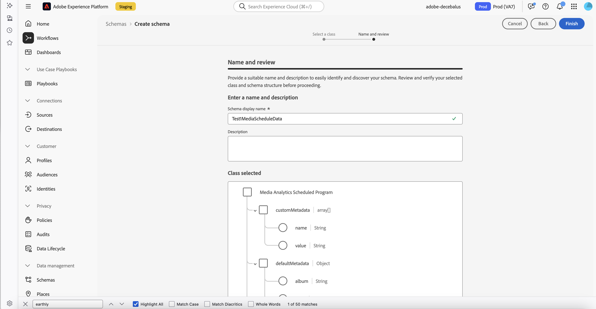

# ライブコンテンツを追跡するスケジュールデータのアップロード

>[!AVAILABILITY]
>
>この記事で説明している機能は、リリースの限定的テスト段階にあり、お使いの環境ではまだ使用できない可能性があります。機能が一般公開されたら、このメモは削除されます。リリースプロセスについて詳しくは、[Customer Journey Analytics機能リリース &#x200B;](https://experienceleague.adobe.com/ja/docs/analytics-platform/using/releases/releases) を参照してください。

過去のライブストリーミングメディアコンテンツのスケジュールデータをアップロードして、ライブコンテンツの視聴をより簡単かつ正確に追跡できます。 個々のプログラム、さらには特定のトピックやプログラムセグメントの視聴者を追跡できます。

以下は、スケジュールデータのアップロードでサポートされるライブコンテンツの例です。

* FAST（無料広告サポート TV）プラットフォーム

* ローカルストリーム

* ライブスポーツ

* ニュースまたはトピックプログラミング

## 機能

過去のライブストリーミングメディアコンテンツのスケジュールされたデータアップロードを使用する場合は、様々な機能を使用できます。 ここでは、プログラムのパフォーマンスを分析する際に役立つ主な機能について説明します。

これらの機能は、ストリーミングメディアコレクションの実装方法に関係なく使用できます。

* **プログラムスケジュールを正確に追跡**：分析する期間の、ライブストリーム内の個々のプログラムの開始時刻および終了時刻を特定します。 正確な開始時間と終了時間で、正確な実行時間が正確に反映され、各ビューアセッションに対して分析できます。

  例えば、正確な開始時刻と終了時刻は、イベントが終了するまで、ライブスポーツイベントで常に把握されるわけではありません。 データアップロードのスケジュールを設定すると、プログラムが終了した後に開始時刻と終了時刻を更新することで、正確なレポートを取得できます。

* **個々のトピックまたはプログラムセグメントの追跡**：特定のプログラム内の特定のトピックまたはプログラムセグメント（タイムスロット）に対して、新しい時間ベースのディメンションを作成します。 これらの時間ベースのディメンションを使用すると、プログラムの視聴者をより具体的なレベルで分析し、最も共感を得たトピックやプログラムセグメントに関するインサイトを収集できます。

  例えば、サッカーの試合などのライブスポーツイベントを分析する場合、前半、後半で別々のディメンションを作成できます。 この方法でプログラム内の特定のトピックやセグメントを追跡すると、ビューアの動作をより詳細に分類できます。

* **Journey Optimizerでのユーザージャーニーの作成**：特定のセッションでユーザーが閲覧したプログラム（またはユーザーが閲覧したトピックやプログラムセグメント）を追跡し、Adobe Journey Optimizerでこのデータを使用して、特定のプログラムを視聴したユーザーや、特定のトピックに興味を示したユーザーのユーザージャーニーを作成します。

## ストリーミングメディアのスケジュールデータの仕組みについて

ストリーミングメディアのデータのスケジュール機能は、次のように動作します。

1. スケジュールプログラムレコードのスケジュールプログラムデータセットを読み取り、スケジュールの日付でフィルタリングします。

   過去 24 時間から 48 時間に発生したプログラムに対してのみ機能します。

2. メディアデータセットからメディアクローズイベントを読み取り、日付およびスケジュールプログラムレコードの XDM パスでフィルタリングします。

3. メディアクローズイベントごとに、メディアセッションと重なる番組があるので、同じ数のメディアスケジュール開始イベントが生成されます。

   各メディアスケジュール開始イベントには、スケジュールの名前と長さが含まれます。

   また、**scheduleTimePlayed** という新しい時間指標には、メディアセッションがスケジュールされたプログラムと重なった秒数が含まれます。 スケジュール開始イベントのタイムスタンプは、番組が開始されたときのタイムスタンプです。

4. 新しいスケジュール開始イベントをAEP メディアデータセットに書き込みます。

## 前提条件

過去のライブコンテンツのスケジュールデータをアップロードするには、ストリーミングメディア環境が次の前提条件を満たす必要があります。

* [&#x200B; トラッキングの概要 &#x200B;](/help/use-cases/track-av-playback/track-core-overview.md) で説明されているように、ストリーミングメディアコレクションを有効にして、スケジュールデータをアップロードするコンテンツに対してトラッキングを行う必要があります。<!--specifics??? -->

* Customer Journey Analyticsで Streaming Media Collection を使用します。 スケジュールデータをアップロードする機能は、Adobe Analyticsでは使用できません。

## AEPでのプログラムスケジュールデータセットの作成

スケジュール情報をプッシュする前に、Experience Platformでプログラムスケジュールデータセットを作成する必要があります。

1. **Media Analytics スケジュール済みプログラム** XDM クラスに基づいてスキーマを作成します。

   

   これは、Media Analytics スケジュール済みプログラムクラスの XDM 定義です。

   [https://github.com/adobe/xdm/blob/master/components/fieldgroups/tv-schedule/media-analytics-scheduled-program.schema.json](https://github.com/adobe/xdm/blob/master/components/fieldgroups/tv-schedule/media-analytics-scheduled-program.schema.json)

1. 作成したスキーマに基づいてデータセットを作成します。

1. 次のセクション [&#x200B; プッシュスケジュール情報 &#x200B;](#push-schedule-information) に進みます。

## プッシュスケジュール情報

[&#x200B; プログラムスケジュールデータセットを作成 &#x200B;](#create-a-program-schedule-dataset-in-aep) した後、スケジュール情報をプッシュできます。

1. スケジュール情報を含んだ.json ファイルを作成します。

   .json ファイルには、XDM スキーマに従って、スケジュールプログラムオブジェクトの配列が含まれている必要があります。

1. .json ファイルをアップロードします。

   >[!NOTE]
   >
   >この節の cURL の例では、次の変数を使用します。
   >
   >* Adobe Developerでの認証の場合：
   >     * CUSTOMER_API_KEY
   >     * AUTH_TOKEN
   >* 組織 ID: CUSTOMER_ORG_ID
   >* セットアップで作成されたレコードデータセットのデータセット ID : DATASET_ID
   >* ファイルのアップロードで使用される最初のリクエストで作成されたバッチ ID: BATCH_ID
   >* レコードのプッシュに使用するファイル名：FILE_NAME

   1. 新しいバッチを作成してから、応答からバッチ ID を取得します。

      cURL を使用して新しいAEP バッチを作成する次の例について考えてみます。

      ```
          curl -i 'https://platform.adobe.io/data/foundation/import/batches' \
          -X POST \
          -H 'Accept: application/json' \
          -H 'x-api-key: <CUSTOMER_API_KEY>' \
          -H 'x-gw-ims-org-id: <CUSTOMER_ORG_ID>' \
          -H 'Content-Type: application/json' \
          -H 'Authorization: Bearer <OAUTH_TOKEN>' \
          --data-raw '{"datasetId":"<DATASET_ID>","inputFormat":{"format":"json","isMultiLineJson":true},"tags":{"test":["2"]}}'
      
          HTTP/1.1 201 Created
          {
              "id": "BATCH_ID",
              "imsOrg": "CUSTOMER_ORG_ID",
              "updated": 1749838941763,
              "status": "loading",
              "created": 1749838941763,
              "relatedObjects": [
                  {
                      "type": "dataSet",
                      "id": "DATASET_ID"
                  }
              ],
              "version": "1.0.0",
              ............
          }
      ```

   1. バッチ ID を使用して、プログラムスケジュールのデータレコードを含む.json ファイルをプッシュします。

      スケジュールの情報をプッシュするには、[&#x200B; バッチ取得 API の概要 &#x200B;](https://experienceleague.adobe.com/ja/docs/experience-platform/ingestion/batch/overview) で説明しているように、AEP バッチ API を使用する必要があります。

      次の cURL を使用した例では、スケジュールレコードを含んだファイルをプッシュします。

      ```
          curl -i 'https://platform.adobe.io/data/foundation/import/batches/<BATCH_ID>/datasets/<DATASET_ID>/files/<FILE_NAME>' \
          -X PUT \
          -H 'x-api-key: <CUSTOMER_API_KEY>' \
          -H 'x-gw-ims-org-id: <CUSTOMER_ORG_ID>' \
          -H 'Content-Type: application/json' \
          -H 'Authorization: Bearer <OAUTH_TOKEN>' \
          --upload-file ./schedule_21_05_2025.json`
      ```

   1. バッチを完了します。

      cURL を使用してバッチを完了する次の例について考えてみます。

      ```
          curl -i 'https://platform.adobe.io/data/foundation/import/batches/<BATCH_ID>?action=COMPLETE' \
          -X POST \
          -H 'x-api-key: <CUSTOMER_API_KEY>' \
          -H 'x-gw-ims-org-id: <CUSTOMER_ORG_ID>' \
          -H 'Content-Type: application/json' \
          -H 'Authorization: Bearer <OAUTH_TOKEN>'
      ```

1. 次の節 [Adobe カスタマーケアでサポートチケットを登録する &#x200B;](#log-a-support-ticket-with-adobe-customer-care) に進みます。

## Adobe カスタマーケアへのサポートチケットの登録

次の情報を入力して、Adobe カスタマーケアにサポートチケットを登録します。

* **メディアデータセット**：メディアセッションデータの読み取り元となるデータセットのデータセット ID を指定します。

* **データセットをスケジュール**：スケジュールレコードをプッシュするデータセットのデータセット ID を指定します。

* **出力メディアデータセット**: スケジュール開始イベントが保存されるデータセットのデータセット ID を指定します。

  このデータセット ID は、メディアデータセットに使用されているのと同じデータセット ID である可能性があります。 データセット ID が異なる場合でも、メディアデータセットと同じ XDM スキーマが必要です。

* **組織 ID**：組織 ID を指定します。

## 2 つのレコードを持つスケジュール .json ファイルの例

次の例は、2 つのレコードを持つ schedule .json ファイルです。 各.json ファイルには、1 日にスケジュールされたすべてのプログラムが含まれている必要があります。

```
   [
        {
            "_id": "any_identifier_as_id_1",
            "customMetadata": [
                {
                    "name": "Sample value",
                    "value": "Sample value"
                }
            ],
            "defaultMetadata": {
                "album": "Sample value",
                "artist": "Sample value",
                "assetID": "Sample value",
                "author": "Sample value",
                "cdn": "Sample value",
                "dayPart": "Sample value",
                "episode": "Sample value",
                "feed": "Sample value",
                "firstAirDate": "Sample value",
                "firstDigitalDate": "Sample value",
                "genreList": [
                    "Sample value"
                ],
                "label": "Sample value",
                "network": "Sample value",
                "originator": "Sample value",
                "publisher": "Sample value",
                "rating": "Sample value",
                "season": "Sample value",
                "show": "Sample value",
                "showType": "Sample value",
                "station": "Sample value",
                "streamFormat": "Sample value"
            },
            "mediaProgramDetails": {
                "length": 1800,
                "name": "Show Name",
                "startTimestamp": "2025-05-01T00:30:00+00:00"
            },
            "scheduleDate": "2025-05-01",
            "scheduleFilter": {
                "filterPath": "xdm.mediaReporting.sessionDetails.channel",
                "filterValue": "Channel Name"
            },
        },
        {
            "_id": "any_identifier_as_id_2",
            "customMetadata": [
                {
                    "name": "Sample value",
                    "value": "Sample value"
                }
            ],
            "defaultMetadata": {
                "album": "Sample value",
                "artist": "Sample value",
                "assetID": "Sample value",
                "author": "Sample value",
                "cdn": "Sample value",
                "dayPart": "Sample value",
                "episode": "Sample value",
                "feed": "Sample value",
                "firstAirDate": "Sample value",
                "firstDigitalDate": "Sample value",
                "genreList": [
                    "Sample value"
                ],
                "label": "Sample value",
                "network": "Sample value",
                "originator": "Sample value",
                "publisher": "Sample value",
                "rating": "Sample value",
                "season": "Sample value",
                "show": "Sample value",
                "showType": "Sample value",
                "station": "Sample value",
                "streamFormat": "Sample value"
            },
            "mediaProgramDetails": {
                "length": 3600,
                "name": "Show Name 2",
                "startTimestamp": "2025-05-01T01:00:00+00:00"
            },
            "scheduleDate": "2025-05-01",
            "scheduleFilter": {
                "filterPath": "xdm.mediaReporting.sessionDetails.channel",
                "filterValue": "Channel Name"
            }
        }
    ]
```

### 例のスケジュールプログラムフィールドについて

1. **mediaProgramDetails**：スケジュール開始イベントの作成に必要な最小限の情報が含まれている必要があります。
   * **startTimestamp**：番組が開始された時刻。
   * **name**：番組のわかりやすい名前。
   * **length**：番組の継続秒数。

     >[!IMPORTANT]
     >
     >複数のスケジュールデータリクエストがある場合、開始時刻と終了時刻を重ねることはできません。

1. **scheduleDate**：番組が放送された日付。 形式は YYYY-MM-DD にする必要があります。 スケジュールデータセットのフィルタリングと、アドビがスケジュールを作成するためのすべてのスケジュールの取得に使用されます。
1. **scheduleFilter**：すべてのメディアセッション終了イベントのフィルタリングに使用します。
   * **filterPath**：フィルタリングに使用するフィールドへの XDM パス。
   * **filterValue**：フィルタリングに使用する値。
1. **customMetadata**：スケジュールに追加するカスタムメタデータには、開始イベントがあります。 このメタデータは、セッション終了イベントに存在するカスタムメタデータを上書きするために使用されます。
1. **defaultMetadata**：メディアクローズ呼び出し時に存在するデフォルトのメタデータを追加または上書きできるディメンションの特定のリストです。

   Customer Journey Analyticsで作成し、レポートするディメンションの次の例について考えてみます。

   * **[「_エピソード名_」 &#x200B;](https://experienceleague.adobe.com/ja/docs/media-analytics/using/implementation/variables/audio-video-parameters#episode)**：このディメンションは、特定のシリーズのどのエピソードが最もパフォーマンスが高いかを学ぶのに役立ちます。

   * **[アセット ID](https://experienceleague.adobe.com/ja/docs/media-analytics/using/implementation/variables/audio-video-parameters#asset-id)**

1. [Customer Journey Analyticsでのデータの分析 &#x200B;](#analyze-data-in-customer-journey-analytics) を参照してください。

## Customer Journey Analyticsでのデータの分析

[&#x200B; スケジュールデータファイルのリクエストとアップロード &#x200B;](#request-and-upload-the-schedule-data-file) に記載されているデータファイルをアップロードすると、1 日以内に、データをCustomer Journey Analyticsでレポートする準備が整います。

Customer Journey Analyticsで過去のライブストリーミングメディアデータについてレポートするには：

1. 新しいプロジェクトを作成するか、既存のプロジェクトを開きます。

1. 過去のライブストリーミングメディアデータの分析に必要なテーブルやビジュアライゼーションを作成して、プロジェクトを作成します。

   プロジェクトを作成する際には、スケジュールデータファイルに含まれ、Adobe カスタマーケアに送信された情報を使用します。 これには、一致するキー、ディメンション、追加のメタデータが含まれます。 詳しくは、[&#x200B; スケジュールデータファイルをリクエストしてアップロード &#x200B;](#request-and-upload-the-schedule-data-file) を参照してください。


<!-- 

Extra

Things they need to upload:
Everything on that slide + other metadata
You can't overlap 2 schedules.
You can build a journey in AJO for the people who watch Mike, Mike, and Mike. e.g. 
This is recurring.
Available to all SKUs? "Increases cost for updated data by 22%, but included in the new higher tier Streaming Media SKU."

You can now upload schedule data of past live content to more easily and accurately track viewership. Live content includes content from FAST (Free Ad Supported TV) platforms or local streams.
You can track which programs a person viewed in a given session, or even which topics or program segments they viewed. These capabilities are available regardless of how you implemented Streaming Media Collection.
Previously, it was difficult to accurately tie a given session to specific programs when analyzing live content, and it wasn't possible to tie a given session to individual topics or program segments.
Schedule data uploads of live content in Streaming Media Collection includes the following capabilities:
Upload schedules for past live content, regardless of your Streaming Media Collection implementation.
Identify the start and end times of each individual program in the live stream for the period of time that you want to analyze. With accurate start and end times, the precise running time is accurately reflected and can be analyzed against each viewer session.
For example, precise beginning and end times are not always known for a live sporting event until the event is over. Schedule data uploads allow you to get accurate reporting by updating the start and end times after the program finishes.
Create new time-based dimensions for specific topics or program segments (time slots) within a given program. These time-based dimensions allow you to analyze viewership of a program at a more specific level, helping to gather insights about which topics or program segments resonated best.
For example, when analyzing a live sporting event, such as a soccer match, you can create separate dimensions for the first half, half time, and second half. This allows for more detailed breakdowns of viewer behavior for specific segments of a program.
These capabilities allow you to:
Analyze show viewership to understand performance.
Target users based on program viewership.
Analyze viewership based on metadata like topic, sports league, sponsorship, and so forth.
Target based on metadata viewership.
Correct media metrics for show dimensions of live sports/events for easier analysis at scale.
Increased ease of use for live sports

-->
