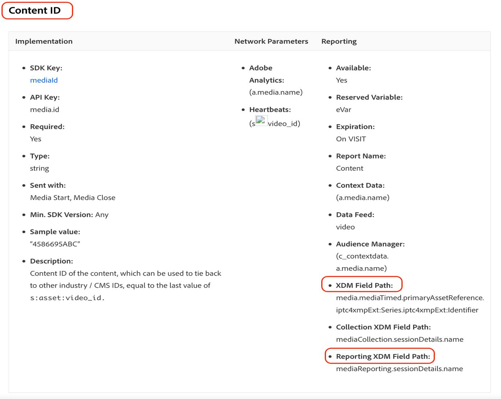
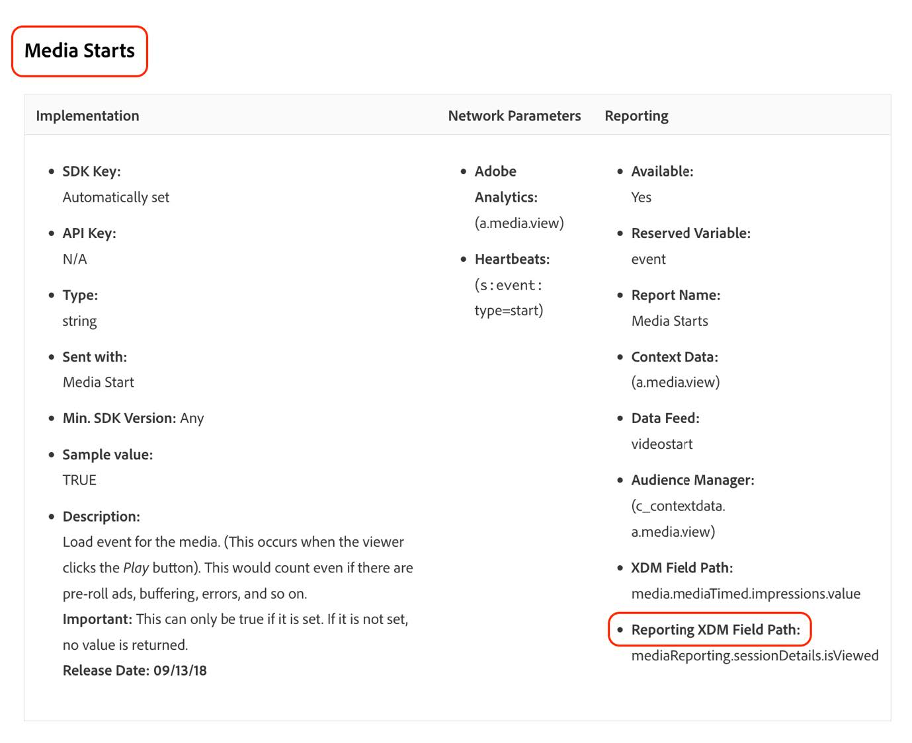

# 新しいストリーミングメディアフィールドへのオーディエンスの移行

このドキュメントでは、「Media」と呼ばれるAdobe ストリーミングメディアコレクションのデータタイプのフィールドを使用するオーディエンスを、「[ メディアレポートの詳細 ](https://experienceleague.adobe.com/en/docs/experience-platform/xdm/data-types/media-reporting-details) と呼ばれる新しい対応するデータタイプを使用するように移行する方法について説明します。

## オーディエンスの移行

オーディエンスを「メディア」という古いデータタイプから「[ メディアレポートの詳細 ](https://experienceleague.adobe.com/en/docs/experience-platform/xdm/data-types/media-reporting-details)」という新しいデータタイプに移行するには、オーディエンスを編集し、各ルールで非推奨（廃止予定）のデータタイプの古いフィールドを、新しいデータタイプの新しい対応するフィールドに置き換える必要があります。

1. 非推奨の「メディア」データタイプのフィールドを含むルールを見つけます。 これが、パス `media.mediaTimed` で始まるすべてのフィールドです。

1. 新しい「[ メディアレポートの詳細 ](https://experienceleague.adobe.com/en/docs/experience-platform/xdm/data-types/media-reporting-details)」データタイプのフィールドを使用して、これらのルールを複製します。

1. オーディエンスが期待どおりに動作していることを検証するまで、両方のルールを保持します。

1. 非推奨の「メディア」データタイプからフィールドを含むルールを削除します。

1. オーディエンスが引き続き期待どおりに動作していることを検証します。

古いフィールドと新しいフィールド間のマッピングについては、[ オーディオおよびビデオパラメーター ](https://experienceleague.adobe.com/en/docs/media-analytics/using/implementation/variables/audio-video-parameters#content-id) ページの [ コンテンツ ID](https://experienceleague.adobe.com/ja/docs/media-analytics/using/implementation/variables/audio-video-parameters) パラメーターを参照してください。 古いフィールドパスは「XDM フィールドパス」プロパティの下にあり、新しいフィールドパスは「レポート XDM フィールドパス」プロパティの下にあります。

## 例

移行ガイドラインに従いやすくするために、単一ルールのオーディエンスを含む次の例を考えてみましょう。 オーディエンスには単一のルールがあるので、移行ガイドラインを適用する必要があるのは 1 回だけです。

1. 右上隅の [!UICONTROL **オーディエンスを編集**] ボタンを選択します。

1. オーディエンス用に設定されたルールを見つけます。

   

   

1. ルールを選択して、設定を開きます。

   

1. （オプション）ルールで使用されているフィールドのパスを表示するには、フィールド名の近くにある情報ボタンを選択します。

   

1. フィールド名（この場合は「メディア開始」）を特定します。

   

1. 古いフィールド間をマッピングするには、[ オーディオおよびビデオパラメーター ](https://experienceleague.adobe.com/ja/docs/media-analytics/using/implementation/variables/audio-video-parameters) ページを参照してください。 古いフィールドパスは「XDM フィールドパス」プロパティの下にあり、新しいフィールドパスは「レポート XDM フィールドパス」プロパティの下にあります。 例えば、「[ メディア開始 ](https://experienceleague.adobe.com/en/docs/media-analytics/using/implementation/variables/audio-video-parameters#media-starts)」パラメーターの場合、`media.mediaTimed.impressions.value` の対応する設定は `mediaReporting.sessionDetails.isViewed` です。

   

1. 新しいフィールドを使用して、既存のルールと同じルールを追加します。

   

   

   

1. 「[!UICONTROL **保存**]」を選択して、オーディエンスを保存します。 オーディエンスが期待どおりに動作しているかどうかを検証する必要がある限り、この設定を保持できます。

1. 検証が完了したら、古いフィールドを削除してから、「[!UICONTROL **保存**] を選択してオーディエンスを保存します。

   

1. オーディエンスを再度検証します。

   オーディエンスの移行プロセスが完了しました。
