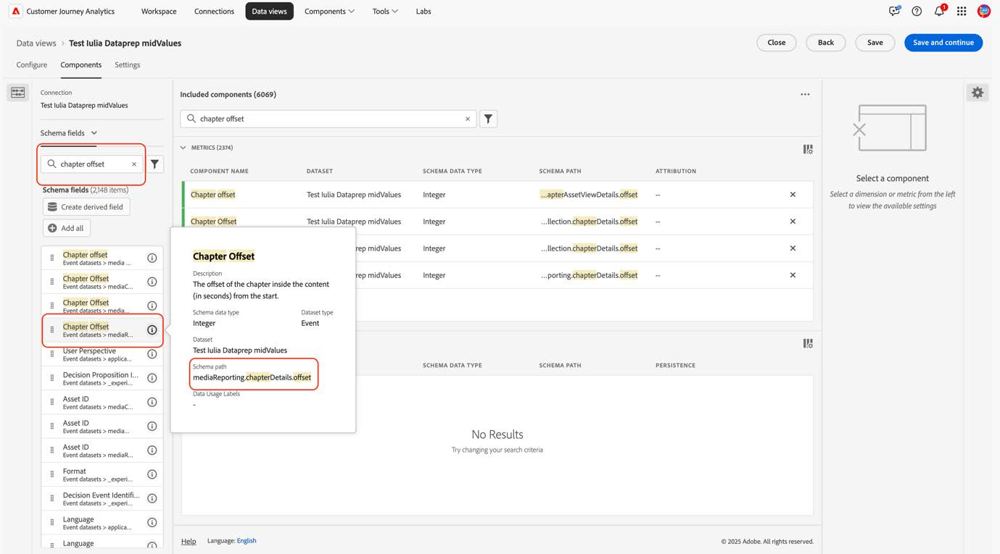
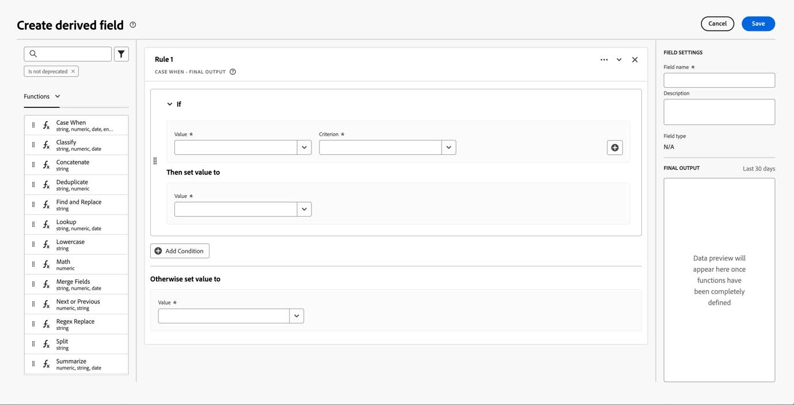

# 新しいストリーミングメディアフィールドを使用するようにCustomer Journey Analyticsを移行する

このドキュメントでは、「Media」と呼ばれるAdobe ストリーミングメディアサービスのデータタイプを使用するCustomer Journey Analytics設定を、「[ メディアレポートの詳細 ](https://experienceleague.adobe.com/en/docs/experience-platform/xdm/data-types/media-reporting-details) と呼ばれる新しい対応するデータタイプを使用するように更新する方法について説明します。

## Customer Journey Analyticsを移行

Customer Journey Analyticsの設定を「Media」という古いデータタイプから「[Media レポートの詳細 ](https://experienceleague.adobe.com/en/docs/experience-platform/xdm/data-types/media-reporting-details)」という新しいデータタイプに移行するには、古いデータタイプを使用している次の設定を更新する必要があります。

* データビュー

* 派生フィールド

### データビューを移行

データ・ビューを新しいデータ・タイプに移行するには、次の手順に従います。

1. 非推奨の「メディア」データタイプを使用して、すべてのデータビューを見つけます。 これは、パスが `media.mediaTimed` で始まるすべてのフィールドです。

1. 次のいずれかの操作を行います。

   * これらのデータビューで、新しい「メディアレポートの詳細」データタイプのフィールドを挿入します。

   * 新しい「メディアレポートの詳細」データタイプが設定されている場合は、それを使用する派生フィールドを作成します。「メディアレポートの詳細」データタイプが設定されていない場合は、古い「メディア」データタイプにフォールバックします。

### 派生フィールドを移行

派生フィールドを新しいデータタイプに移行するには、次の手順に従います。

1. 非推奨の「メディア」データタイプを使用して、すべての派生フィールドを見つけます。 これは、パスが `media.mediaTimed` で始まるフィールドを含むすべての派生フィールドです。

1. 派生フィールドの古いフィールドをすべて、「メディアレポートの詳細」の新しい対応するフィールドに置き換えます。

古いフィールドと新しいフィールド間のマッピングについては、[ オーディオおよびビデオパラメーター ](https://experienceleague.adobe.com/ja/docs/media-analytics/using/implementation/variables/audio-video-parameters#content-id) ページの [ コンテンツ ID](https://experienceleague.adobe.com/ja/docs/media-analytics/using/implementation/variables/audio-video-parameters) パラメーターを参照してください。 古いフィールドパスは「XDM フィールドパス」プロパティの下にあり、新しいフィールドパスは「レポート XDM フィールドパス」プロパティの下にあります。

## 例

移行ガイドラインに従いやすくするために、古い非推奨（廃止予定）の「メディア」データタイプのフィールドを含むデータビューを含む次の例を考えてみましょう。 このデータビューでは、対応する新しいフィールドを追加する必要があります。

### データビューを更新

次のいずれかのオプションを使用して、データビューを更新できます。

#### オプション 1

1. 非推奨（廃止予定）のデータタイプの古いフィールドを使用している指標またはディメンションを見つけます。

   

1. [ チャプターパラメーター ](https://experienceleague.adobe.com/en/docs/media-analytics/using/implementation/variables/chapter-parameters#chapter-offset) 記事の [ チャプターオフセット ](https://experienceleague.adobe.com/ja/docs/media-analytics/using/implementation/variables/chapter-parameters) セクションで、対応する新しいフィールドを確認します。

1. データビュー内の対応する新しいフィールドを見つけます。

   

1. 新しいフィールドを指標またはディメンションにドラッグします。

1. 非推奨の「メディア」データタイプのフィールドを使用するすべての指標およびディメンションに対して、このプロセスを繰り返します。

#### オプション 2

このオプションは、特定のイベントに対して存在する値に基づいて、古いフィールドから値を選択する派生フィールドまたは新しいフィールドから値を選択する派生フィールドを作成します。 この派生フィールドは、使用されているプロジェクトの古い「メディア」データタイプを置き換えます。

新しい「メディアレポートの詳細」データタイプが設定されている場合はそのデータタイプを使用する「チャプター名」の派生フィールドを作成する場合、「メディアレポートの詳細」データタイプが設定されていない場合は古い「メディア」データタイプにフォールバックする場合：

1. 「Case When」句を派生フィールドにドラッグします。

   

1. [!UICONTROL **チャプターパラメーター**] ページの **チャプター名** パラメーターに示されているように、[ レポート XDM フィールドパス ](https://experienceleague.adobe.com/en/docs/media-analytics/using/implementation/variables/chapter-parameters#chapter-name) の値を使用して [If](https://experienceleague.adobe.com/ja/docs/media-analytics/using/implementation/variables/chapter-parameters) 句に入力します。

   

   

   

   

1. 非推奨の「メディア」データタイプの古いフィールドを使用して、フォールバック値を入力します。

   

   

   これが、派生フィールドの最終的な定義です。

   

1. 派生フィールドを更新するには、古い非推奨フィールド（`media.mediaTimed` で始まるパス）を使用している派生フィールドを見つけます。

   

1. 更新する派生フィールドの上にマウスポインターを置き、「[!UICONTROL **編集**] アイコンを選択します。

1. 古いデータタイプ（`media.mediaTimed` で始まるパス）からすべてのフィールドを見つけ、新しい対応するフィールドに置き換えます。

   

1. [ ストリーミングメディアパラメーター ](https://experienceleague.adobe.com/en/docs/media-analytics/using/implementation/variables/audio-video-parameters#content-name-variable) 記事の [ コンテンツ名（変数） ](https://experienceleague.adobe.com/en/docs/media-analytics/using/implementation/variables/audio-video-parameters#content-name-variable) セクションで、対応する新しいフィールドを確認します。

1. 古いフィールドを新しいフィールドに置き換えます。

   

1. 古い非推奨（廃止予定）の「メディア」データタイプのフィールドを使用して、すべての派生フィールドに対してこのプロセスを繰り返します。

   CJA設定の移行が完了しました。
