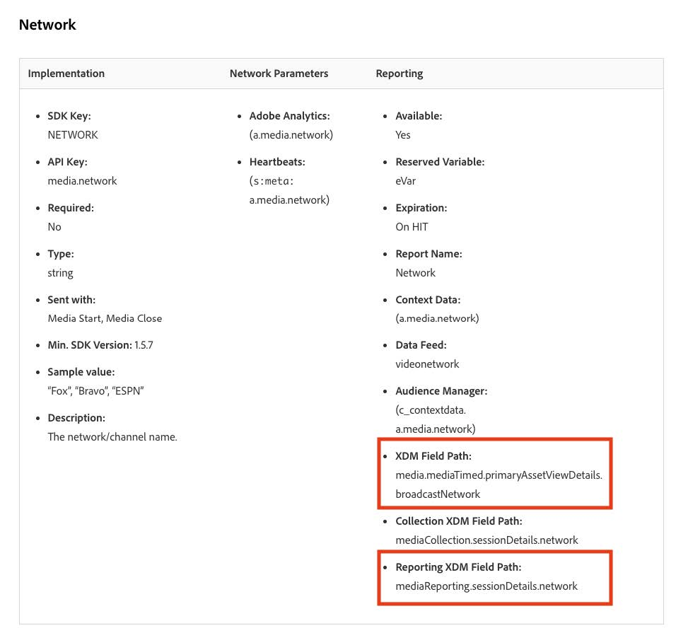

# カスタムフィールドのデータ準備を新しいストリーミングメディアフィールドに移行する

このドキュメントでは、Adobe Streaming Media Collection データに対して有効なAdobe データ収集フローの上に存在するデータ準備サービスを移行するプロセスについて説明します。 移行により、Adobe Streaming Media Collection データタイプ「Media」からデータ準備マッピングが変換され、対応する新しいデータタイプ「[ メディアレポートの詳細 ](https://experienceleague.adobe.com/ja/docs/experience-platform/xdm/data-types/media-reporting-details)」が使用されます。

## カスタムフィールドのデータ準備の移行

データ準備のマッピングを「メディア」という古いデータ・タイプから「[ メディア・レポート詳細 ](https://experienceleague.adobe.com/ja/docs/experience-platform/xdm/data-types/media-reporting-details)」という新しいデータ・タイプに移行するには、データ準備のマッピングを編集する必要があります：

>[!IMPORTANT]
>
>データの損失を防ぐには、この節の手順を実行する前に、新しい `mediaReporting` フィールドを使用して Analytics ソースコネクタがデプロイされていることを確認してください。

1. Adobe Experience Platformの「[!UICONTROL **ソース**]」セクションで、「[!UICONTROL **データフロー**]」タブに移動します。

1. Adobe Data Collection を介してAdobe AnalyticsからAdobe Experience Platformにストリーミングメディアデータを読み込む役割を果たすデータフローを見つけます。

1. [!UICONTROL **データフローを更新**] を選択して、非推奨フィールドを含むすべてのカスタムソースマッピングを、新しい XDM オブジェクトの新しい対応するフィールドに置き換えることで、データ準備の設定を変更します。

1. 非推奨（廃止予定）の「Media」オブジェクトからソースフィールドを含むマッピングを見つけます。

1. 新しい「メディアレポートの詳細」オブジェクトのフィールドを使用して、これらのソースを置き換えます。

1. マッピングが引き続き期待どおりに機能していることを検証します。

古いフィールドと新しいフィールド間のマッピングについては、[ オーディオおよびビデオパラメーター ](https://experienceleague.adobe.com/ja/docs/media-analytics/using/implementation/variables/audio-video-parameters#content-id) ページの [ コンテンツ ID](https://experienceleague.adobe.com/ja/docs/media-analytics/using/implementation/variables/audio-video-parameters) パラメーターを参照してください。 古いフィールドパスは「XDM フィールドパス」プロパティの下にあり、新しいフィールドパスは「レポート XDM フィールドパス」プロパティの下にあります。

## 例

移行ガイドラインに従いやすくするために、単一のマッピングを含む次のデータフローの例を考えてみましょう。 この場合、移行ガイドラインを 1 回だけ適用する必要があります。

1. Adobe Experience Platformの「[!UICONTROL **ソース**]」セクションで、「[!UICONTROL **データフロー**]」タブに移動します。

1. Adobe Data Collection を介してAdobe AnalyticsからAdobe Experience Platformにストリーミングメディアデータを読み込む役割を果たすデータフローを見つけます。

1. **[!UICONTROL データフローを更新]** を選択して、次の画像に示すように、編集 UI を入力します。

   

1. 「**[!UICONTROL マッピング]**」タブで、「**[!UICONTROL カスタム]**」を選択します。

1. フィールドをソースとして使用するカスタムマッピング `media.mediaTimed` 特定します。

   

   この例では、開発組織のスキーマにカスタムフィールドグループを作成したので、ターゲットフィールドは `_dcbl` の下にあります。 カスタムフィールドグループのパスは、組織名に基づいて異なります。

1. `media.mediaTimed` オブジェクトを使用する各マッピングについて、このドキュメントを使用して、`mediaReporting` オブジェクトで対応するマッピングを見つけます。

   例えば、Network の場合、`media.mediaTimed.primaryAssetViewDetails`.broadcastNetwork の対応関係は `mediaReporting.sessionDetails.network` です。

   

1. 「**[!UICONTROL Source フィールド]**」フィールドで、`media.mediaTimed` のパスを `mediaReporting` のパスに置き換えます。 ターゲットフィールドは変更されません。

   

1. 「**[!UICONTROL 次へ]**」を選択して、変更を保存します。

   ステータスが **[!UICONTROL 処理中]** と表示されます。 変更が適用されると、ステータスが **[!UICONTROL 有効]** になります。

   

## 様々なデータタイプを使用した例

上記の例では、関係するすべてのデータタイプが文字列なので、マッピングの置き換えは直接でした。

ソースフィールドのデータタイプがターゲットフィールドのデータタイプと異なる場合は、[ データ準備のトラブルシューティングガイド ](https://experienceleague.adobe.com/ja/docs/experience-platform/data-prep/troubleshooting-guide)、[ データ準備によるデータ形式の処理 ](https://experienceleague.adobe.com/ja/docs/experience-platform/data-prep/data-handling) および [ データ準備のマッピング機能 ](https://experienceleague.adobe.com/ja/docs/experience-platform/data-prep/data-handling) のガイドラインに従う必要があります。

例えば、ソースのタイプが文字列で、ターゲットのタイプがブール値の場合、Data Prep では、値を自動的に解析し、ソースの値をブール値に変換できます。

ソースタイプが数値で、ターゲットタイプがブール値の場合は、データ操作関数を使用する必要があります。

`media.mediaTimed` を使用したカスタムフィールドへのマッピング。

同じカスタムフィールドへの `mediaReporting` を使用したマッピング：

