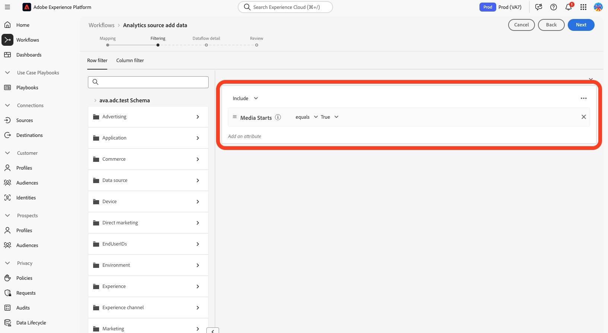
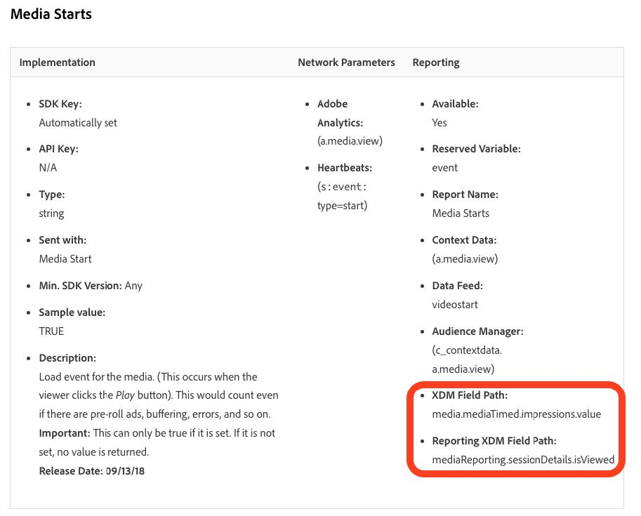

# 新しいストリーミングメディアフィールドへのプロファイルの移行

このドキュメントでは、ストリーミングメディアデータに対してAdobe Analyticsが有効なAdobe データ収集フローの上に存在するプロファイルフィルタリングサービスを移行するプロセスについて説明します。 移行により、プロファイルフィルタリングサービスが、「Media」と呼ばれるAdobe streaming media services データタイプの使用から、「[&#x200B; メディアレポートの詳細 &#x200B;](https://experienceleague.adobe.com/ja/docs/experience-platform/xdm/data-types/media-reporting-details) と呼ばれる新しい対応するデータタイプの使用に変換されます。

## プロファイルの移行

プロファイルフィルタリングを古い「メディア」というデータタイプから新しい「[&#x200B; メディアレポートの詳細 &#x200B;](https://experienceleague.adobe.com/ja/docs/experience-platform/xdm/data-types/media-reporting-details)」というデータタイプに移行するには、既存のプロファイルフィルタリングルールを編集する必要があります。

1. Adobe Experience Platformの「[!UICONTROL **ソース**]」セクションで、「[!UICONTROL **データフロー**]」タブに移動します。

1. Adobe Data Collection を介してAdobe AnalyticsからAdobe Experience Platformにストリーミングメディアデータを読み込む役割を果たすデータフローを見つけます。

1. [!UICONTROL **データフローを更新**] を選択して、非推奨フィールドを含むすべてのカスタムルールを、新しい XDM オブジェクトの新しい対応するフィールドに置き換えることで、プロファイルフィルタリング設定を変更します。

1. 非推奨（廃止予定）の「Media」オブジェクトのフィールドを含むフィルターを見つけます。

1. 新しい「メディアレポートの詳細」オブジェクトからフィールドを追加して、これらのフィルターを追加します。

1. 2 つのフィールド間に OR 演算子を使用します。

1. プロファイルが引き続き期待どおりに動作していることを検証します。

古いフィールドと新しいフィールド間のマッピングについては、[&#x200B; オーディオおよびビデオパラメーター &#x200B;](https://experienceleague.adobe.com/ja/docs/media-analytics/using/implementation/variables/audio-video-parameters#content-id) ページの [&#x200B; コンテンツ ID](https://experienceleague.adobe.com/ja/docs/media-analytics/using/implementation/variables/audio-video-parameters) パラメーターを参照してください。 古いフィールドパスは「XDM フィールドパス」プロパティの下にあり、新しいフィールドパスは「レポート XDM フィールドパス」プロパティの下にあります。

## 例

移行ガイドラインに従いやすくするために、単一のプロファイルフィルタリングルールを含む次のデータフローの例について考えてみます。 この場合は、ルールが 1 つだけなので、移行ガイドラインを適用する必要があるのは 1 回だけです。

1. Adobe Experience Platformの「[!UICONTROL **ソース**]」セクションで、「[!UICONTROL **データフロー**]」タブに移動します。

&#x200B;1. Adobe AnalyticsからAdobe Analyticsを介してAdobe Experience Platformにストリーミングメディアデータを読み込む役割を果たすデータフローを見つけます。

1. **[!UICONTROL データフローを更新]** を選択して、次の画像に示すように、編集 UI を入力します。

   

1. 「**[!UICONTROL 次へ]**」を選択して、「フィルタリング」タブに移動します。

   

1. 「**[!UICONTROL フィルター]**」タブで、フィールドに依存するフィルタリングルール `media.mediaTimed` 特定します。

   

   meda.mediaTimed オブジェクトを使用する各フィルターについて、`mediaReporting` オーディオおよびビデオパラメーター [&#x200B; ページを使用して &#x200B;](https://experienceleague.adobe.com/ja/docs/media-analytics/using/implementation/variables/audio-video-parameters) オブジェクトで対応するフィールドを見つけ、古いフィールドと新しいフィールド間をマッピングします。 古いフィールドパスは「XDM フィールドパス」プロパティの下にあり、新しいフィールドパスは「レポート XDM フィールドパス」プロパティの下にあります。 例えば、[&#x200B; メディア開始 &#x200B;](https://experienceleague.adobe.com/ja/docs/media-analytics/using/implementation/variables/audio-video-parameters#media-starts) の場合、`media.mediaTimed.impressions.value` の通信相手は `mediaReporting.sessionDetails.isViewed` です。

   

1. 関連する「`mediaReporting`」フィールドをフィルタールールにドラッグし、2 つのルール間で OR 演算子を使用します。 新しいフィールドを使用する際に、既存のルールと同じルールを追加します。

   

1. 「**[!UICONTROL 次へ]**」を選択して、変更を保存します。
