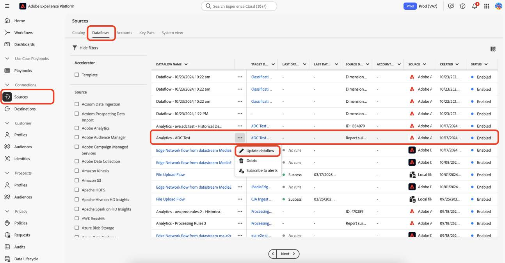

# プロファイルを新しいストリーミングメディアフィールドに移行

このドキュメントでは、ストリーミングメディアデータに対してAdobe Analyticsが有効になっているAdobe Data Collection フローの上に存在するプロファイルフィルタリングサービスを移行するプロセスについて説明します。 この移行は、プロファイルフィルタリングサービスを「Media」というAdobe ストリーミングメディアサービスのデータタイプを使用して変換し、「[Media Reporting Details](https://experienceleague.adobe.com/en/docs/experience-platform/xdm/data-types/media-reporting-details)」という新しい対応するデータタイプを使用します。

## プロファイルの移行

プロファイルフィルタリングを「メディア」と呼ばれる古いデータタイプから「[ メディアレポートの詳細](https://experienceleague.adobe.com/en/docs/experience-platform/xdm/data-types/media-reporting-details)」と呼ばれる新しいデータタイプに移行するには、既存のプロファイルフィルタリングルールを編集する必要があります。

1. Adobe Experience Platformの「[!UICONTROL **ソース**]」セクションで、「[!UICONTROL **データフロー**]」タブに移動します。

1. Adobe Data Collectionを使用して、Adobe AnalyticsからAdobe Experience Platformにストリーミングメディアデータを読み込むデータフローを見つけます。

1. 非推奨フィールドを含むすべてのカスタムルールを、新しいXDM オブジェクトの新しい対応するフィールドに置き換えることで、[!UICONTROL **データフローの更新**]&#x200B;を選択して、プロファイルフィルタリングの設定を変更します。

1. 非推奨の「メディア」オブジェクトのフィールドを含むフィルターを探します。

1. 新しい「Media Reporting Details」オブジェクトからフィールドを追加して、これらのフィルターを追加します。

1. 2つのフィールド間にOR演算子を使用します。

1. プロファイルが期待どおりに動作していることを確認します。

古いフィールドと新しいフィールドの間のマッピングについては、[ コンテンツ ID](/help/reporting/dimensions/content.md) パラメーターと、[ ストリーミングメディアサービス ](/help/media-overview.md)に記載されているストリーミングメディア変数の残りの部分を参照してください。 古いフィールドパスは「XDM フィールドパス」プロパティの下にあり、新しいフィールドパスは「レポート XDM フィールドパス」プロパティの下にあります。

## 例

移行ガイドラインに簡単に従えるように、単一のプロファイルフィルタリングルールを含む次のデータフローの例を考えてみましょう。 この場合、ルールは1つしかないため、移行ガイドラインを1回だけ適用する必要があります。

1. Adobe Experience Platformの「[!UICONTROL **ソース**]」セクションで、「[!UICONTROL **データフロー**]」タブに移動します。

1.Adobe AnalyticsからAdobe Analyticsを介してAdobe Experience Platformにストリーミングメディアデータを読み込むデータフローを見つけます。

1. 次の画像に示すように、**[!UICONTROL データフローを更新]**&#x200B;を選択して編集UIに入ります。

   

1. 「**[!UICONTROL 次へ]**」を選択して、「フィルター」タブに移動します。

   

1. 「**[!UICONTROL フィルタリング]**」タブで、`media.mediaTimed` フィールドに依存するフィルタリングルールを特定します。

   

   meda.mediaTimed オブジェクトを使用する各フィルターについて、[ ストリーミングメディアサービス ](/help/media-overview.md)に記載されているストリーミングメディア変数を使用して、`mediaReporting` オブジェクト内の対応するフィールドを検索し、古いフィールドと新しいフィールドの間をマッピングします。 古いフィールドパスは「XDM フィールドパス」プロパティの下にあり、新しいフィールドパスは「レポート XDM フィールドパス」プロパティの下にあります。 例えば、[Media Starts](/help/reporting/metrics/media-starts.md)の場合、`media.mediaTimed.impressions.value`の通信相手は`mediaReporting.sessionDetails.isViewed`です。

   

1. 関連する`mediaReporting` フィールドをフィルタリングルールにドラッグし、2つのルール間でOR演算子を使用します。 新しいフィールドを使用する場合は、既存のルールと同じルールを追加します。

   

1. **[!UICONTROL 次へ]**&#x200B;を選択して変更を保存します。
